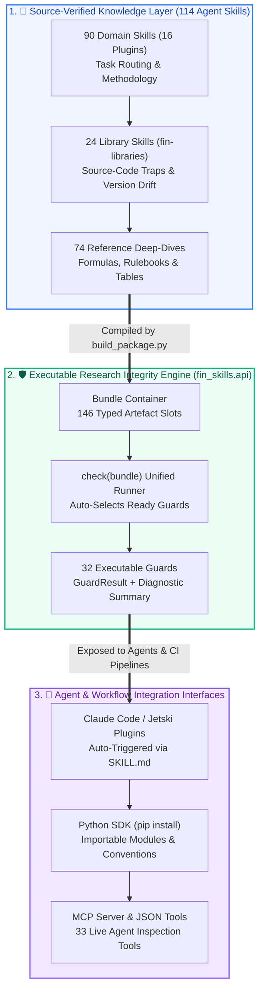

# fin-skills — Source-Verified Knowledge Base & Executable Audit Engine for Quantitative Finance

<div align="center">

[](https://github.com/howard-lynn-ye/fin-skills/releases)
[](#6-complete-skill-catalog-114-skills)
[](#2-executable-audit-engine-fin_skillsapi)
[-success.svg)](#5-empirical-benchmarks--maturity-status)
[](#5-empirical-benchmarks--maturity-status)
[](#license)

**API Documentation:** [howard-lynn-ye.github.io/fin-skills](https://howard-lynn-ye.github.io/fin-skills/) · **Spec:** [agentskills.io](https://agentskills.io/specification)

</div>

---

## 🎯 1. What This Repo Does (Executive Summary)

**114 [Agent Skills](https://agentskills.io/specification) for Claude Code and coding agents that tell an LLM which Python quant-finance library to use, what each one silently gets wrong, and whether a backtest result is real.** 90 domain skills, plus 24 optional per-library deep dives you install only if you want them.

### Why Does This Exist?
The AI-for-finance ecosystem is saturated at two extremes—**API wrappers** (how to fetch a price) and **textbook dumps** (what is Black-Scholes)—but nearly vacant at **research integrity and library implementation traps**. Pre-trained LLMs routinely write backtest code with fatal, silent defects because popular Python libraries harbor unintuitive defaults:
- **`vectorbt`** fills orders at the **signal's own bar close** (`price=np.inf`) by default—introducing 100% look-ahead bias.
- **`alphalens-reloaded`** starts forward returns on date $t$'s **own price** without lagging the factor.
- **`Microsoft Qlib`** default normalizers fit mean/variance across the entire dataset (leaking the test set into training).
- **`empyrical.sharpe_ratio(risk_free=0.05)`** treats `0.05` as **5% per day** (returning a Sharpe of $-65$).
- **`quantstats.cagr(rf=...)`** accepts a risk-free rate and **silently discards it** via an internal exclusion list.
- **Western backtest engines applied to China A-shares** ignore T+1 settlement, limit-up/down fill blocks, suspensions, and the `2023-08-28` seller-only stamp duty halving.

**`fin-skills` solves this at two levels:**
1. **Source-Verified Knowledge Base (`plugins/*/skills/`)**: Every claim is dated (`verified_on`) and tagged with primary-source provenance (✅ verified in source code / exchange rulebook · ⚠️ secondhand · ❓ unverified).
2. **Executable Audit Engine (`fin_skills.api`)**: Reading a skill changes what an LLM *says*; running an executable guard changes what its pipeline is *allowed to report*. We package **32 guards that return a `GuardResult`** behind a unified `Bundle` container and `check()` API, plus **33 tools an agent can call over JSON** via MCP or OpenAI/Anthropic tool schemas.

---

## 🏗️ 2. System Architecture



---

## 📊 3. Project Maturity & Current Progress Scorecard

**Current Status:** Production Release **`v0.1.0`** (September 2026). All core domain plugins, library deep-dives, unified Python API, MCP server, and empirical leak benchmarks are complete and verified.

| Dimension | Current Milestone / Metric | Verification & Engineering Status |
| :--- | :--- | :--- |
| **Knowledge Coverage** | **114 Agent Skills** across **17 Plugins** | **100% Validated** against the portable 6-field Agent Skills specification (`scripts/validate.py`). Covers Equities, A-Shares, Crypto, Options, Fixed Income, Credit, Macro, Microstructure, ML, and Tax. |
| **Executable Code Guards** | **32 Unified Guards** (`fin_skills.api`)<br>**99 Standalone Scripts** | **Production Ready.** Every guard returns a structured `GuardResult(passed, summary, metrics)`. Standalone scripts verified across OS/encoding boundaries (`scripts/check_scripts.py`). |
| **Empirical Leak Benchmark (`leak_bench`)** | **12 / 12 Planted Defects Caught (100%)**<br>**0 False Positives** on Clean Data | **Benchmark Verified** ([`benchmarks/RESULTS.md`](benchmarks/RESULTS.md)). Tested on a 1,565-day synthetic world with delistings and splits; every guard executes in **< 0.07s**. |
| **Agent Routing Accuracy (`eval_blind`)** | **107 / 108 Queries Correct (99.1%)** | **Ground-Truth Verified** (`scripts/eval_blind.py`). Blind LLM selection from skill descriptions alone across 108 realistic English/Chinese queries and stack traces. |
| **Test Suite & CI Rigor** | **123 Test Files · 1,600+ Unit Tests** | **100% Passing** (`pytest -q`). Zero drift enforced between `SKILL.md` sources, `catalog/index.json`, README counts, and generated Python modules. |
| **Ecosystem Federation** | **92 Third-Party Packs Federated**<br>(from 139 Repos / 4,851 Skills Audited) | **Curated & Commit-Pinned** ([`catalog/federation-notes.md`](catalog/federation-notes.md)). Official vendor packs (Alpaca, Kraken, OKX, Longbridge) and community repos integrated with SHA pinning. |

---

## ⚡ 4. Quick Start & Usage

### Mode A: As a Python Package (`fin_skills.api`)

Install directly from GitHub (no PyPI required):

```bash
pip install git+https://github.com/howard-lynn-ye/fin-skills
```

#### 1. Audit a Backtest Run with `Bundle` and `check()`
The `Bundle` container holds the artefacts of a research run under a fixed 146-slot vocabulary. Calling `check(b)` automatically runs every guard whose required inputs are present:

```python
from fin_skills.api import Bundle, check, get, Suite, conventions as c

# 1. Assemble your backtest artefacts into a typed Bundle
b = Bundle(
    returns=strategy_returns,
    turnover=turnover_series,
    rf=0.05,
    bars=ohlcv_bars,
    signal_fn=lambda df: df.close.rolling(20).mean(),
    close=aapl_close,
    actions=aapl_corporate_actions,
)

# 2. Check which guards are ready to run and what 1-slot additions unlock more
print(b.coverage().summary())

# 3. Execute all applicable research integrity guards in one call
report = check(b)
print(report.summary())
```

#### 2. Run Individual Look-Ahead & Integrity Guards
```python
# Perturb future bars after index k=250 and verify historical signals never change
res = get("assert_causal").run(fn=lambda d: d.close.shift(-1), df=ohlcv_bars, k=250)
print(res.passed, res.summary())
# -> False, "FAIL: LOOK-AHEAD ... cells before index 250 changed"

# Run a custom subset of guards
Suite("assert_causal", "warmup_probe", "cost_curve").check(b)

# Use source-verified market conventions
c.annualization_factor("crypto")                                    # 365
c.liquidation_price(entry=100, leverage=10, mmr=0.004, side="long") # Maintenance margin math
c.pip_value("USDJPY", notional=100_000, price=150.25).value_usd     # Exact FX pip value
```

#### 3. Query the Skill Knowledge Base Programmatically
```python
import fin_skills

fin_skills.catalog()                           # List all 114 skills: name, plugin, summary
fin_skills.load("research-integrity-guards")   # Read full SKILL.md markdown text
fin_skills.references("options-backtesting")   # Dict of reference files {filename: text}
fin_skills.find("survivorship", "universe")    # Search skills mentioning both terms
```

---

### Mode B: In Claude Code / Coding Agents (Skill Plugins)

```bash
# 1. Register the marketplace
/plugin marketplace add howard-lynn-ye/fin-skills

# 2. Install core methodology & integrity guards
/plugin install fin-core@fin-skills

# 3. Install only the domain plugins relevant to your desk
/plugin install fin-china@fin-skills        # China A-shares & Greater China rules
/plugin install fin-ml@fin-skills           # Financial ML (triple barrier, meta-labeling, purged CV)
/plugin install fin-models@fin-skills       # Factor models, GARCH, Kalman, VaR/CVaR, option pricing
/plugin install fin-strategies@fin-skills   # Trend following, stat-arb, execution algos, Kelly sizing
/plugin install fin-llm@fin-skills          # LLM trading agents, architectures & empirical evidence
```

> [!IMPORTANT]
> **Skill-Listing Context Budget**: Claude Code's default listing budget is ~1% of the context window (~2,000 tokens). Past ~20 skills, descriptions are silently dropped to name-only and stop auto-triggering. Set `"skillListingBudgetFraction": 0.03` in `~/.claude/settings.json` when installing multiple plugins, or inspect usage with `/context`.

---

### Mode C: As an MCP Server or JSON Tool Suite for LLM Agents

Give any LLM agent live execution access to the 33 JSON-callable tools (`list_skills`, `read_skill`, `check_backtest`, and `check_<guard>`):

```bash
pip install "fin-skills[mcp]"
claude mcp add fin-skills -- python -m fin_skills.mcp
```

For custom agent frameworks (OpenAI, Anthropic, LangChain):
```bash
python -m fin_skills.tools --json --format anthropic  # or openai, openai-chat, mcp
```

---

## 🔍 5. Empirical Benchmarks & What This Repo Corrects

### A. What Models & Tutorials Get Wrong vs. Verified Reality

Every fact below was verified against primary source code or regulatory filings on `2026-09-03/04`:

| Common Belief / LLM Default | Source-Verified Reality (`fin-skills`) |
| :--- | :--- |
| **`vectorbt.Portfolio.from_signals` is safe by default** | **Fills at the signal's own bar close** (`price=np.inf`). Must explicitly lag signals or pass `open` prices. |
| **`alphalens` lags factors automatically** | **Never lags.** Forward returns start at date $t$'s own price; passing unlagged close-derived factors leaks 1 full bar. |
| **`empyrical.sharpe_ratio(risk_free=0.05)` means 5% annual** | Means **5% per day**. Produces a nonsensical Sharpe ratio of $-65$. |
| **`quantstats.cagr(rf=0.05)` adjusts for risk-free rate** | **Silently discards `rf`.** `"cagr"` sits on a hardcoded exclusion list inside `_prepare_returns`. |
| **`arch` SPA / StepM / MCS tests take return series** | **They take LOSSES.** Passing returns silently inverts the hypothesis test and selects your worst strategy. |
| **`yf.download()` returns raw OHLC + `Adj Close`** | **`auto_adjust=True` since v1.0** — there is no `Adj Close` column; OHLC are pre-adjusted. |
| **`py_vollib` is the standard Python options library** | **Dead shim since v1.0.12** (4 files, 0 code). Use `vollib` (and note Vega/Rho are $100\times$ smaller than QuantLib). |
| **`ib_insync` is the Interactive Brokers client** | **Archived in 2023-07.** The maintained successor is `ib_async`. |
| **`mlfinlab` implements Advances in Financial ML** | **Removed from PyPI; GitHub source is stubbed** (every function body is literally `pass`). Use `purgedcv` + `fin-ml` scripts. |
| **Pattern Day Trader (PDT) $25k rule restricts US equity bots** | **Eliminated on 2026-06-04** (SEC Release 34-105226). |

---

### B. The Leak Detection Benchmark (`benchmarks/leak_bench.py`)

We evaluate our executable guards against a 1,565-day synthetic market containing 36 equities (including 10 delistings and 16 stock splits) across **12 planted research defects**:

| Planted Research Defect | Severity | Corrupted Sharpe (vs 1.80 Clean) | Caught By Guard | Execution Time |
| :--- | :---: | :---: | :--- | :---: |
| **`wrong_side_asof`** (Point-in-time timestamp leak) | High | `2.63` (+0.83 fake boost) | `safe_asof` | `0.020s` |
| **`cost_too_low`** (Unrealistic 1bp execution assumption) | High | `2.09` (+0.29 fake boost) | `cost_plausibility` | `0.001s` |
| **`lookahead_signal`** (Centered rolling window / shift(-1)) | Critical | `1.99` (+0.19 fake boost) | `assert_causal` | `0.006s` |
| **`warmup_live_window`** (Indicator warm-up inside test window) | Medium | `1.83` (+0.03 distortion) | `warmup_probe` | `0.063s` |
| **`survivor_only_universe`** (Omitting 10 delisted stocks) | High | `1.82` (+0.02 survivorship) | `survivorship_audit`, `pit_universe` | `0.010s` |
| **`unpurged_cv`** (Overlapping labels across K-Fold splits) | High | `1.79` (leaked validation) | `purge_effect` | `0.031s` |
| **`latest_vintage_fundamentals`** (Restated financial statements) | High | `1.78` (restatement leak) | `pit_fundamentals` | `0.023s` |
| **`shared_scaler`** (`StandardScaler` fit on full train+test) | High | `1.76` (distribution leak) | `fold_leak_test` | `0.022s` |
| **`forward_adjusted_qfq`** (Trading on forward-adjusted prices) | Medium | `1.71` (level distortion) | `adjustment_check` | `0.001s` |
| **`llm_cutoff_overlap`** (Evaluating LLM inside training window) | Critical | `1.46` (memorization bias) | `contamination_probe` | `0.000s` |
| **`unadjusted_split`** (Trading raw prices across stock splits) | High | `0.77` (-1.03 fake crash) | `adjustment_check` | `0.001s` |
| **`single_calm_quarter`** (Cherry-picked low-vol regime window) | Medium | `0.77` (regime fragility) | `regime_coverage` | `0.001s` |
| **Clean Baseline Data (False Alarm Test)** | — | **`1.80` (True Sharpe)** | **0 False Alarms (`ok` across all 13)** | — |

Full reproducible benchmark output: [`benchmarks/RESULTS.md`](benchmarks/RESULTS.md).

---

## 📚 6. Complete Skill Catalog (114 Skills across 17 Plugins)

### Plugin Architecture Overview

| Plugin Name | Skills | Focus Area & Primary Scope |
| :--- | :---: | :--- |
| **`fin-core`** | 18 | **Start here (`quant-stack-router` & `research-integrity-guards`).** Backtest validation, overfitting (PBO/DSR), multiple-testing ledgers, signal construction, execution cost, portfolio risk, options & ETF mechanics. |
| **`fin-ml`** | 7 | **Financial Machine Learning.** Triple-barrier labeling, meta-labeling, sample uniqueness weights, fractional differentiation, feature importance (MDI/MDA traps), structural breaks (CUSUM/SADF), bet sizing. |
| **`fin-models`** | 13 | **Quantitative Models.** Cross-sectional factor models, covariance shrinkage, GARCH & realized volatility, Kalman state-space, cointegration stat-arb, VaR/CVaR backtests, yield curves, implied vol surfaces. |
| **`fin-strategies`** | 5 | **Trading Strategies.** Time-series momentum & trend following, alpha combination & neutralization, VWAP/TWAP/Almgren-Chriss execution algorithms, Avellaneda-Stoikov market making, Kelly position sizing. |
| **`fin-market-data`** | 6 | **Data Engineering & Symbology.** Point-in-time SEC fundamentals, vendor selection, security master symbology (`(identifier, DATE)` mapping for Ticker/CIK/FIGI/CUSIP), safe `asof` joins. |
| **`fin-alt-data`** | 4 | **Alternative Data.** SEC Form 4 insider trading, 13F institutional holdings (age distribution vs 45-day lag), Congressional trading disclosures, social & influencer sentiment feeds. |
| **`fin-china`** | 2 | **China A-Shares.** `china-ashare-data` (AkShare/Tushare/BaoStock traps) & `china-trading-stack` (T+1, 10%/20% price limits, suspensions, auction rules, QMT/vnpy/CTP). |
| **`fin-llm`** | 5 | **LLM Trading Agents.** Published empirical evidence on LLM trading agents, multi-agent architectures, RL/DL trading frameworks (`FinRL` status), MCP servers, and using `fin-skills` as JSON tools. |
| **`fin-fixed-income`** | 7 | **Fixed Income & Rates.** Accrued interest conventions, duration/DV01, OIS multi-curve discounting, SOFR/RFR compounding in arrears, LIBOR fallbacks, ex-dividend bond rebates. |
| **`fin-credit`** | 4 | **Credit & Corporate Bonds.** CDS upfront points & risky annuity, FINRA TRACE corporate bond volume censoring & 15-min window, credit spread measures (G/I/Z/OAS), rating transition matrices. |
| **`fin-microstructure`** | 5 | **Market Microstructure & MC.** Limit order book queueing models (Cont-Stoikov-Talreja), Hawkes self-exciting point processes, tick-level intraday metrics, copulas, variance-reduced Monte Carlo. |
| **`fin-macro`** | 5 | **Macro & Nowcasting.** Real-time vintage macro backtesting (ALFRED), GDP dynamic factor nowcasting, release calendars & embargoes, NBER recession indicator look-ahead, X-13 seasonal adjustment drift. |
| **`fin-tax-accounting`** | 5 | **Tax-Aware Backtesting.** Tax-lot matching (FIFO/HIFO/SpecID), wash-sale rules on monthly rebalances, Section 1256 60/40 derivatives tax, China A-share stamp duty & holding-period dividend tax. |
| **`fin-futures-fx`** | 2 | **Futures & FX.** Continuous contract stitching methods (roll gaps & backwardation traps) and FX spot/carry conventions. |
| **`fin-crypto` / `fin-asia`** | 2 | **Crypto & APAC.** 24/7 crypto execution/funding rate traps and Asia-Pacific market rules outside mainland China. |
| **`fin-libraries`** | 24 | **Opt-In Per-Library Deep Dives.** Source-level audits for `qlib`, `vectorbt`, `backtesting.py`, `yfinance`, `akshare`, `tushare`, `quantlib`, `alphalens`, `arch`, `ccxt`, `nautilus_trader`, `polars`, `purgedcv`, etc. |

---

### Full Generated Skill Index

<!-- BEGIN GENERATED SKILL TABLE -->

| Plugin | Skill | Covers | Refs | Scripts |
|---|---|---|---:|---:|
| `fin-alt-data` | [`congressional-trading-disclosures`](plugins/fin-alt-data/skills/congressional-trading-disclosures/SKILL.md) | Build a congressional-trading signal on the disclosure date instead of the transaction date, and price what the amount brackets cost you. | 0 | 1 |
| `fin-alt-data` | [`insider-form-4`](plugins/fin-alt-data/skills/insider-form-4/SKILL.md) | Filter Form 4 to open-market purchases by transaction code, then key the signal to the first session that can trade the acceptance timestamp. | 0 | 1 |
| `fin-alt-data` | [`institutional-13f`](plugins/fin-alt-data/skills/institutional-13f/SKILL.md) | Clone or study 13F holdings without the quarter-end look-ahead, and report the full age distribution of the positions instead of the 45-day deadline. | 0 | 1 |
| `fin-alt-data` | [`social-and-influencer-feeds`](plugins/fin-alt-data/skills/social-and-influencer-feeds/SKILL.md) | What social data you can legally and practically get in 2026, and what the part you can get does to a backtest. | 0 | 1 |
| `fin-asia` | [`asia-pacific-markets`](plugins/fin-asia/skills/asia-pacific-markets/SKILL.md) | Data and trading for Asia-Pacific outside mainland China. | 0 | 0 |
| `fin-china` | [`china-ashare-data`](plugins/fin-china/skills/china-ashare-data/SKILL.md) | Get China A-share and Greater China market data without the ecosystem's silent traps. | 4 | 0 |
| `fin-china` | [`china-trading-stack`](plugins/fin-china/skills/china-trading-stack/SKILL.md) | Backtest and execute Chinese-market strategies under the rules a Western engine gets wrong. | 3 | 1 |
| `fin-core` | [`backtest-overfitting`](plugins/fin-core/skills/backtest-overfitting/SKILL.md) | Decide whether an edge that passed every mechanical check is still just the best of N tries. | 0 | 1 |
| `fin-core` | [`backtest-validation`](plugins/fin-core/skills/backtest-validation/SKILL.md) | Decide whether a result survives the number of things you tried. | 3 | 3 |
| `fin-core` | [`backtesting-engines`](plugins/fin-core/skills/backtesting-engines/SKILL.md) | Choose a backtesting engine and know what it silently models wrong. | 6 | 0 |
| `fin-core` | [`broker-execution-apis`](plugins/fin-core/skills/broker-execution-apis/SKILL.md) | Connect to a broker and place orders without accidentally trading live money. | 4 | 1 |
| `fin-core` | [`combining-data-sources`](plugins/fin-core/skills/combining-data-sources/SKILL.md) | Combine information of DIFFERENT kinds into one research view whose every number can be traced back to what was knowable when. | 0 | 2 |
| `fin-core` | [`derivatives-pricing`](plugins/fin-core/skills/derivatives-pricing/SKILL.md) | Choose a derivatives pricing library and get its Greek units and conventions right. | 4 | 1 |
| `fin-core` | [`etf-mechanics`](plugins/fin-core/skills/etf-mechanics/SKILL.md) | Why an ETF's price series does not behave like the index it tracks - daily-reset leverage, NAV vs price, distributions, holdings files and fees. | 0 | 1 |
| `fin-core` | [`execution-cost-analysis`](plugins/fin-core/skills/execution-cost-analysis/SKILL.md) | Measure what your execution actually cost instead of assuming a number - implementation shortfall, benchmark choice, impact models, and the gap between the cost you assumed and the | 0 | 2 |
| `fin-core` | [`external-skill-index`](plugins/fin-core/skills/external-skill-index/SKILL.md) | A verified index of every public finance Agent Skill repository — 139 repos, 4,851 SKILL.md files — so you can find what already exists instead of rebuilding it, and avoid the thir | 0 | 0 |
| `fin-core` | [`multiple-testing-ledger`](plugins/fin-core/skills/multiple-testing-ledger/SKILL.md) | Apply family-wise error and false-discovery control to a whole research programme, using the trial ledger's own registered count as m. | 0 | 1 |
| `fin-core` | [`options-backtesting`](plugins/fin-core/skills/options-backtesting/SKILL.md) | Options positions end in ways you do not control - live or in a backtest: assignment, expiry settlement, pin risk, multi-leg lifecycle, historical chain assembly, and the margin th | 3 | 1 |
| `fin-core` | [`portfolio-and-risk`](plugins/fin-core/skills/portfolio-and-risk/SKILL.md) | Turn signals into weights, and compute performance metrics that are actually correct. | 9 | 1 |
| `fin-core` | [`pre-trade-checks`](plugins/fin-core/skills/pre-trade-checks/SKILL.md) | Check a proposed order before a human sends it - this skill checks orders and never sends one. | 0 | 1 |
| `fin-core` | [`quant-stack-router`](plugins/fin-core/skills/quant-stack-router/SKILL.md) | Entry router for Python quantitative finance: names the right library and flags where the model's training prior is stale. | 0 | 0 |
| `fin-core` | [`regime-detection`](plugins/fin-core/skills/regime-detection/SKILL.md) | Detect and label market regimes without letting the labels see the future, and state regime coverage in the form the result gate demands. | 0 | 3 |
| `fin-core` | [`research-integrity-guards`](plugins/fin-core/skills/research-integrity-guards/SKILL.md) | Second-pass audit that decides whether a finance result is real, applied after the work exists. | 2 | 3 |
| `fin-core` | [`signal-construction`](plugins/fin-core/skills/signal-construction/SKILL.md) | Compute technical indicators and engineered features without leaking the future. | 2 | 2 |
| `fin-core` | [`us-market-rules`](plugins/fin-core/skills/us-market-rules/SKILL.md) | US trading rules that decide whether a strategy is executable at all - short-sale restrictions, margin, settlement, day-trading limits, and what a data licence lets you keep. | 0 | 0 |
| `fin-credit` | [`cds-mechanics-and-upfront`](plugins/fin-credit/skills/cds-mechanics-and-upfront/SKILL.md) | Turn a CDS quote into the cash that actually changes hands - standard coupons, points upfront, the risky annuity, the IMM roll and the accrual rebate. | 0 | 1 |
| `fin-credit` | [`corporate-bond-data-and-trace`](plugins/fin-credit/skills/corporate-bond-data-and-trace/SKILL.md) | Use FINRA TRACE corporate bond data without inheriting the two things it does not tell you - the 15-minute reporting window and the size caps that censor volume. | 0 | 1 |
| `fin-credit` | [`credit-spread-measures`](plugins/fin-credit/skills/credit-spread-measures/SKILL.md) | Work out which spread a corporate bond quote actually is and what it was measured against, so two "spreads" on the same bond stop disagreeing. | 0 | 1 |
| `fin-credit` | [`ratings-transitions-and-migration`](plugins/fin-credit/skills/ratings-transitions-and-migration/SKILL.md) | Estimate and use a credit rating transition matrix without producing negative probabilities or a five-year default rate that is five times the wrong number. | 0 | 1 |
| `fin-crypto` | [`crypto-data-and-execution`](plugins/fin-crypto/skills/crypto-data-and-execution/SKILL.md) | Crypto market data and execution, and how a 24/7 market breaks equity tooling. | 3 | 1 |
| `fin-fixed-income` | [`bond-conventions-and-accrued`](plugins/fin-fixed-income/skills/bond-conventions-and-accrued/SKILL.md) | Compute accrued interest, clean and dirty prices and day-count year fractions on a bond without silently picking the wrong convention. | 0 | 1 |
| `fin-fixed-income` | [`duration-convexity-and-dv01`](plugins/fin-fixed-income/skills/duration-convexity-and-dv01/SKILL.md) | Get the right duration number and the right DV01, for a bond, a floater or a hedge ratio. | 0 | 1 |
| `fin-fixed-income` | [`ex-dividend-and-rebate-interest`](plugins/fin-fixed-income/skills/ex-dividend-and-rebate-interest/SKILL.md) | Handle bonds that trade ex-dividend, where accrued interest goes negative and the buyer is paid rebate interest instead of paying it. | 0 | 1 |
| `fin-fixed-income` | [`libor-transition-and-fallbacks`](plugins/fin-fixed-income/skills/libor-transition-and-fallbacks/SKILL.md) | Work out what a US dollar LIBOR contract actually falls back to under the LIBOR Act, and why the spread everyone quotes is the easy half. | 0 | 1 |
| `fin-fixed-income` | [`ois-discounting-and-multi-curve`](plugins/fin-fixed-income/skills/ois-discounting-and-multi-curve/SKILL.md) | Price a swap with separate projection and discount curves, and catch the single-curve bug that the standard par-reprice check cannot see. | 0 | 1 |
| `fin-fixed-income` | [`sofr-and-rfr-compounding`](plugins/fin-fixed-income/skills/sofr-and-rfr-compounding/SKILL.md) | Compute a compounded-in-arrears overnight rate correctly - SOFR, SONIA, ESTR, TONA, SARON - including the lookback, lockout and observation-shift conventions. | 0 | 1 |
| `fin-fixed-income` | [`yield-measures-and-bill-quotes`](plugins/fin-fixed-income/skills/yield-measures-and-bill-quotes/SKILL.md) | Turn a bond or bill price into the right yield, and stop treating a discount rate as one. | 0 | 1 |
| `fin-futures-fx` | [`futures-continuous-contracts`](plugins/fin-futures-fx/skills/futures-continuous-contracts/SKILL.md) | Build and use a futures price series correctly — a continuous contract does not exist in the market, it is stitched, and the stitching method changes your answer. | 0 | 2 |
| `fin-futures-fx` | [`fx-markets`](plugins/fin-futures-fx/skills/fx-markets/SKILL.md) | Trade and backtest FX correctly — quote conventions, pip sizing, and the carry that a spot-only backtest silently omits. | 0 | 1 |
| `fin-libraries` | [`lib-akshare`](plugins/fin-libraries/skills/lib-akshare/SKILL.md) | akshare is the widest free Chinese-market scraper (1,103 public interfaces) and it purges its own PyPI history, so you cannot pin it. | 0 | 0 |
| `fin-libraries` | [`lib-alpaca-py`](plugins/fin-libraries/skills/lib-alpaca-py/SKILL.md) | Alpaca's current Python SDK, which defaults to the paper host but lets url_override silently send live orders from a client that believes it is in the sandbox. | 0 | 0 |
| `fin-libraries` | [`lib-alphalens`](plugins/fin-libraries/skills/lib-alphalens/SKILL.md) | alphalens-reloaded scores cross-sectional factors, and its forward return starts at date t's OWN price - it never lags your factor. | 0 | 0 |
| `fin-libraries` | [`lib-arch`](plugins/fin-libraries/skills/lib-arch/SKILL.md) | The reference GARCH implementation in Python, and the home of SPA/StepM/MCS - which all take LOSSES, so passing returns silently inverts the test and names your worst strategy as t | 0 | 1 |
| `fin-libraries` | [`lib-backtesting-py`](plugins/fin-libraries/skills/lib-backtesting-py/SKILL.md) | Single-asset bar-loop backtester with honest next-open fills, an AGPL-3.0 licence, and an indicator API that computes over the entire series before slicing. | 0 | 0 |
| `fin-libraries` | [`lib-ccxt`](plugins/fin-libraries/skills/lib-ccxt/SKILL.md) | The unified MIT client for 100+ crypto venues - and not a backtester, with an OHLCV endpoint that silently truncates and returns an unclosed final bar. | 0 | 0 |
| `fin-libraries` | [`lib-edgartools`](plugins/fin-libraries/skills/lib-edgartools/SKILL.md) | edgartools is the default free SEC EDGAR client - typed objects for 20+ form types, XBRL statements, no API key - and it 403s on every request until you call set_identity(). | 0 | 0 |
| `fin-libraries` | [`lib-fredapi`](plugins/fin-libraries/skills/lib-fredapi/SKILL.md) | fredapi wraps FRED/ALFRED and is the primary anti-look-ahead tool in macro - and three of its four vintage methods are buggy in source. | 0 | 0 |
| `fin-libraries` | [`lib-freqtrade`](plugins/fin-libraries/skills/lib-freqtrade/SKILL.md) | freqtrade is a live-first crypto bot with the best bias detectors in the field and a backtester that assumes zero slippage always. | 0 | 0 |
| `fin-libraries` | [`lib-ib-async`](plugins/fin-libraries/skills/lib-ib-async/SKILL.md) | The maintained Interactive Brokers Python client - successor to the archived ib_insync - where one digit of the port number is all that separates paper from live. | 0 | 0 |
| `fin-libraries` | [`lib-nautilus-trader`](plugins/fin-libraries/skills/lib-nautilus-trader/SKILL.md) | Event-driven Rust-core engine with the strongest execution modelling in open source, gated to Python 3.12-3.14, where a wrong ts_init silently makes every bar visible one interval  | 0 | 0 |
| `fin-libraries` | [`lib-polars`](plugins/fin-libraries/skills/lib-polars/SKILL.md) | The polars wheel is now an empty 865 KB py3-none-any shim hard-pinned to polars-runtime-32, so a lockfile listing only polars does not pin the engine. | 0 | 1 |
| `fin-libraries` | [`lib-purgedcv`](plugins/fin-libraries/skills/lib-purgedcv/SKILL.md) | The only genuinely sklearn-protocol-compliant purged and embargoed splitter, and the one that refuses to run until you state when each label resolved - understate evaluation_times  | 0 | 1 |
| `fin-libraries` | [`lib-pyportfolioopt`](plugins/fin-libraries/skills/lib-pyportfolioopt/SKILL.md) | Textbook mean-variance and Black-Litterman optimizer whose HRPOpt silently accepts a price matrix where it requires returns and returns plausible garbage. | 0 | 1 |
| `fin-libraries` | [`lib-qlib`](plugins/fin-libraries/skills/lib-qlib/SKILL.md) | Microsoft Qlib (pip name pyqlib, imported as qlib) ships Alpha158/Alpha360 and a default normalizer that leaks your test set into training, silently. | 0 | 0 |
| `fin-libraries` | [`lib-quantlib`](plugins/fin-libraries/skills/lib-quantlib/SKILL.md) | The only broadly-permissive, mature, full-coverage derivatives library in Python, whose global evaluationDate returns an NPV of exactly 0.0 with no warning once it is past expiry. | 0 | 1 |
| `fin-libraries` | [`lib-quantstats`](plugins/fin-libraries/skills/lib-quantstats/SKILL.md) | The tearsheet library whose cagr(rf=...) accepts your risk-free rate and silently discards it - "cagr" sits on an exclusion list inside _prepare_returns, which dispatches on the ca | 0 | 1 |
| `fin-libraries` | [`lib-riskfolio`](plugins/fin-libraries/skills/lib-riskfolio/SKILL.md) | The 26-risk-measure portfolio optimizer whose stateful API optimizes against stale or missing mu and Sigma - with no error - if you forget assets_stats(). | 0 | 0 |
| `fin-libraries` | [`lib-skfolio`](plugins/fin-libraries/skills/lib-skfolio/SKILL.md) | The sklearn-compatible portfolio estimator library whose CombinatorialPurgedCV breaks sklearn's own split() contract - it yields (train, [test_0, ...]), and normal two-variable unp | 0 | 0 |
| `fin-libraries` | [`lib-talib`](plugins/fin-libraries/skills/lib-talib/SKILL.md) | The C reference implementation of technical indicators, where every pure-Python port disagrees during warm-up and none of them say so. | 0 | 0 |
| `fin-libraries` | [`lib-tushare`](plugins/fin-libraries/skills/lib-tushare/SKILL.md) | tushare is the cheapest source of genuinely point-in-time A-share fundamentals, and it sends your token over plaintext HTTP. | 0 | 0 |
| `fin-libraries` | [`lib-vectorbt`](plugins/fin-libraries/skills/lib-vectorbt/SKILL.md) | Vectorized Numba/Rust backtester built for parameter sweeps, whose from_signals fills at the signal's own bar close by default. | 0 | 0 |
| `fin-libraries` | [`lib-vollib`](plugins/fin-libraries/skills/lib-vollib/SKILL.md) | Machine-precision implied volatility with no bracketing, behind a package name restructured in 2026 - py_vollib is now a DEAD SHIM with four files and zero library code, and every  | 0 | 1 |
| `fin-libraries` | [`lib-yfinance`](plugins/fin-libraries/skills/lib-yfinance/SKILL.md) | The default free Yahoo Finance downloader, whose yf.download() now returns pre-adjusted OHLC with no Adj Close column at all. | 0 | 0 |
| `fin-llm` | [`fin-skills-as-tools`](plugins/fin-llm/skills/fin-skills-as-tools/SKILL.md) | How to hand this library to an agent as TOOLS rather than as reading - the MCP server, the exported Anthropic and OpenAI tool definitions, the JSON payload conventions, and the fou | 0 | 0 |
| `fin-llm` | [`finance-agent-architectures`](plugins/fin-llm/skills/finance-agent-architectures/SKILL.md) | How the mainstream finance agent systems are built, and how to stage a research-to-execution pipeline whose gates are code. | 2 | 1 |
| `fin-llm` | [`finance-mcp-servers`](plugins/fin-llm/skills/finance-mcp-servers/SKILL.md) | Pick a finance MCP server, and know its licence and blast radius before connecting it. | 0 | 0 |
| `fin-llm` | [`llm-finance-agents`](plugins/fin-llm/skills/llm-finance-agents/SKILL.md) | What the published evidence says about LLM trading agents, and the real status of the frameworks. | 2 | 1 |
| `fin-llm` | [`rl-and-ml-trading`](plugins/fin-llm/skills/rl-and-ml-trading/SKILL.md) | Reinforcement learning and deep learning for trading: what installs, and what the evidence says. | 0 | 0 |
| `fin-macro` | [`gdp-nowcasting-dynamic-factor`](plugins/fin-macro/skills/gdp-nowcasting-dynamic-factor/SKILL.md) | Nowcast the quarter you are in from monthly data with a ragged edge, using statsmodels' DynamicFactorMQ - and score it against the benchmarks it has to beat. | 0 | 1 |
| `fin-macro` | [`macro-regime-and-recession-indicators`](plugins/fin-macro/skills/macro-regime-and-recession-indicators/SKILL.md) | Recession probabilities, the Sahm rule and yield-curve inversion - and the fact that the NBER label they are all scored against was assigned years after the fact. | 0 | 1 |
| `fin-macro` | [`macro-release-calendar-and-embargo`](plugins/fin-macro/skills/macro-release-calendar-and-embargo/SKILL.md) | Build the timestamp at which a macro number becomes tradeable - release date, clock time, timezone - and know where the release mechanics changed under your sample. | 0 | 1 |
| `fin-macro` | [`real-time-macro-backtesting`](plugins/fin-macro/skills/real-time-macro-backtesting/SKILL.md) | Run a macro strategy twice - once on today's revised series and once on the vintage that existed at each decision date - and report both Sharpes. | 0 | 1 |
| `fin-macro` | [`seasonal-adjustment-and-x13`](plugins/fin-macro/skills/seasonal-adjustment-and-x13/SKILL.md) | Seasonal adjustment is a second, silent vintage - the published seasonally adjusted history keeps changing with no new data. | 0 | 1 |
| `fin-market-data` | [`choosing-a-data-vendor`](plugins/fin-market-data/skills/choosing-a-data-vendor/SKILL.md) | Decide whether a data source may legally and factually serve a research question, before any fetch code is written. | 0 | 1 |
| `fin-market-data` | [`finding-and-searching-data`](plugins/fin-market-data/skills/finding-and-searching-data/SKILL.md) | Find the identifier before you fetch it, and know which free sources can actually search. | 0 | 1 |
| `fin-market-data` | [`fundamental-and-macro-data`](plugins/fin-market-data/skills/fundamental-and-macro-data/SKILL.md) | Company fundamentals and macro series with correct point-in-time semantics. | 3 | 1 |
| `fin-market-data` | [`market-data-engineering`](plugins/fin-market-data/skills/market-data-engineering/SKILL.md) | Store, join and parallelize market data you already hold, without corrupting it. | 4 | 2 |
| `fin-market-data` | [`market-data-sourcing`](plugins/fin-market-data/skills/market-data-sourcing/SKILL.md) | Choose a market price or reference data vendor and use it without silently corrupting the numbers. | 11 | 1 |
| `fin-market-data` | [`security-master-and-symbology`](plugins/fin-market-data/skills/security-master-and-symbology/SKILL.md) | Map ticker, CIK, ISIN, FIGI, SEDOL and CUSIP on (identifier, DATE) rather than on identifier, and detect when the entity behind one changed. | 0 | 1 |
| `fin-microstructure` | [`copulas-and-dependence`](plugins/fin-microstructure/skills/copulas-and-dependence/SKILL.md) | Separate the marginals from the dependence - Gaussian, Student t, Clayton and Gumbel copulas, Kendall's tau, tail dependence coefficients, and what fitting the wrong family costs i | 0 | 1 |
| `fin-microstructure` | [`hawkes-processes`](plugins/fin-microstructure/skills/hawkes-processes/SKILL.md) | Fit and test a self-exciting point process for clustered order arrivals - exponential-kernel Hawkes intensity, Ogata thinning, maximum likelihood, the branching ratio, and the rand | 0 | 1 |
| `fin-microstructure` | [`intraday-microstructure`](plugins/fin-microstructure/skills/intraday-microstructure/SKILL.md) | Measure the market at the tick level and know when the measure is lying. | 0 | 1 |
| `fin-microstructure` | [`limit-order-book-models`](plugins/fin-microstructure/skills/limit-order-book-models/SKILL.md) | Model the order book as a queueing system - Cont-Stoikov-Talreja birth-death queues, the probability the mid moves up before down given the two queue sizes, and the fill probabilit | 0 | 1 |
| `fin-microstructure` | [`monte-carlo-methods`](plugins/fin-microstructure/skills/monte-carlo-methods/SKILL.md) | Make a Monte Carlo converge to the RIGHT number - variance reduction with measured factors, Longstaff-Schwartz for American options, scrambled-Sobol QMC, and the discretisation bia | 0 | 1 |
| `fin-ml` | [`bet-sizing`](plugins/fin-ml/skills/bet-sizing/SKILL.md) | Turn a predicted probability into a position - the 2*Phi(z)-1 size curve, averaging concurrent bets instead of adding them, discretising to buy turnover, and the concurrency budget | 0 | 1 |
| `fin-ml` | [`feature-importance-financial`](plugins/fin-ml/skills/feature-importance-financial/SKILL.md) | Rank features without believing MDI - it is in-sample, it favours columns with many distinct values, and it splits credit between substitutable features; MDA under-states collinear | 0 | 1 |
| `fin-ml` | [`fractional-differentiation`](plugins/fin-ml/skills/fractional-differentiation/SKILL.md) | Make a price series stationary without throwing away the memory a model needs - the weight recursion, the fixed-width window, and the scan for the smallest d that passes ADF. | 0 | 1 |
| `fin-ml` | [`meta-labeling`](plugins/fin-ml/skills/meta-labeling/SKILL.md) | A primary model picks the side, a secondary model trained on "was the primary right" decides whether to act - raising precision, lowering recall, and paying for itself in costs. | 0 | 1 |
| `fin-ml` | [`sample-weights-and-uniqueness`](plugins/fin-ml/skills/sample-weights-and-uniqueness/SKILL.md) | Overlapping labels are not independent observations - compute concurrency, average uniqueness and return-attributed weights, and divide your t-statistics by the overlap factor befo | 0 | 1 |
| `fin-ml` | [`structural-breaks`](plugins/fin-ml/skills/structural-breaks/SKILL.md) | Sample events with the symmetric CUSUM filter instead of on a clock, and test for explosive behaviour with SADF instead of one full-sample ADF that has no power against a bubble in | 0 | 1 |
| `fin-ml` | [`triple-barrier-labeling`](plugins/fin-ml/skills/triple-barrier-labeling/SKILL.md) | Label a trade by which of profit-taking, stop loss and the holding-period limit is hit FIRST, with barriers scaled to the volatility at the event - instead of by the sign of the re | 0 | 1 |
| `fin-models` | [`covariance-and-risk-models`](plugins/fin-models/skills/covariance-and-risk-models/SKILL.md) | Estimate a covariance matrix an optimizer can actually invert, and report how much variance it hides. | 0 | 1 |
| `fin-models` | [`credit-risk-models`](plugins/fin-models/skills/credit-risk-models/SKILL.md) | Estimate a default probability and price credit, and keep the two probabilities apart - the risk-neutral one that prices and the physical one that forecasts. | 0 | 1 |
| `fin-models` | [`factor-and-timeseries-research`](plugins/fin-models/skills/factor-and-timeseries-research/SKILL.md) | Judge whether a cross-sectional factor predicts returns, and forecast financial series. | 7 | 1 |
| `fin-models` | [`factor-models`](plugins/fin-models/skills/factor-models/SKILL.md) | Build long-short factor portfolios from a characteristic panel and test the alpha with standard errors that survive serial correlation. | 1 | 1 |
| `fin-models` | [`implied-vol-surface`](plugins/fin-models/skills/implied-vol-surface/SKILL.md) | Build a volatility surface that is not silently arbitrageable - invert prices to implied vols, fit a smile, check butterfly and calendar arbitrage, and interpolate between maturiti | 0 | 1 |
| `fin-models` | [`option-pricing-models`](plugins/fin-models/skills/option-pricing-models/SKILL.md) | Implement an option pricing model correctly - closed form, tree, characteristic function, Monte Carlo - and the four places each silently returns a plausible wrong number. | 0 | 1 |
| `fin-models` | [`portfolio-optimizers`](plugins/fin-models/skills/portfolio-optimizers/SKILL.md) | Turn expected returns and a covariance matrix into weights, and measure what the optimizer did to your estimation error on the way. | 0 | 1 |
| `fin-models` | [`risk-measures-var-cvar`](plugins/fin-models/skills/risk-measures-var-cvar/SKILL.md) | Compute Value-at-Risk and Expected Shortfall by the four estimators that disagree in the tail, and backtest them properly. | 0 | 1 |
| `fin-models` | [`stat-arb-cointegration`](plugins/fin-models/skills/stat-arb-cointegration/SKILL.md) | Screen, test and trade a cointegrated pair without counting the trials wrong, applying the single-series ADF table to a fitted residual, or estimating the hedge ratio on the window | 0 | 1 |
| `fin-models` | [`state-space-and-kalman`](plugins/fin-models/skills/state-space-and-kalman/SKILL.md) | Estimate a time-varying hedge ratio or beta with a Kalman filter, and know which of its three state series you are allowed to trade - the smoothed one has read the whole sample. | 0 | 1 |
| `fin-models` | [`term-structure-models`](plugins/fin-models/skills/term-structure-models/SKILL.md) | Build and fit a yield curve, and price a zero-coupon bond in a short-rate model, without the convention and identification traps. | 0 | 1 |
| `fin-models` | [`time-series-forecasting-models`](plugins/fin-models/skills/time-series-forecasting-models/SKILL.md) | Score a forecast against the baseline it has to beat - naive, seasonal-naive, drift, mean - with MASE, rolling-origin evaluation and a Diebold-Mariano test, instead of an R^2 on a  | 0 | 1 |
| `fin-models` | [`volatility-models`](plugins/fin-models/skills/volatility-models/SKILL.md) | Fit and forecast volatility - GARCH, range-based realized variance, HAR-RV - without the two errors that silently move the answer: the units `arch` expects, and a range estimator u | 0 | 1 |
| `fin-strategies` | [`alpha-combination-and-neutralization`](plugins/fin-strategies/skills/alpha-combination-and-neutralization/SKILL.md) | Score several alphas, combine them, and strip the exposures you did not mean to take. | 0 | 1 |
| `fin-strategies` | [`execution-algorithms`](plugins/fin-strategies/skills/execution-algorithms/SKILL.md) | Build the schedule that works an order - VWAP, TWAP, POV, Almgren-Chriss - and know what each one is optimizing. | 0 | 1 |
| `fin-strategies` | [`market-making-models`](plugins/fin-strategies/skills/market-making-models/SKILL.md) | Quote a two-sided market and survive the inventory - Avellaneda-Stoikov reservation price and optimal spread, and the adverse selection the model does not price. | 0 | 1 |
| `fin-strategies` | [`position-sizing-kelly`](plugins/fin-strategies/skills/position-sizing-kelly/SKILL.md) | Decide how much to bet given an edge - Kelly, fractional Kelly, and volatility targeting - and the drawdown each implies. | 0 | 1 |
| `fin-strategies` | [`trend-following-models`](plugins/fin-strategies/skills/trend-following-models/SKILL.md) | Build a trend-following or time-series-momentum strategy the way the paper defines it, and measure the two look-aheads that flatter its backtest. | 1 | 1 |
| `fin-tax-accounting` | [`after-tax-backtesting`](plugins/fin-tax-accounting/skills/after-tax-backtesting/SKILL.md) | Attach lot matching, wash sales and section 1256 to an existing backtest and report after-tax Sharpe beside pre-tax - and refuse to report one that does not state its rate, jurisdi | 0 | 1 |
| `fin-tax-accounting` | [`china-ashare-trading-taxes`](plugins/fin-tax-accounting/skills/china-ashare-trading-taxes/SKILL.md) | A-share stamp duty is charged to the seller only and halved on 2023-08-28, and dividend tax is a step function of holding period - a turnover penalty written into the tax code that | 0 | 1 |
| `fin-tax-accounting` | [`section-1256-and-derivatives-tax`](plugins/fin-tax-accounting/skills/section-1256-and-derivatives-tax/SKILL.md) | Futures and broad-based index options are marked to market on the last business day of the year and split 60/40 long/short regardless of holding period, so two options with the sam | 0 | 1 |
| `fin-tax-accounting` | [`tax-lot-matching-and-cost-basis`](plugins/fin-tax-accounting/skills/tax-lot-matching-and-cost-basis/SKILL.md) | The same trades produce four different reported P&Ls depending on which lot you sold, and only one of the four methods is a statutory default. | 0 | 1 |
| `fin-tax-accounting` | [`wash-sale-rules`](plugins/fin-tax-accounting/skills/wash-sale-rules/SKILL.md) | A wash sale defers a loss into the replacement's basis rather than destroying it, and a monthly-rebalanced strategy triggers one on almost every trade. | 0 | 1 |

<!-- END GENERATED SKILL TABLE -->

---

## 🌐 7. Federated Third-Party Skill Marketplace

The marketplace also lists 92 third-party skill packs by their own GitHub source in `.claude-plugin/marketplace.json`, so they install through this marketplace without duplicating their code here.
- **Sources**: Official vendor repositories (Alpaca, Kraken, Longbridge, OKX, HTX, Pionex, BloFin, CoinStats, Upstox, J-Quants, Nansen), Anthropic's financial-services marketplace, and vetted community packs (`algo-trading-skills` [501 skills], `ftshare-skills` [215], `yuping322-finskills` [107], `vibe-trading-skills` [90], `doramagic-skills` [82]).
- **Safety & Provenance**: Every third-party pack installs **disabled by default** (`defaultEnabled: false`), pins a verified commit SHA (`metadata.verified_on`), and explicitly states its credential handling and live-order blast radius. See [`catalog/federation-notes.md`](catalog/federation-notes.md) and [`catalog/federation-notes-wave2.md`](catalog/federation-notes-wave2.md) for full audit logs.

---

## 🛠️ 8. Worked Examples & Maintainer Toolchain

### Runnable Offline Examples (`examples/`)

| Worked Example | What It Demonstrates |
| :--- | :--- |
| [`examples/audit_a_backtest.py`](examples/audit_a_backtest.py) | End-to-end audit workflow: assemble a `Bundle`, inspect `coverage()`, run `check()`, identify two planted look-ahead/cost defects, fix them, and verify all guards pass. |
| [`examples/point_in_time_fundamentals.py`](examples/point_in_time_fundamentals.py) | Joins quarterly SEC fundamentals to daily prices two ways (restated latest vintage vs. point-in-time filing acceptance timestamp) and measures the artificial Sharpe inflation. |
| [`examples/futures_roll.py`](examples/futures_roll.py) | Stitches a futures roll chain three ways (unadjusted, ratio-adjusted, difference back-adjusted) and proves which return operator matches true dollar P&L. |

### Repository Maintenance & Validation CLI

```bash
python scripts/build_index.py    # 1. Regenerate catalog/index.json and README skill table/counts
python scripts/build_package.py  # 2. Compile plugins/*/skills/ into importable fin_skills/ package
python scripts/validate.py       # 3. Validate 6-field spec, live counts, references & zero drift
python scripts/eval_blind.py     # 4. Run blind LLM routing evaluation (107/108 accuracy)
python benchmarks/leak_bench.py  # 5. Re-run the 12-defect x 13-guard leak detection benchmark
pytest -q                        # 6. Execute the 1,600+ unit test suite
```

---

## 📜 License & Scope Disclaimer

- **Repository License**: MIT License for all original skills, scripts, and API code in this repository.
- **Third-Party Library Licenses**: Documented per-library inside `fin-libraries` (e.g., AGPL-3.0 for `backtesting.py` / `openbb`, GPL for `backtrader` / `freqtrade`, Commons Clause for `vectorbt`, non-commercial source-available for `rateslib` / `RQAlpha`).
- **Disclaimer**: Nothing in this repository constitutes financial or investment advice. No skill or script in this repository places live market orders.
