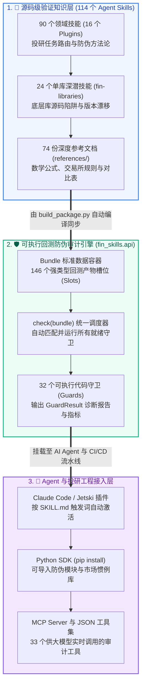

# fin-skills — Python 量化金融源码级验证知识库与可执行防伪审计引擎

<div align="center">

[](https://github.com/howard-lynn-ye/fin-skills/releases)
[](#6-完整技能全景目录-114-个-skills)
[](#2-系统全景架构)
[-success.svg)](#5-实证基准评测与大模型常见错误纠偏)
[](#3-项目成熟度与当前进度记分卡)
[](#8-开源协议与免责声明)

**语言切换 / Language:** [English (`README.md`)](README.md) · **简体中文 (`README_ZH.md`)**  
**官方 API 文档站:** [howard-lynn-ye.github.io/fin-skills](https://howard-lynn-ye.github.io/fin-skills/) · **Agent Skills 规范:** [agentskills.io](https://agentskills.io/specification)

</div>

---

## 🎯 1. 这个仓库做了什么？（核心定位与执行摘要）

**`fin-skills` 是专为 Claude Code、Jetski 等编程 Agent 及量化研究员打造的 Python 量化金融知识库与自动化防伪审计引擎。** 它包含 **114 个符合 Agent Skills 国际规范的技能包**（90 个按投研任务划分的领域技能 + 24 个可选的单库源码级深潜技能），以及 **32 个可通过统一 Python API (`fin_skills.api`) 或 MCP 协议直接调用的可执行代码守卫（Guards）**。

### 为什么需要这个项目？
当前 AI + 金融开源生态呈现出极端的“两头大、中间空”：
- 一端是海量的 **API 爬虫封装**（教你如何拉取 K 线）；
- 另一端是泛泛而谈的 **金融教科书/百科摘要**（背诵 Black-Scholes 公式）；
- **唯独中间最核心的一环——“决定一个量化回测结果是真实 Alpha 还是代码作弊的方法论与底层库陷阱”——几乎是一片空白。**

由于主流 Python 量化库存在大量反直觉的默认行为，预训练大模型（GPT-4、Claude、Qwen 等）在写回测代码时，**默认写出的几乎都是带有严重静默作弊（Silent Bugs）的废代码**：
1. **`vectorbt` 静默前视偏差**：`Portfolio.from_signals` 默认以**信号产生当根 K 线的收盘价**成交（`price=np.inf`），相当于收盘后算出信号立刻穿越回收盘那一秒买入，虚增夏普比率。
2. **`alphalens-reloaded` 静默泄露**：计算因子 IC 和分层收益时，远期收益默认从 $t$ 日**当天自己的价格**开始起算（从不自动对因子做 lag），直接传入收盘价算出的因子会泄露整整一根 K 线。
3. **`Microsoft Qlib` 全样本数据泄露**：默认归一化器（Normalizer）会在包含测试集的全样本上计算均值和标准差，导致未来行情分布静默泄露到训练集。
4. **`empyrical` 量纲灾难**：`empyrical.sharpe_ratio(risk_free=0.05)` 中的 `0.05` 被当成**日无风险利率 5%**（年化高达 $1825\%$），直接算出 $-65$ 的荒谬夏普比率。
5. **`quantstats` 静默丢弃参数**：`quantstats.cagr(rf=0.05)` 表面上接收了无风险利率参数，但内部源码 `_prepare_returns` 的黑名单列表里硬编码了 `"cagr"`，导致传入的 `rf` 被**静默丢弃**。
6. **西方回测框架在 A 股上的制度性失真**：默认 T+0 交易、无视 10%/20% 涨跌停板锁死无法买入/卖出、无视停牌、忽略 `2023-08-28` 印花税减半且**仅向卖方单边征收**以及红利税按持股期限阶梯征收的规则。

### 我们的双层解决方案
1. **第一层：一手源码/法规验证的知识层 (`plugins/*/skills/`)**
   - 每一条结论均标注了**验证日期 (`verified_on`)** 与可信度溯源标记：`✅ 一手源码/交易所规则实测验证` · `⚠️ 二手文献` · `❓ 暂无法验证`。凡是可以通过安装库并运行代码实测对比的结论（如 QuantLib 与 vollib 希腊字母量纲相差 100 倍），均附带可复现脚本。
2. **第二层：可执行的回测防伪审计引擎 (`fin_skills.api` & MCP Tools)**
   - **读文档只能改变大模型“怎么说”，运行代码守卫才能决定投研流水线“允许报告什么结果”。**
   - 我们将 **32 个返回 `GuardResult` 的可执行守卫函数**封装在统一的 **`Bundle` 容器与 `check()` 接口**之后，并导出了 **33 个 JSON 工具 (`fin_skills.tools`)**，支持 Agent 在生成回测报告前自动运行全套防伪体检。

---

## 🏗️ 2. 系统全景架构



---

## 📊 3. 项目成熟度与当前进度记分卡（做到什么程度了？）

**当前状态：** 生产级正式版本 **`v0.1.0`**（2026 年 9 月）。全套 17 个领域的知识库、24 个主流 Python 库源码审计、统一防伪 API、MCP Server 以及 12 类量化作弊检出基准测试均已 100% 完成并验证通过。

| 核心维度 | 当前完成度与量化指标 | 验证标准与工程状态说明 |
| :--- | :--- | :--- |
| **1. 知识库覆盖规模** | **114 个自研 Skills**<br>（分布在 **17 个 Plugins**） | **100% 通过规范校验** (`scripts/validate.py`)。全面覆盖股票、中国 A 股、加密货币、期权衍生品、固收、信用债、宏观、市场微观结构、金融机器学习与税务会计。 |
| **2. 可执行防伪代码** | **32 个统一 API 守卫 (`fin_skills.api`)**<br>**99 个独立复现脚本** | **生产级可用。** 每个守卫返回结构化的 `GuardResult(passed, summary, metrics)`。所有 99 个独立脚本均通过 Windows/Linux 跨平台与字符编码严格测试 (`check_scripts.py`)。 |
| **3. 造假检出基准 (`leak_bench`)** | **12 / 12 植入缺陷 100% 捕获**<br>**干净数据 0 误报 (FP = 0)** | **实证基准验证** ([`benchmarks/RESULTS.md`](benchmarks/RESULTS.md))。在包含退市与拆股的 1,565 天合成股票市场中植入 12 类典型量化作弊，13 个守卫在 **< 0.07 秒**内全部精准拦截。 |
| **4. Agent 路由准确率 (`eval_blind`)** | **107 / 108 真实投研提问路由正确 (99.1%)** | **盲测真值验证** (`scripts/eval_blind.py`)。大模型仅凭 Skill 列表描述，在 108 个中英文真实投研问题、报错堆栈与症状描述上实现 99.1% 精准选型。 |
| **5. 自动化测试与零漂移** | **123 个测试文件 · 1,600+ 单元测试** | **100% 全绿通过** (`pytest -q`)。通过 `build_index.py` 与 `build_package.py --check` 强制保证 `SKILL.md` 文档、目录索引与生成的 Python 包之间 **零漂移（Zero Drift）**。 |
| **6. 第三方联邦生态 (`Marketplace`)** | **联邦集成 92 个第三方金融 Skill 包**<br>（审计 139 个仓库 / 4,851 个 Skills） | **严格审计并锁定 Commit SHA** ([`catalog/federation-notes.md`](catalog/federation-notes.md))。集成 Alpaca、Kraken、OKX、Longbridge 等官方库及 A 股社区库（默认禁用防误触实盘）。 |

---

## ⚡ 4. 快速开始与三大使用模式

### 模式 A：作为 Python 防伪与工具包使用 (`fin_skills.api`)

直接通过 GitHub 安装（无需等待 PyPI 同步）：

```bash
pip install git+https://github.com/howard-lynn-ye/fin-skills
```

#### 1. 使用 `Bundle` 和 `check()` 一键审计回测结果
`Bundle` 容器定义了 146 个标准数据槽位（Slots）。只需将回测产出的收益率、换手率、K 线或信号函数放入 `Bundle`，调用 `check(b)` 即可自动运行所有输入条件已满足的防伪守卫：

```python
from fin_skills.api import Bundle, check, get, Suite, conventions as c

# 1. 将回测产物装入强类型 Bundle 容器（自动校验时间索引排序与类型）
b = Bundle(
    returns=strategy_returns,
    turnover=turnover_series,
    rf=0.05,
    bars=ohlcv_bars,
    signal_fn=lambda df: df.close.rolling(20).mean(),
    close=aapl_close,
    actions=aapl_corporate_actions,
)

# 2. 查看当前数据可激活哪些守卫，以及补充哪个槽位可解锁更多审计
print(b.coverage().summary())

# 3. 一键运行所有就绪的防伪守卫并打印诊断报告
report = check(b)
print(report.summary())
```

#### 2. 单独调用某个未来函数 / 因果性检测器 (`assert_causal`)
```python
# 截断并扰动索引 k=250 之后的未来 K 线，验证历史信号是否发生任何改变
res = get("assert_causal").run(fn=lambda d: d.close.shift(-1), df=ohlcv_bars, k=250)
print(res.passed, res.summary())
# -> False, "FAIL: LOOK-AHEAD ... cells before index 250 changed"

# 组合运行指定的守卫子集
Suite("assert_causal", "warmup_probe", "cost_curve").check(b)

# 调用经过源码级验证的市场惯例与金融算术函数
c.annualization_factor("crypto")                                    # 365
c.liquidation_price(entry=100, leverage=10, mmr=0.004, side="long") # 精确维持保证金强平价
c.pip_value("USDJPY", notional=100_000, price=150.25).value_usd     # 外汇标准点值计算
```

#### 3. 在 Python 中编程检索知识库文档
```python
import fin_skills

fin_skills.catalog()                           # 列出全部 114 个技能的名称、所属插件与摘要
fin_skills.load("research-integrity-guards")   # 读取指定技能完整的 SKILL.md 文本
fin_skills.references("options-backtesting")   # 获取该技能下的所有参考文档字典
fin_skills.find("survivorship", "universe")    # 检索同时包含指定关键词的技能
```

---

### 模式 B：在 Claude Code / Jetski 等 Agent 中作为插件安装

```bash
# 1. 添加插件市场源
/plugin marketplace add howard-lynn-ye/fin-skills

# 2. 安装核心防伪方法论与路由插件（必装）
/plugin install fin-core@fin-skills

# 3. 按研究方向按需安装领域插件
/plugin install fin-china@fin-skills        # 中国 A 股与大中华区交易制度与数据源
/plugin install fin-ml@fin-skills           # 金融机器学习（三道屏障标签、元标签、Purged CV）
/plugin install fin-models@fin-skills       # 量化模型（多因子、GARCH、卡尔曼滤波、VaR/CVaR、期权）
/plugin install fin-strategies@fin-skills   # 经典策略（时序动量、统计套利、算法执行、凯利公式）
/plugin install fin-llm@fin-skills          # 金融大模型 Agent 架构与实证表现评估
```

> [!IMPORTANT]
> **注意 Agent 上下文预算（Context Budget）**：Claude Code 默认分配给 Skill 列表的上下文预算约为总窗口的 1%（约 2,000 tokens）。当安装超过约 20 个 Skills 时，超出部分的描述会被**静默截断为仅剩名称**，导致无法自动触发。若同时安装多个插件，请务必在 `~/.claude/settings.json` 中设置 `"skillListingBudgetFraction": 0.03`。

---

### 模式 C：作为 MCP Server 或 JSON 工具集挂载给任意大模型 Agent

将全部 **33 个 JSON 可调用工具**（7 个目录检索工具 + 26 个实时代码审计工具）挂载给任意支持 MCP 或 Function Calling 的 Agent 框架：

```bash
pip install "fin-skills[mcp]"
claude mcp add fin-skills -- python -m fin_skills.mcp
```

导出 Anthropic / OpenAI 标准 Tool Schema：
```bash
python -m fin_skills.tools --json --format anthropic  # 可选: openai, openai-chat, mcp
```

---

## 🔍 5. 实证基准评测与大模型常见错误纠偏

### A. 大模型与常见教程的“错误共识” vs. 源码验证真相

以下每一项事实均于 `2026-09-03/04` 经一手源码或监管文件实测核实：

| 常见错误认知 / LLM 默认生成的代码 | `fin-skills` 源码级验证真相 |
| :--- | :--- |
| **`vectorbt.Portfolio.from_signals` 开箱即用很安全** | **默认以信号当根 K 线收盘价成交** (`price=np.inf`)，100% 未来函数。必须显式 lag 信号或传入次日 `open` 价。 |
| **`alphalens` 会自动对因子做滞后（Lag）处理** | **从不自动 lag。** 远期收益从 $t$ 日当天价格起算；直接传入收盘价计算的因子会静默泄露 1 根完整 K 线。 |
| **`empyrical.sharpe_ratio(risk_free=0.05)` 表示年化 5% 无风险利率** | 源码将其解释为**每天 5% 的无风险利率**，直接算出约 $-65$ 的荒谬夏普比率。 |
| **`quantstats.cagr(rf=0.05)` 会扣除无风险利率** | **静默丢弃 `rf` 参数。** `"cagr"` 被硬编码在 `_prepare_returns` 内部黑名单列表中。 |
| **`arch` 库的 SPA / StepM / MCS 检验直接传入收益率序列** | **源码要求传入亏损（Losses = -Returns）。** 直接传入收益率会将检验完全反转，把最差策略选为最优。 |
| **`yf.download()` 返回原始 OHLC + `Adj Close` 列** | **自 v1.0 起默认 `auto_adjust=True`**——不再有 `Adj Close` 列，返回的 OHLC 已经是前复权价格。 |
| **`py_vollib` 是计算期权隐含波动率的标准库** | **自 v1.0.12 起已变成无任何代码的死包（Dead Shim）。** 真正的包名为 `vollib`（且其 Vega/Rho 比 QuantLib 小 100 倍）。 |
| **`ib_insync` 是连接盈透证券（IBKR）的标准库** | **已于 2023-07 停止维护并归档。** 当前活跃维护的官方继任者为 `ib_async`。 |
| **`mlfinlab` 实现了《金融机器学习进展（AFML）》算法** | **已从 PyPI 下架；GitHub 源码已被清空为桩代码**（所有函数体均为空 `pass`）。请使用 `purgedcv` + `fin-ml` 脚本。 |
| **美股日内交易受 $25,000 账户门槛（PDT 规则）限制** | **PDT 规则已于 2026-06-04 被 SEC 正式废除**（SEC Release 34-105226）。 |

---

### B. 量化造假与数据泄露检出基准 (`benchmarks/leak_bench.py`)

我们在一个包含 **1,565 个交易日、36 支股票（含 10 支退市股、16 次拆股）** 的合成市场中，人为植入了 **12 种量化论文与回测中最典型的作弊/缺陷**，测试 `fin_skills.api` 守卫的检出能力：

| 植入的回测作弊 / 数据缺陷类型 | 严重程度 | 作弊后虚增/失真夏普 (干净基准 `1.80`) | 成功拦截的守卫 (Guard) | 守卫运行耗时 |
| :--- | :---: | :---: | :--- | :---: |
| **`wrong_side_asof`**（Point-in-Time 时间戳对齐方向错误） | 高危 | `2.63` (+0.83 虚假暴涨) | `safe_asof` | `0.020s` |
| **`cost_too_low`**（假设不切实际的 1bp 超低交易成本） | 高危 | `2.09` (+0.29 虚假虚增) | `cost_plausibility` | `0.001s` |
| **`lookahead_signal`**（居中滚动窗口 / `shift(-1)` 未来函数） | 致命 | `1.99` (+0.19 虚假虚增) | `assert_causal` | `0.006s` |
| **`warmup_live_window`**（在测试集窗口内才开始计算指标预热期） | 中危 | `1.83` (+0.03 统计失真) | `warmup_probe` | `0.063s` |
| **`survivor_only_universe`**（剔除 10 支退市股票的幸存者偏差） | 高危 | `1.82` (+0.02 幸存者虚增) | `survivorship_audit`, `pit_universe` | `0.010s` |
| **`unpurged_cv`**（重叠标签在 K-Fold 切分时未做 Purge/Embargo） | 高危 | `1.79` (验证集泄露) | `purge_effect` | `0.031s` |
| **`latest_vintage_fundamentals`**（使用事后重述修正的财报数据） | 高危 | `1.78` (财报重述泄露) | `pit_fundamentals` | `0.023s` |
| **`shared_scaler`**（在 Train+Test 全样本上拟合 `StandardScaler`） | 高危 | `1.76` (分布泄露) | `fold_leak_test` | `0.022s` |
| **`forward_adjusted_qfq`**（直接使用前复权价格序列进行回测交易） | 中危 | `1.71` (价格水平失真) | `adjustment_check` | `0.001s` |
| **`llm_cutoff_overlap`**（在大模型预训练语料时间窗口内评测 LLM） | 致命 | `1.46` (记忆背诵偏差) | `contamination_probe` | `0.000s` |
| **`unadjusted_split`**（在拆股除权日直接交易未复权原始价格） | 高危 | `0.77` (-1.03 虚假暴跌) | `adjustment_check` | `0.001s` |
| **`single_calm_quarter`**（精心挑选单一低波动平稳季度进行汇报） | 中危 | `0.77` (跨周期脆弱性) | `regime_coverage` | `0.001s` |
| **干净基准数据测试（False Positive 误报率测试）** | — | **`1.80` (真实夏普比率)** | **全部 13 个守卫 0 误报 (`ok`)** | — |

完整复现脚本与检测矩阵详见：[`benchmarks/RESULTS.md`](benchmarks/RESULTS.md)。

---

## 📚 6. 完整技能全景目录（114 个 Skills / 17 个 Plugins）

### 17 个插件模块分类导览

| 插件名称 (Plugin) | 技能数 | 核心领域与防伪覆盖范围 |
| :--- | :---: | :--- |
| **`fin-core`** | 18 | **核心方法论总入口（必读 `quant-stack-router` 与 `research-integrity-guards`）。** 涵盖回测验证、过拟合检验 (PBO/DSR)、多重检验账本、信号防泄露构建、执行成本分析、组合风险、期权回测与 ETF 机制。 |
| **`fin-ml`** | 7 | **金融机器学习。** 三道屏障标签法 (Triple-Barrier)、元标签 (Meta-Labeling)、样本唯一性权重、分数阶差分、特征重要性陷阱 (MDI/MDA)、结构性突变检验 (CUSUM/SADF)、概率头寸管理 (Bet Sizing)。 |
| **`fin-models`** | 13 | **量化金融模型。** 截面多因子模型、协方差收缩估计、GARCH 与已实现波动率、卡尔曼状态空间、协整统计套利、VaR/CVaR 尾部风险回测、利率期限结构、无套利隐含波动率曲面。 |
| **`fin-strategies`** | 5 | **经典交易策略。** 时间序列动量与趋势跟踪、多 Alpha 合成与正交中性化、VWAP/TWAP/Almgren-Chriss 算法执行、Avellaneda-Stoikov 双边做市模型、凯利公式头寸管理。 |
| **`fin-market-data`** | 6 | **市场数据工程与主数据。** Point-in-Time 财报与宏观序列、数据商合规选型、基于 `(标识符, 日期)` 的证券主数据映射（Ticker/CIK/FIGI/CUSIP 借壳与变更追踪）、安全 `asof` 时间对齐。 |
| **`fin-alt-data`** | 4 | **另类数据投研。** SEC Form 4 内部人交易、13F 机构持仓（持仓账龄分布 vs 45 天延迟陷阱）、美国国会议员交易披露、社交媒体与大V舆情数据合规获取及幸存者偏差。 |
| **`fin-china`** | 2 | **中国 A 股专项。** `china-ashare-data`（AkShare/Tushare/BaoStock 接口陷阱与复权规则）与 `china-trading-stack`（T+1、10%/20% 涨跌停锁死、停牌、集合竞价、QMT/vnpy/CTP 实盘对接）。 |
| **`fin-llm`** | 5 | **大模型金融 Agent。** LLM 交易 Agent 学术实证证据与散户反指效应、多智能体投研架构、强化学习/深度学习交易框架 (`FinRL`) 现状评估、金融 MCP Server 选型、将本库作为 JSON 工具挂载。 |
| **`fin-fixed-income`** | 7 | **固定收益与利率。** 债券应计利息与计息日惯例、久期/凸性/DV01、OIS 多曲线贴现、SOFR/RFR 后置复利计算、美元 LIBOR 后备转换机制、除息期债券负应计利息处理。 |
| **`fin-credit`** | 4 | **信用债与衍生品。** CDS 标准票息与前端费用计算、FINRA TRACE 公司债 15 分钟报告窗口与成交量截断偏差、信用利差度量 (G/I/Z/OAS)、信用评级转移生成矩阵。 |
| **`fin-microstructure`** | 5 | **市场微观结构与蒙特卡洛。** 限价订单簿排队模型 (Cont-Stoikov-Talreja)、Hawkes 自激励点过程、日内高频逐笔指标 (VPIN/Kyle lambda)、Copula 尾部相依结构、方差缩减蒙特卡洛模拟。 |
| **`fin-macro`** | 5 | **宏观量化与现时预测。** 基于 ALFRED 初值（Vintage）的实时宏观回测、参差边缘月度数据 GDP 动态因子现时预测 (Nowcasting)、宏观发布日历与静默期、NBER 衰退标签前视陷阱、X-13 季调事后改写。 |
| **`fin-tax-accounting`** | 5 | **税务感知回测。** 成本税基批次匹配 (FIFO/HIFO/SpecID)、月度调仓触发的洗售规则 (Wash Sale)、Section 1256 衍生品 60/40 计税规则、A 股卖方单边印花税减半与持股期限阶梯红利税。 |
| **`fin-futures-fx`** | 2 | **期货与外汇。** 期货主力连续合约拼接算子（展期跳空与贴水负价格陷阱）与外汇现货/隔夜息差（Carry）回测惯例。 |
| **`fin-crypto` / `fin-asia`** | 2 | **加密货币与亚太市场。** 7×24 小时加密货币资金费率/未收盘 K 线陷阱，以及日本、韩国、印度、港股等亚太市场交易制度。 |
| **`fin-libraries`** | 24 | **24 个主流 Python 库源码级深潜（按需安装）。** 涵盖 `qlib`, `vectorbt`, `backtesting.py`, `yfinance`, `akshare`, `tushare`, `quantlib`, `alphalens`, `arch`, `ccxt`, `nautilus_trader`, `polars`, `purgedcv` 等。 |

---

### 全部 114 个 Skills 详细中文解析目录

| 所属插件 (Plugin) | 技能名称 (Skill) | 核心解决的问题与防伪覆盖范围 (中文解析) | 参考文档数 | 验证脚本数 |
| :--- | :--- | :--- | :---: | :---: |
| `fin-alt-data` | [`congressional-trading-disclosures`](plugins/fin-alt-data/skills/congressional-trading-disclosures/SKILL.md) | 基于披露日而非交易日构建美国国会议员交易信号，并量化披露金额区间（Brackets）带来的信息损耗成本。 | 0 | 1 |
| `fin-alt-data` | [`insider-form-4`](plugins/fin-alt-data/skills/insider-form-4/SKILL.md) | 按交易代码过滤 SEC Form 4 公开市场增持记录，并将信号严格对齐至 SEC 接收时间戳后的首个可交易时段。 | 0 | 1 |
| `fin-alt-data` | [`institutional-13f`](plugins/fin-alt-data/skills/institutional-13f/SKILL.md) | 在规避季度末前视偏差的前提下复现或研究 13F 机构持仓，报告持仓的完整账龄分布而非简单假设 45 天延迟。 | 0 | 1 |
| `fin-alt-data` | [`social-and-influencer-feeds`](plugins/fin-alt-data/skills/social-and-influencer-feeds/SKILL.md) | 梳理 2026 年可合法合规获取的社交媒体与大V舆情数据源，以及幸存/可得数据对回测结果的真实影响。 | 0 | 1 |
| `fin-asia` | [`asia-pacific-markets`](plugins/fin-asia/skills/asia-pacific-markets/SKILL.md) | 中国大陆以外亚太市场（日本、韩国、印度、港股、新加坡、澳洲等）的数据源与交易制度细节。 | 0 | 0 |
| `fin-china` | [`china-ashare-data`](plugins/fin-china/skills/china-ashare-data/SKILL.md) | 获取中国 A 股及大中华区行情与基本面数据，规避复权、停牌、ST 退市及免费接口的静默陷阱。 | 4 | 0 |
| `fin-china` | [`china-trading-stack`](plugins/fin-china/skills/china-trading-stack/SKILL.md) | 在西方回测引擎默认算错的 A 股特殊规则下（T+1、涨跌停锁死、停牌、集合竞价、2023印花税减半）正确回测与实盘。 | 3 | 1 |
| `fin-core` | [`backtest-overfitting`](plugins/fin-core/skills/backtest-overfitting/SKILL.md) | 使用 PBO（回测过拟合概率）、CSCV 和最小回测长度（MinBTL），判断通过了机械检查的策略是否只是 N 次尝试中的幸存者。 | 0 | 1 |
| `fin-core` | [`backtest-validation`](plugins/fin-core/skills/backtest-validation/SKILL.md) | 使用平减夏普比率（Deflated Sharpe Ratio, DSR）验证回测结果在扣除多重试验次数影响后是否依然显著。 | 3 | 3 |
| `fin-core` | [`backtesting-engines`](plugins/fin-core/skills/backtesting-engines/SKILL.md) | 对比主流 Python 回测引擎（vectorbt、backtesting.py、Qlib、NautilusTrader、vnpy），揭示各框架默认静默算错的成交假设。 | 6 | 0 |
| `fin-core` | [`broker-execution-apis`](plugins/fin-core/skills/broker-execution-apis/SKILL.md) | 安全连接券商实盘/模拟盘接口（IBKR、Alpaca、QMT、CTP），防止因一行配置错误将模拟单发往实盘账户。 | 4 | 1 |
| `fin-core` | [`combining-data-sources`](plugins/fin-core/skills/combining-data-sources/SKILL.md) | 将不同频率与来源（日频行情、季度财报、宏观发布、另类舆情）的数据融合为严格 Point-in-Time 的无前视偏差研究视图。 | 0 | 2 |
| `fin-core` | [`derivatives-pricing`](plugins/fin-core/skills/derivatives-pricing/SKILL.md) | 选择衍生品定价库（QuantLib vs vollib）并统一其希腊字母（Greeks）量纲、计息日惯例与隐含波动率精度。 | 4 | 1 |
| `fin-core` | [`etf-mechanics`](plugins/fin-core/skills/etf-mechanics/SKILL.md) | 解析 ETF 价格序列为何偏离其跟踪指数：每日杠杆重置损耗、折溢价（NAV vs 市价）、分红除权、持仓披露文件与管理费。 | 0 | 1 |
| `fin-core` | [`execution-cost-analysis`](plugins/fin-core/skills/execution-cost-analysis/SKILL.md) | 精确度量真实交易执行成本（Implementation Shortfall、到达价基准、市场冲击模型），消除假设成本与实盘滑点之间的鸿沟。 | 0 | 2 |
| `fin-core` | [`external-skill-index`](plugins/fin-core/skills/external-skill-index/SKILL.md) | 经过源码验证的 139 个公开金融 Agent Skill 仓库索引（共 4,851 个 SKILL.md），甄别可直接复用的资产并剔除 1/3 侵权/失效库。 | 0 | 0 |
| `fin-core` | [`multiple-testing-ledger`](plugins/fin-core/skills/multiple-testing-ledger/SKILL.md) | 基于试验账本登记的总尝试次数 m，对整个量化研究项目执行 Bonferroni、Holm、BHY 家族误差率（FWER/FDR）多重假设检验控制。 | 0 | 1 |
| `fin-core` | [`options-backtesting`](plugins/fin-core/skills/options-backtesting/SKILL.md) | 处理期权回测中不受控的生命周期事件：美式提前行权指派、到期交割、Pin Risk（钉死风险）、多腿策略展期与历史期权链拼接保证金。 | 3 | 1 |
| `fin-core` | [`portfolio-and-risk`](plugins/fin-core/skills/portfolio-and-risk/SKILL.md) | 将预测信号转化为组合权重，并正确计算各项风险收益指标（修正 empyrical/quantstats 中的无风险利率与年化量纲错误）。 | 9 | 1 |
| `fin-core` | [`pre-trade-checks`](plugins/fin-core/skills/pre-trade-checks/SKILL.md) | 在订单发出前执行纯代码级风控拦截（乌龙指检查、成交量占比限制、交易时段/集合竞价窗口、重复发单拦截与一键熔断开关）。 | 0 | 1 |
| `fin-core` | [`quant-stack-router`](plugins/fin-core/skills/quant-stack-router/SKILL.md) | Python 量化金融生态总路由：指明特定投研任务应使用的标准库，并标记大模型预训练语料已过时的版本漂移与弃用接口。 | 0 | 0 |
| `fin-core` | [`regime-detection`](plugins/fin-core/skills/regime-detection/SKILL.md) | 在不引入未来数据（如全样本 HMM 平滑或事后 NBER 衰退标签）的前提下识别市场状态，并按审计门禁要求报告跨状态覆盖率。 | 0 | 3 |
| `fin-core` | [`research-integrity-guards`](plugins/fin-core/skills/research-integrity-guards/SKILL.md) | 量化回测结果的终极防伪审计守门员：按幸存者偏差、可得性时间戳、标签泄露、成本真实性、多重试验次数五大关卡逐级证伪。 | 2 | 3 |
| `fin-core` | [`signal-construction`](plugins/fin-core/skills/signal-construction/SKILL.md) | 构建技术指标与工程化特征，彻底杜绝居中滚动窗口、全样本归一化与未来偏移（shift(-1)）引发的前视泄露。 | 2 | 2 |
| `fin-core` | [`us-market-rules`](plugins/fin-core/skills/us-market-rules/SKILL.md) | 决定美股策略是否具备可执行性的制度规则：卖空限制（SSR/借券费）、保证金、T+1 交割、PDT 规则废除（2026-06）及行情数据授权。 | 0 | 0 |
| `fin-credit` | [`cds-mechanics-and-upfront`](plugins/fin-credit/skills/cds-mechanics-and-upfront/SKILL.md) | 将信用违约互换（CDS）报价转化为真实交割现金流：标准票息、前端费用（Upfront Points）、风险年金、IMM 展期与应计返还。 | 0 | 1 |
| `fin-credit` | [`corporate-bond-data-and-trace`](plugins/fin-credit/skills/corporate-bond-data-and-trace/SKILL.md) | 正确处理 FINRA TRACE 公司债逐笔成交数据，规避 15 分钟延迟报告窗口与大额成交量截断（Censoring）带来的统计失真。 | 0 | 1 |
| `fin-credit` | [`credit-spread-measures`](plugins/fin-credit/skills/credit-spread-measures/SKILL.md) | 精确区分并计算公司债的各类信用利差（G-spread、I-spread、Z-spread、OAS），消除不同基准曲线导致的利差矛盾。 | 0 | 1 |
| `fin-credit` | [`ratings-transitions-and-migration`](plugins/fin-credit/skills/ratings-transitions-and-migration/SKILL.md) | 使用生成矩阵（Generator Matrix）估计信用评级转移矩阵，避免离散统计出现负概率或将五年违约率简单算成一年期的五倍。 | 0 | 1 |
| `fin-crypto` | [`crypto-data-and-execution`](plugins/fin-crypto/skills/crypto-data-and-execution/SKILL.md) | 加密货币 7×24 小时连续交易市场的数据清洗与执行陷阱：永续合约资金费率、跨交易所价差、未收盘 K 线截断与爆仓强平机制。 | 3 | 1 |
| `fin-fixed-income` | [`bond-conventions-and-accrued`](plugins/fin-fixed-income/skills/bond-conventions-and-accrued/SKILL.md) | 精确计算债券应计利息（Accrued Interest）、净价/全价（Clean/Dirty Price）与各类计息日惯例（ACT/ACT、30/360 等）。 | 0 | 1 |
| `fin-fixed-income` | [`duration-convexity-and-dv01`](plugins/fin-fixed-income/skills/duration-convexity-and-dv01/SKILL.md) | 针对固定利率债、浮息债及对冲组合，正确计算修正久期、有效久期、凸性（Convexity）与基点价值（DV01）。 | 0 | 1 |
| `fin-fixed-income` | [`ex-dividend-and-rebate-interest`](plugins/fin-fixed-income/skills/ex-dividend-and-rebate-interest/SKILL.md) | 处理除息期（Ex-Dividend Period）交易的债券：此时应计利息为负数，买方需向卖方收取返还利息而非支付利息。 | 0 | 1 |
| `fin-fixed-income` | [`libor-transition-and-fallbacks`](plugins/fin-fixed-income/skills/libor-transition-and-fallbacks/SKILL.md) | 根据《LIBOR 法案》解析美元 LIBOR 存量合约的后备利率转换机制（CME Term SOFR + 固定利差调整）及其定价细节。 | 0 | 1 |
| `fin-fixed-income` | [`ois-discounting-and-multi-curve`](plugins/fin-fixed-income/skills/ois-discounting-and-multi-curve/SKILL.md) | 使用分离的预测曲线（Projection Curve）与 OIS 贴现曲线（Discount Curve）为利率互换定价，捕获单曲线平价复现无法发现的偏差。 | 0 | 1 |
| `fin-fixed-income` | [`sofr-and-rfr-compounding`](plugins/fin-fixed-income/skills/sofr-and-rfr-compounding/SKILL.md) | 精确计算后置复利（Compounded-in-Arrears）无风险隔夜利率（SOFR、SONIA、ESTR、TONA），涵盖观察期回溯、锁定期与观察位移惯例。 | 0 | 1 |
| `fin-fixed-income` | [`yield-measures-and-bill-quotes`](plugins/fin-fixed-income/skills/yield-measures-and-bill-quotes/SKILL.md) | 将国库券（T-Bills）贴现率报价与附息债券价格转化为可比到期收益率（BEY/YTM），杜绝将贴现率直接当成收益率使用。 | 0 | 1 |
| `fin-futures-fx` | [`futures-continuous-contracts`](plugins/fin-futures-fx/skills/futures-continuous-contracts/SKILL.md) | 正确拼接期货连续主力合约：对比价差后复权、比例复权与不复权序列，证明哪种收益率算子能精确还原真实美元盈亏（P&L）。 | 0 | 2 |
| `fin-futures-fx` | [`fx-markets`](plugins/fin-futures-fx/skills/fx-markets/SKILL.md) | 外汇（FX）现货与远期策略回测：报价惯例（直接/间接标价）、点值（Pip Value）计算，以及纯现货回测静默遗漏的隔夜息差（Carry）。 | 0 | 1 |
| `fin-libraries` | [`lib-akshare`](plugins/fin-libraries/skills/lib-akshare/SKILL.md) | AkShare（最全的免费中国市场爬虫库，含 1,103 个接口）源码级指南：应对其清空 PyPI 历史版本导致无法锁版本（Pin）的工程方案。 | 0 | 0 |
| `fin-libraries` | [`lib-alpaca-py`](plugins/fin-libraries/skills/lib-alpaca-py/SKILL.md) | Alpaca 官方 Python SDK 指南：揭示其默认连接模拟盘但可通过 url_override 静默向实盘发单的接口陷阱。 | 0 | 0 |
| `fin-libraries` | [`lib-alphalens`](plugins/fin-libraries/skills/lib-alphalens/SKILL.md) | alphalens-reloaded 截面因子评估指南：其远期收益默认从 t 日当天价格起算（从不自动 lag 因子），直接传入收盘因子将泄露一整根 K 线。 | 0 | 0 |
| `fin-libraries` | [`lib-arch`](plugins/fin-libraries/skills/lib-arch/SKILL.md) | Python GARCH 波动率与多重比较检验（SPA/StepM/MCS）标准库：其检验函数接收的是亏损（Losses）而非收益，传反会导致选出最差策略。 | 0 | 1 |
| `fin-libraries` | [`lib-backtesting-py`](plugins/fin-libraries/skills/lib-backtesting-py/SKILL.md) | 单资产 K 线循环回测库 backtesting.py 指南：具备诚实的次日开盘价（next-open）成交机制，但需注意 AGPL-3.0 协议及全序列预计算指标。 | 0 | 0 |
| `fin-libraries` | [`lib-ccxt`](plugins/fin-libraries/skills/lib-ccxt/SKILL.md) | 支持 100+ 加密货币交易所的 CCXT 统一接口指南：注意 fetch_ohlcv 默认截断条数限制，且最后一根返回的是尚未收盘的实时 K 线。 | 0 | 0 |
| `fin-libraries` | [`lib-edgartools`](plugins/fin-libraries/skills/lib-edgartools/SKILL.md) | SEC EDGAR 免费财报解析库 edgartools 指南：支持 20+ 表单类型与 XBRL 财务报表，但未调用 set_identity() 前所有请求均返回 403。 | 0 | 0 |
| `fin-libraries` | [`lib-fredapi`](plugins/fin-libraries/skills/lib-fredapi/SKILL.md) | 宏观经济数据库 FRED/ALFRED 客户端 fredapi 指南：用于提取历史时点初值（Vintage）防前视泄露，但源码中 4 个 vintage 方法有 3 个存在 Bug。 | 0 | 0 |
| `fin-libraries` | [`lib-freqtrade`](plugins/fin-libraries/skills/lib-freqtrade/SKILL.md) | 加密货币实盘交易机器人 freqtrade 指南：拥有业内最强的未来函数检测器，但其回测引擎默认假设滑点永远为零。 | 0 | 0 |
| `fin-libraries` | [`lib-ib-async`](plugins/fin-libraries/skills/lib-ib-async/SKILL.md) | 盈透证券（IBKR）Python 客户端 ib_async（已归档库 ib_insync 的官方继任者）指南：注意模拟盘与实盘端口号仅相差一位数字的实盘风险。 | 0 | 0 |
| `fin-libraries` | [`lib-nautilus-trader`](plugins/fin-libraries/skills/lib-nautilus-trader/SKILL.md) | 基于 Rust 核心的高性能事件驱动回测/实盘引擎 NautilusTrader 指南：拥有最强的订单簿微观成交模拟，但 ts_init 设置错误会导致整根 K 线提前可见。 | 0 | 0 |
| `fin-libraries` | [`lib-polars`](plugins/fin-libraries/skills/lib-polars/SKILL.md) | 高性能数据帧 Polars 指南：揭示其 PyPI 轮子现已成为绑定 polars-runtime-32 的空壳 shim，仅锁定 polars 版本号无法锁定底层引擎。 | 0 | 1 |
| `fin-libraries` | [`lib-purgedcv`](plugins/fin-libraries/skills/lib-purgedcv/SKILL.md) | 唯一严格遵循 sklearn 协议的 Purged & Embargoed 交叉验证切分器 purgedcv 指南：强制要求显式传入每个标签的结算时间戳（evaluation_times）。 | 0 | 1 |
| `fin-libraries` | [`lib-pyportfolioopt`](plugins/fin-libraries/skills/lib-pyportfolioopt/SKILL.md) | 经典均值-方差与 Black-Litterman 组合优化库 PyPortfolioOpt 指南：注意 HRPOpt 会静默接收价格矩阵（本应传入收益率）并输出看似合理的垃圾权重。 | 0 | 1 |
| `fin-libraries` | [`lib-qlib`](plugins/fin-libraries/skills/lib-qlib/SKILL.md) | 微软量化投资平台 Microsoft Qlib（pyqlib）源码指南：揭示 Alpha158/360 特征及默认 Normalizer 在全样本（含测试集）上算均值方差的严重数据泄露。 | 0 | 0 |
| `fin-libraries` | [`lib-quantlib`](plugins/fin-libraries/skills/lib-quantlib/SKILL.md) | 金融工程衍生品定价黄金标准库 QuantLib 指南：注意全局 evaluationDate 一旦超过期权到期日，所有 NPV 会静默返回 0.0 且不抛任何警告。 | 0 | 1 |
| `fin-libraries` | [`lib-quantstats`](plugins/fin-libraries/skills/lib-quantstats/SKILL.md) | 量化绩效报告库 QuantStats 源码审计：其 cagr(rf=...) 接收无风险利率参数后会在内部 _prepare_returns 黑名单中将其静默丢弃。 | 0 | 1 |
| `fin-libraries` | [`lib-riskfolio`](plugins/fin-libraries/skills/lib-riskfolio/SKILL.md) | 支持 26 种风险度量的组合优化库 Riskfolio-Lib 指南：注意其有状态 API 若忘记重新调用 assets_stats() 将沿用陈旧均值协方差矩阵进行优化。 | 0 | 0 |
| `fin-libraries` | [`lib-skfolio`](plugins/fin-libraries/skills/lib-skfolio/SKILL.md) | 兼容 sklearn 的现代组合优化库 skfolio 指南：注意其 CombinatorialPurgedCV 返回 (train, [test_0, ...])，直接双变量解包会破坏 sklearn 契约。 | 0 | 0 |
| `fin-libraries` | [`lib-talib`](plugins/fin-libraries/skills/lib-talib/SKILL.md) | 技术指标 C 语言参考实现 TA-Lib 指南：对比纯 Python 移植版（pandas-ta 等）在 EMA/RSI 预热期（Warm-up）的显著数值分歧。 | 0 | 0 |
| `fin-libraries` | [`lib-tushare`](plugins/fin-libraries/skills/lib-tushare/SKILL.md) | A 股 Point-in-Time 财报与行情数据源 Tushare Pro 指南：性价比最高的真实披露日财报源，但需注意其 SDK 默认通过明文 HTTP 发送 API Token。 | 0 | 0 |
| `fin-libraries` | [`lib-vectorbt`](plugins/fin-libraries/skills/lib-vectorbt/SKILL.md) | 基于 Numba/Rust 的超高速向量化参数扫描回测库 vectorbt 指南：其 from_signals 默认以信号当根 K 线收盘价（price=np.inf）成交，必须手动 lag。 | 0 | 0 |
| `fin-libraries` | [`lib-vollib`](plugins/fin-libraries/skills/lib-vollib/SKILL.md) | 机器精度隐含波动率计算库 vollib 指南：注意旧包名 py_vollib 已成无代码的死包（Dead Shim），且 vollib 的 Vega/Rho 量纲比 QuantLib 小 100 倍。 | 0 | 1 |
| `fin-libraries` | [`lib-yfinance`](plugins/fin-libraries/skills/lib-yfinance/SKILL.md) | 雅虎财经免费行情下载器 yfinance 指南：自 v1.0 起 yf.download() 默认开启 auto_adjust=True，返回预复权 OHLC 且彻底移除了 Adj Close 列。 | 0 | 0 |
| `fin-llm` | [`fin-skills-as-tools`](plugins/fin-llm/skills/fin-skills-as-tools/SKILL.md) | 将本仓库作为可执行工具（Tools）而非静态文本挂载给 Agent：涵盖 MCP Server 部署、Anthropic/OpenAI Tool Schema 导出及 JSON 载荷规范。 | 0 | 0 |
| `fin-llm` | [`finance-agent-architectures`](plugins/fin-llm/skills/finance-agent-architectures/SKILL.md) | 主流金融多智能体（Multi-Agent）系统架构剖析，以及如何构建以硬代码风控门禁（Code Gates）为边界的“投研→执行”流水线。 | 2 | 1 |
| `fin-llm` | [`finance-mcp-servers`](plugins/fin-llm/skills/finance-mcp-servers/SKILL.md) | 主流金融 MCP（Model Context Protocol）服务器选型指南：在连接前评估其开源协议合规性、API 密钥暴露面与实盘下单爆炸半径。 | 0 | 0 |
| `fin-llm` | [`llm-finance-agents`](plugins/fin-llm/skills/llm-finance-agents/SKILL.md) | 大模型交易 Agent 的学术实证证据与真实表现审计：揭示零样本散户情绪反指效应、预训练语料时间重叠（Contamination）与框架真实状态。 | 2 | 1 |
| `fin-llm` | [`rl-and-ml-trading`](plugins/fin-llm/skills/rl-and-ml-trading/SKILL.md) | 强化学习（RL）与深度学习在量化交易中的真实落地评估：剖析 FinRL 等主流开源框架的依赖失效现状与过拟合陷阱。 | 0 | 0 |
| `fin-macro` | [`gdp-nowcasting-dynamic-factor`](plugins/fin-macro/skills/gdp-nowcasting-dynamic-factor/SKILL.md) | 基于 statsmodels DynamicFactorMQ 处理参差边缘（Ragged-Edge）月度宏观数据，对当季 GDP 进行实时现时预测（Nowcasting）。 | 0 | 1 |
| `fin-macro` | [`macro-regime-and-recession-indicators`](plugins/fin-macro/skills/macro-regime-and-recession-indicators/SKILL.md) | 评估萨姆规则（Sahm Rule）、收益率曲线倒挂与衰退概率模型，揭示 NBER 官方衰退标签均为事后追认（不可用于实时回测）的真相。 | 0 | 1 |
| `fin-macro` | [`macro-release-calendar-and-embargo`](plugins/fin-macro/skills/macro-release-calendar-and-embargo/SKILL.md) | 构建宏观经济数据的真实可交易时间戳（精确到发布日期、美东/北京时刻与静默期 Embargo），应对样本期内发布机制的演变。 | 0 | 1 |
| `fin-macro` | [`real-time-macro-backtesting`](plugins/fin-macro/skills/real-time-macro-backtesting/SKILL.md) | 双轨运行宏观量化策略：对比基于今日修正后终值（Revised Series）与基于历史各决策日当时初值（ALFRED Vintage）的真实夏普比率差异。 | 0 | 1 |
| `fin-macro` | [`seasonal-adjustment-and-x13`](plugins/fin-macro/skills/seasonal-adjustment-and-x13/SKILL.md) | 揭示季节性调整（X-13ARIMA-SEATS）构成的第二重隐蔽前视泄露：已公布的历史季调序列会随未来新数据加入而不断被事后重算改写。 | 0 | 1 |
| `fin-market-data` | [`choosing-a-data-vendor`](plugins/fin-market-data/skills/choosing-a-data-vendor/SKILL.md) | 在编写任何数据拉取代码前，从法律授权条款（是否允许衍生建模/商业分发）与数据事实质量两方面评估金融数据供应商。 | 0 | 1 |
| `fin-market-data` | [`finding-and-searching-data`](plugins/fin-market-data/skills/finding-and-searching-data/SKILL.md) | 在拉取行情前精准定位证券唯一标识符，并梳理哪些免费数据源具备真实的跨市场模糊检索与代码映射能力。 | 0 | 1 |
| `fin-market-data` | [`fundamental-and-macro-data`](plugins/fin-market-data/skills/fundamental-and-macro-data/SKILL.md) | 具备严格 Point-in-Time（历史时点可得性）语义的公司财务报表与宏观经济序列清洗、对齐与重述版本管理规范。 | 3 | 1 |
| `fin-market-data` | [`market-data-engineering`](plugins/fin-market-data/skills/market-data-engineering/SKILL.md) | 大规模多频行情数据的本地存储（Parquet/Arrow 分区）、跨时区对齐、并行化处理与零损坏连接（Join）工程实践。 | 4 | 2 |
| `fin-market-data` | [`market-data-sourcing`](plugins/fin-market-data/skills/market-data-sourcing/SKILL.md) | 股票、期货与参考数据供应商（Polygon、Databento、Tiingo、AkShare、Tushare、Yahoo）对比选型，规避各家静默篡改数值的陷阱。 | 11 | 1 |
| `fin-market-data` | [`security-master-and-symbology`](plugins/fin-market-data/skills/security-master-and-symbology/SKILL.md) | 建立基于 (标识符, 日期) 二元组而非单一代码的证券主数据映射（Ticker/CIK/ISIN/FIGI/CUSIP），精准识别借壳、代码复用与主体变更。 | 0 | 1 |
| `fin-microstructure` | [`copulas-and-dependence`](plugins/fin-microstructure/skills/copulas-and-dependence/SKILL.md) | 分离边缘分布与相关性结构：高斯、Student-t、Clayton 与 Gumbel Copula 拟合、秩相关系数（Kendall tau）及尾部相依性定价失真。 | 0 | 1 |
| `fin-microstructure` | [`hawkes-processes`](plugins/fin-microstructure/skills/hawkes-processes/SKILL.md) | 拟合与检验高频订单流聚类的自激励点过程（Hawkes Process）：指数核强度、Ogata 稀疏模拟、极大似然估计与分支比（Branching Ratio）。 | 0 | 1 |
| `fin-microstructure` | [`intraday-microstructure`](plugins/fin-microstructure/skills/intraday-microstructure/SKILL.md) | 日内高频逐笔（Tick-level）市场微观结构度量：有效价差、Kyle lambda、VPIN（知情交易概率）计算及其在涨跌停/流动性枯竭时的失真。 | 0 | 1 |
| `fin-microstructure` | [`limit-order-book-models`](plugins/fin-microstructure/skills/limit-order-book-models/SKILL.md) | 将限价订单簿（LOB）建模为排队系统（Cont-Stoikov-Talreja 生死过程）：计算给定买卖队列深度下中间价先涨后跌的概率及限价单成交率。 | 0 | 1 |
| `fin-microstructure` | [`monte-carlo-methods`](plugins/fin-microstructure/skills/monte-carlo-methods/SKILL.md) | 确保蒙特卡洛模拟收敛至真实价格：控制变量与对偶变量方差缩减、美式期权 Longstaff-Schwartz 最小二乘回归及 Sobol 准随机序列离散化偏差。 | 0 | 1 |
| `fin-ml` | [`bet-sizing`](plugins/fin-ml/skills/bet-sizing/SKILL.md) | 将模型预测概率转化为头寸规模：2*Phi(z)-1 sizing 曲线、并发活跃赌注的均值化（而非简单累加）、离散化换手控制与防止前视泄露的并发预算。 | 0 | 1 |
| `fin-ml` | [`feature-importance-financial`](plugins/fin-ml/skills/feature-importance-financial/SKILL.md) | 金融特征重要性评估避坑指南：揭示树模型 MDI（样本内偏差、偏好高基数特征）与 MDA（共线性低估、随机 K-Fold 下彻底失效）的数学缺陷。 | 0 | 1 |
| `fin-ml` | [`fractional-differentiation`](plugins/fin-ml/skills/fractional-differentiation/SKILL.md) | 分数阶差分（Fractional Differentiation）：在保留价格序列长期记忆性的同时使其通过 ADF 平稳性检验（权重递推公式与固定窗口截断）。 | 0 | 1 |
| `fin-ml` | [`meta-labeling`](plugins/fin-ml/skills/meta-labeling/SKILL.md) | 元标签（Meta-Labeling）双层建模架构：主模型决定多空方向，次级模型学习“主模型是否正确”以决定是否扣动扳机（严禁在主模型训练集上训练次级模型）。 | 0 | 1 |
| `fin-ml` | [`sample-weights-and-uniqueness`](plugins/fin-ml/skills/sample-weights-and-uniqueness/SKILL.md) | 处理金融重叠标签（Overlapping Labels）的非独立性：计算样本并发度、平均唯一性（Average Uniqueness）与收益归因权重，修正膨胀的 t 统计量。 | 0 | 1 |
| `fin-ml` | [`structural-breaks`](plugins/fin-ml/skills/structural-breaks/SKILL.md) | 使用对称 CUSUM 过滤器替代固定时间采样提取事件，并通过上确界 ADF（SADF）检验价格泡沫与结构性突变（解决全样本 ADF 检验功效不足）。 | 0 | 1 |
| `fin-ml` | [`triple-barrier-labeling`](plugins/fin-ml/skills/triple-barrier-labeling/SKILL.md) | 三道屏障标签法（Triple-Barrier Labeling）：按止盈、止损与最大持仓期限三者中**最先触及**的边界（按当时波动率动态缩放）为交易打标签。 | 0 | 1 |
| `fin-models` | [`covariance-and-risk-models`](plugins/fin-models/skills/covariance-and-risk-models/SKILL.md) | 估计组合优化器可稳定求逆的协方差矩阵：Ledoit-Wolf 收缩估计、随机矩阵理论（RMT）马氏去噪与因子风险模型方差解释度报告。 | 0 | 1 |
| `fin-models` | [`credit-risk-models`](plugins/fin-models/skills/credit-risk-models/SKILL.md) | 估计违约概率（PD）与信用风险定价：严格区分用于衍生品定价的风险中性违约概率（Risk-Neutral）与用于风控预测的真实物理违约概率（Physical）。 | 0 | 1 |
| `fin-models` | [`factor-and-timeseries-research`](plugins/fin-models/skills/factor-and-timeseries-research/SKILL.md) | 截面多因子选股（Fama-MacBeth 回归、Newey-West 标准误、分层回测）与金融时间序列预测的统计显著性检验标准流程。 | 7 | 1 |
| `fin-models` | [`factor-models`](plugins/fin-models/skills/factor-models/SKILL.md) | 从股票特征面板构建多空因子组合（Long-Short Portfolios），并使用经自相关与异方差修正的稳健标准误检验超额收益 Alpha。 | 1 | 1 |
| `fin-models` | [`implied-vol-surface`](plugins/fin-models/skills/implied-vol-surface/SKILL.md) | 构建无静默无风险套利的隐含波动率曲面（Implied Vol Surface）：SVI 参数化拟合、蝶式套利（Butterfly）与日历套利（Calendar）数学条件检查。 | 0 | 1 |
| `fin-models` | [`option-pricing-models`](plugins/fin-models/skills/option-pricing-models/SKILL.md) | 正确实现四类期权定价模型（Black-Scholes 闭式解、CRR 二叉树、Heston 特征函数傅里叶变换、蒙特卡洛）并排查各自静默算错的边界条件。 | 0 | 1 |
| `fin-models` | [`portfolio-optimizers`](plugins/fin-models/skills/portfolio-optimizers/SKILL.md) | 将预期收益与协方差矩阵转化为最优组合权重（Markowitz、风险平价、HRP），并量化优化器对输入参数估计误差的放大效应。 | 0 | 1 |
| `fin-models` | [`risk-measures-var-cvar`](plugins/fin-models/skills/risk-measures-var-cvar/SKILL.md) | 使用四种在肥尾分布下结论迥异的估计器（历史模拟、正态参数、Cornish-Fisher 展开、极值理论 EVT）计算 VaR 与 CVaR，并执行 Kupiec/Christoffersen 回测。 | 0 | 1 |
| `fin-models` | [`stat-arb-cointegration`](plugins/fin-models/skills/stat-arb-cointegration/SKILL.md) | 统计套利与协整配对交易（Pairs Trading）：规避多重筛选偏差、禁止将单序列 ADF 临界值直接套用于回归残差、严禁在交易窗口内拟合对冲比率。 | 0 | 1 |
| `fin-models` | [`state-space-and-kalman`](plugins/fin-models/skills/state-space-and-kalman/SKILL.md) | 使用卡尔曼滤波（Kalman Filter）动态估计时变对冲比率或 Beta，并严格区分滤波状态（Filtered，可实盘交易）与平滑状态（Smoothed，含全样本未来信息）。 | 0 | 1 |
| `fin-models` | [`term-structure-models`](plugins/fin-models/skills/term-structure-models/SKILL.md) | 构建与拟合利率期限结构曲线（Nelson-Siegel-Svensson、样条插值），并在短率模型（Vasicek/CIR/Hull-White）中为零息债券定价。 | 0 | 1 |
| `fin-models` | [`time-series-forecasting-models`](plugins/fin-models/skills/time-series-forecasting-models/SKILL.md) | 使用 MASE（平均绝对比例误差）、滚动原点评估（Rolling-Origin）与 Diebold-Mariano 检验将时间序列预测模型与朴素基准（Naive/Drift）进行严格对比。 | 0 | 1 |
| `fin-models` | [`volatility-models`](plugins/fin-models/skills/volatility-models/SKILL.md) | 拟合与预测金融波动率（GARCH 族、基于高低开收的已实现方差 Parkinson/Garman-Klass、HAR-RV），规避 arch 库收益率放大 100 倍的量纲要求陷阱。 | 0 | 1 |
| `fin-strategies` | [`alpha-combination-and-neutralization`](plugins/fin-strategies/skills/alpha-combination-and-neutralization/SKILL.md) | 多 Alpha 因子打分合成与正交中性化（行业/市值/风格因子回归剥离），消除组合中未预期的隐性风险暴露。 | 0 | 1 |
| `fin-strategies` | [`execution-algorithms`](plugins/fin-strategies/skills/execution-algorithms/SKILL.md) | 构建大单拆分算法执行调度表（VWAP、TWAP、POV 成交量占比、Almgren-Chriss 最优执行轨迹），明确各算法优化的目标函数与风险厌恶系数。 | 0 | 1 |
| `fin-strategies` | [`market-making-models`](plugins/fin-strategies/skills/market-making-models/SKILL.md) | 双边做市商报价模型（Avellaneda-Stoikov）：计算库存风险调整后的保留价格（Reservation Price）与最优买卖价差，应对模型未定价的逆向选择风险。 | 0 | 1 |
| `fin-strategies` | [`position-sizing-kelly`](plugins/fin-strategies/skills/position-sizing-kelly/SKILL.md) | 基于给定胜率与赔率的头寸管理：全凯利（Full Kelly）、分数凯利（Fractional Kelly）与目标波动率（Vol-Targeting）资金分配及其对应的最大回撤分布。 | 0 | 1 |
| `fin-strategies` | [`trend-following-models`](plugins/fin-strategies/skills/trend-following-models/SKILL.md) | 严格按经典文献复现时间序列动量（TSMOM）与趋势跟踪策略，并精确量化波动率缩放与信号平滑中常见的两处前视偏差对回测的虚增效应。 | 1 | 1 |
| `fin-tax-accounting` | [`after-tax-backtesting`](plugins/fin-tax-accounting/skills/after-tax-backtesting/SKILL.md) | 在回测中挂载税基批次匹配（Lot Matching）、洗售规则（Wash Sale）与 Section 1256 条款，并排报告税前与税后夏普比率。 | 0 | 1 |
| `fin-tax-accounting` | [`china-ashare-trading-taxes`](plugins/fin-tax-accounting/skills/china-ashare-trading-taxes/SKILL.md) | A 股交易税费精确建模：卖方单边征收印花税（2023-08-28 起由 0.1% 减半至 0.05%）、过户费，以及按持股期限阶梯征收的红利税（对高频换手的隐性惩罚）。 | 0 | 1 |
| `fin-tax-accounting` | [`section-1256-and-derivatives-tax`](plugins/fin-tax-accounting/skills/section-1256-and-derivatives-tax/SKILL.md) | 美国税法 Section 1256 衍生品税务处理：期货与宽基指数期权在年末最后一个交易日按市价盯市（Mark-to-Market），无论持仓长短一律按 60% 长期 / 40% 短期资本利得计税。 | 0 | 1 |
| `fin-tax-accounting` | [`tax-lot-matching-and-cost-basis`](plugins/fin-tax-accounting/skills/tax-lot-matching-and-cost-basis/SKILL.md) | 成本税基批次匹配算法（FIFO 先进先出、LIFO、HIFO 最高成本优先、SpecID 指定批次）：同一笔交易在四种方法下产生截然不同的申报盈亏与税负。 | 0 | 1 |
| `fin-tax-accounting` | [`wash-sale-rules`](plugins/fin-tax-accounting/skills/wash-sale-rules/SKILL.md) | 美国洗售规则（Wash Sale Rule，前后 30 天内买回亏损证券）代码实现：亏损并非消失而是递延计入新购入头寸的成本基准（月度调仓策略几乎每笔交易都会触发）。 | 0 | 1 |

---

## 🛠️ 7. 实战示例与开发者维护工具链

### 离线可运行实战示例 (`examples/`)

| 示例脚本 | 演示的核心防伪机制与结论 |
| :--- | :--- |
| [`examples/audit_a_backtest.py`](examples/audit_a_backtest.py) | **端到端回测审计流程**：将策略装入 `Bundle` $\rightarrow$ 查看 `coverage()` $\rightarrow$ 运行 `check()` 抓出两处植入的前视与成本作弊 $\rightarrow$ 修复缺陷后验证全绿通过。 |
| [`examples/point_in_time_fundamentals.py`](examples/point_in_time_fundamentals.py) | **财报 Point-in-Time 对齐实证**：对比“按财报期末日直接合并事后重述财报”与“按 SEC 真实披露时间戳 backward as-of 对齐”两种做法带来的夏普比率虚增幅度。 |
| [`examples/futures_roll.py`](examples/futures_roll.py) | **期货连续合约展期拼接证明**：对比不复权、比例复权与价差后复权三种连续合约序列，严格证明哪种收益率算子能 100% 还原真实账户美元盈亏（Dollar P&L）。 |

### 仓库自动化校验与构建命令

```bash
python scripts/build_index.py    # 1. 从 SKILL.md 重新生成 catalog/index.json 与英文 README 技能表
python scripts/build_package.py  # 2. 将 plugins/*/skills/ 编译同步为可导入的 fin_skills/ Python 包
python scripts/validate.py       # 3. 执行 6 字段规范、实时计数、引用完整性与零漂移强制校验
python scripts/eval_blind.py     # 4. 运行大模型盲测路由评估（107/108 准确率）
python benchmarks/leak_bench.py  # 5. 重新运行 12 类作弊 x 13 守卫检出矩阵基准测试
pytest -q                        # 6. 运行 1,600+ 单元测试套件
```

---

## 📜 8. 开源协议与免责声明

- **仓库代码与文档协议**：本仓库原创的 Skills 文档、验证脚本与 `fin_skills` API 框架均采用 **MIT License** 开源。
- **第三方库协议声明**：各第三方 Python 量化库的开源协议已在 `fin-libraries` 中逐一核实标注（例如 `backtesting.py` / `openbb` 为 AGPL-3.0，`backtrader` / `freqtrade` 为 GPL，`vectorbt` 含 Commons Clause 商业限制，`rateslib` / `RQAlpha` 为非商业源码可用协议，而 `pytdx` / `Ashare` 等无开源许可证）。请注意：**代码开源协议绝不等同于行情/财务数据的商业分发授权。**
- **免责声明**：本仓库所有内容仅供量化金融工程研究与代码防伪审计使用，不构成任何投资建议。本仓库中的任何 Skill 或脚本均不会向真实市场发送实盘订单。
