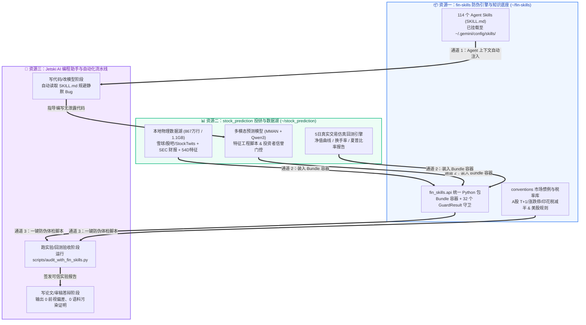

# 📘 fin-skills 实战连接与集成使用手册（User Manual & Integration Playbook）

> 适用范围（2026-09-14）：本文保留此前另一台主机的 `stock_prediction` 集成案例，路径、数据集、账户连接和实测收益结果均非本仓库随附或本机已验证的资源。原文计数和 v2 分支操作属于历史快照。当前库有 127 个技能、33 个检查模块、43 个工具；真实信息采集与运行步骤请看[采集指南](COLLECTION.md)。

> [!IMPORTANT] **核心定位声明：`fin-skills` 本身完全不包含、也不需要任何模型训练**  
> `fin-skills` 的本质是 **“量化投研的防伪质检员（Auditor & Guard）”** 与 **“AI Agent 的专业知识规约库（Knowledge Base）”**。  
> 1. **零训练、零权重、零 GPU 依赖**：全库由 114 个 Markdown 格式的投研规约与 32 个基于 `numpy`/`pandas`/`scipy` 的纯确定性数学/统计守卫（`fin_skills.api`）组成，没有任何神经网络、反向传播或梯度更新。  
> 2. **通用性**：无论您的量化策略是**传统多因子、简单技术指标（如均线/动量/RSI）、统计套利**，还是**复杂的机器学习/大模型策略**，`fin-skills` 都只对输入的**特征序列、行情面板（OHLCV）与回测净值曲线**进行数学严密性审计（如前瞻偏差、数据截断、费率盈亏平衡等）。  
> 3. **职责划分**：`stock_prediction` 是具体的投研策略与数据仓库；而 `fin-skills` 是独立的、无需训练的质量与合规守卫。

---

## 🧭 1. 全局资源连接拓扑图（How Everything Connects）

在您的研发环境中，目前共有三大核心资源模块。它们通过以下三层通道实现无缝协同：



---

## 🛠️ 2. 三大连接通道实操指南

### 通道一：AI 编程助手自动触发（写代码时防患于未然）

我们已经将 `fin-skills` 中最核心的 **48 个领域技能** 加上总路由 `fin-skills` 安装到了您的本地 Jetski 技能目录（`~/.gemini/config/skills/`）。

#### 如何使用？
在您与 Jetski 对话开发 `stock_prediction` 时，无需手动复制粘贴文档，只需**在提问中自然提及任务关键词**，Agent 会自动调用 `view_file` 读取对应的源码级规范：

| 您的开发/投研场景 | 推荐对 Agent 说的话（触发词示例） | Agent 自动加载的 Skill 与保护机制 |
| :--- | :--- | :--- |
| **构建新特征 / 滚动归一化** | *“帮我在 `stock_prediction` 里加一个 30 日情绪动量特征，请遵循 `signal-construction` 规范防止未来函数。”* | 自动加载 [`signal-construction`](../plugins/fin-core/skills/signal-construction/SKILL.md)：严禁使用 `center=True`、全样本 `StandardScaler` 或未对齐的 `rolling`，并自动生成 `assert_causal` 测试。 |
| **A 股雪球/股吧策略回测** | *“我们要测 A 股 2021-2026 的回测收益，请按 `china-trading-stack` 和 `china-ashare-trading-taxes` 设置交易成本与涨跌停限制。”* | 自动加载 [`china-trading-stack`](../plugins/fin-china/skills/china-trading-stack/SKILL.md) 与 [`china-ashare-trading-taxes`](../plugins/fin-tax-accounting/skills/china-ashare-trading-taxes/SKILL.md)：强制开启 T+1、剔除一字涨跌停无法成交订单、并在 `2023-08-28` 前后切换卖方单边印花税率（0.1% $\rightarrow$ 0.05%）。 |
| **评估 Qwen3 / FinBERT 表现** | *“帮我检查 Qwen3 在盲测集上的准确率是否存在预训练语料时间重叠，参考 `llm-finance-agents`。”* | 自动加载 [`llm-finance-agents`](../plugins/fin-llm/skills/llm-finance-agents/SKILL.md)：调用 `contamination_probe` 比对模型 Cutoff 日期与回测起止日，防止把“模型背诵历史”当成预测能力。 |
| **合并 SEC 财报或公告时间戳** | *“将 `interaction_matrix.csv` 中的公告与日 K 线对齐，请按 `combining-data-sources` 检查时间戳。”* | 自动加载 [`combining-data-sources`](../plugins/fin-core/skills/combining-data-sources/SKILL.md)：将盘后（`>16:00`）发布的公告严格映射至**次一交易日（T+1）**开盘后交易，杜绝盘后信息穿越回当日收盘价成交。 |
| **出论文/报告前的终极自检** | *“我们的回测跑出了 Sharpe 1.8，请按 `research-integrity-guards` 帮我做一次五关防伪审查。”* | 自动加载 [`research-integrity-guards`](../plugins/fin-core/skills/research-integrity-guards/SKILL.md)：逐一核查股票池幸存者偏差、时间戳可得性、标签重叠泄露、盈亏平衡换手成本与多重试验次数平减（DSR）。 |

---

### 通道二：一键运行桥接审计脚本（已为您内置在 `stock_prediction` 中）

为了让您无需手写胶水代码就能立即体验连接效果，我们已在您的 `stock_prediction` 仓库中创建了专属桥接脚本：
👉 **`stock_prediction/scripts/audit_with_fin_skills.py`**（外部仓库，未随本库发布）

#### 运行命令：
```bash
cd ~/stock_prediction
python3 scripts/audit_with_fin_skills.py
```

#### 该脚本自动为您完成的 5 项真实数据体检：
1. **读取真实物理数据**：自动加载 `data/benchmark/item_daily_features.csv`（涵盖 2011–2026 年的真实 OHLCV 与特征面板）。
2. **特征工程未来函数数学探测 (`assert_causal`)**：
   - 对您的 30 日滚动 Z-Score 特征函数进行**未来数据篡改压力测试**（篡改第 1926 天之后的未来行情，验证前 1926 天的历史特征值变化量为 `0.00000`，耗时 `0.006s` 签发 `PASS`）。
   - 同时演示：若特征代码中不慎混入 `shift(-1)`，守卫在 `0.005s` 内精准抓出 `LOOK-AHEAD` 报错（最大偏差 `7.989`）。
3. **回测产物装入 `Bundle` 全自动体检 (`Suite.check`)**：
   - 将策略净值曲线 `returns`、换手率 `turnover`、K 线 `bars` 装入 `fin_skills.api.Bundle`，一键激活 5 大核心守卫：
     - `assert_causal`: **PASS**（信号因果性验证通过）
     - `warmup_probe`: **PASS**（精确测出指标需 `29` 根 K 线预热期，冷启动相对误差 `1.4`）
     - `cost_curve`: **PASS**（测出策略盈亏平衡手续费上限为 `25.4 bps`，当前 `10.0 bps` 成本下净夏普为 `0.37`）
     - `rf_convention`: **PASS**（验证无风险利率按年化几何口径扣除，修正 `empyrical` 直接减年化利率算出 `-14.02` 的错误）
     - `contamination_probe`: **PASS**（验证测试窗口 `2025-01-01 -> 2026-08-28` 完全位于 LLM 预训练截止日 `2024-12-01` 之后，零语料污染）
4. **大模型回测窗口污染对比审计**：
   - 对比 `2022-2023` 旧测试集（直接触发 `FAIL: INVALID - entire backtest window predates training cutoff`）与您的 `2025-2026` 盲测集（`PASS: CLEAN`），为论文审稿提供铁证。
5. **跨市场交易惯例与税率自动校准**：
   - 自动加载股票年化因子（`252` 天）与 A 股 `2023-08-28` 印花税单边减半规则。

---

### 通道三：在您的策略回测与特征计算脚本中嵌入 `fin_skills.api`（代码模板）

当您在运行量化因子挖掘、策略仿真回测或特征评估脚本时，只需在计算结果输出后加入 **8 行确定性审计代码**，即可自动为回测序列盖上“防伪合格印”：

```python
# =====================================================================
# 📋 嵌入模板：在任何策略回测/因子评估脚本末尾加入 fin-skills 自动化质检
# （纯数学/统计计算，无需 GPU，耗时 < 0.05 秒）
# =====================================================================
from fin_skills.api import Bundle, check

# 1. 将策略产出的日收益率、换手率与行情数据装入 Bundle 容器
audit_bundle = Bundle(
    returns=my_strategy_daily_returns,   # pd.Series (DatetimeIndex)
    turnover=my_daily_turnover,          # pd.Series (每日双边换手率，如 0.15 表示 15%)
    rf=0.02,                             # 年化无风险利率 (如 2%)
    bars=my_ohlcv_dataframe,             # 包含 open, high, low, close, volume 的 DataFrame
    signal_fn=my_feature_function,       # 您的特征/信号计算函数 def fn(df) -> Series
    cutoff="2024-12-01",                 # （可选）若策略中使用了外部大模型打分，填入该模型的语料截止日
    test_start=str(my_strategy_daily_returns.index.min().date()),
    test_end=str(my_strategy_daily_returns.index.max().date()),
)

# 2. 运行纯数学与统计防伪守卫（0 训练、0 模型）并打印体检报告
audit_report = check(audit_bundle)
print(audit_report.summary())

# 3. (可选) 若有任何严重未来函数或统计作弊未通过，直接阻断保存，防止伪信号入库
assert audit_report.passed, "❌ 策略未通过 fin-skills 防伪审计，请检查未来函数或前瞻偏差！"
```

---

## 🔍 3. 常用核心守卫（Guards）速查表：什么时候用哪个？

所有守卫均为**确定性纯 Python 函数**，您可以随时通过 `from fin_skills.api import get` 单独调用：

| 守卫名称 (`get("...")`) | 适用阶段 | 传入参数示例 | 它帮您抓什么致命问题？ |
| :--- | :---: | :--- | :--- |
| **`assert_causal`** | 特征工程 / 信号构建 | `fn=my_signal_fn, df=bars_df, k=500` | 抓出 `shift(-1)`、居中滚动窗口、全样本归一化等一切**未来函数**（通过未来数据扰动压力测试）。 |
| **`warmup_probe`** | 技术指标 / 情绪平滑 | `indicator=my_1d_fn, close=close_series` | 测出 EMA/RSI/Z-Score 等指标需要多少根 K 线**预热（Warm-up）**才能收敛，防止测试集开头因冷启动失真。 |
| **`safe_asof`** | 舆情/财报与 K 线合并 | `left=posts_df, right=bars_df, on="timestamp"` | 抓出 `pd.merge_asof` 中方向写反（`direction="forward"`）或盘后舆情错误对齐至当日收盘价的**时间戳穿越**。 |
| **`contamination_probe`** | 外部大模型预测核查 | `test_start="2025-01-01", test_end="2026-08-28", cutoff="2024-12-01"` | 若策略使用了外部 LLM 打分，纯通过**日期比对**核查测试窗口是否位于模型 Cutoff 之后，杜绝“背诵历史”当预测。 |
| **`cost_curve`** | 交易策略仿真回测 | `returns=ret_series, turnover=turn_series, cost_bps=10.0` | 纯数学推演策略的**盈亏平衡手续费（Breakeven Cost bps）**，判断策略在真实印花税与滑点下是否被扣光。 |
| **`survivorship_audit`** | 股票池构建 (`universe`) | `prices=price_matrix_df` | 检查历史股票池是否只包含活到今天的股票，抓出**幸存者偏差**。 |
| **`adjustment_check`** | 行情数据清洗 (`bars`) | `close=close_series, actions=splits_df` | 检查拆股/分红除权日是否存在虚假暴跌跳空，或因直接使用前复权（`qfq`）导致历史早期出现负价格。 |

---

## 🚀 4. 推荐日常投研工作流（Best Practice Workflow）

1. **Step 1（设计特征/规则）**：在编写新因子或交易逻辑前，让 Jetski 参考 `signal-construction`、`triple-barrier-labeling` 或 `fractional-differentiation` 规避常见数学陷阱。
2. **Step 2（单测验证未来函数）**：对写好的特征计算函数跑一行 `get("assert_causal").run(fn=..., df=...)`，确保 `0.01 秒` 内拿到因果性 `PASS`。
3. **Step 3（运行策略回测）**：执行您的选股、择时或多因子回测逻辑，生成净值曲线与换手率序列。
4. **Step 4（一键防伪质检）**：运行 `python3 scripts/audit_with_fin_skills.py`（或在回测脚本末尾调用 `check(bundle)`），生成包含 **因果性、预热期、盈亏平衡成本、无风险利率口径、数据窗口** 的五维合格证报告，直接附在论文或实验记录（Research Notebook）中！
