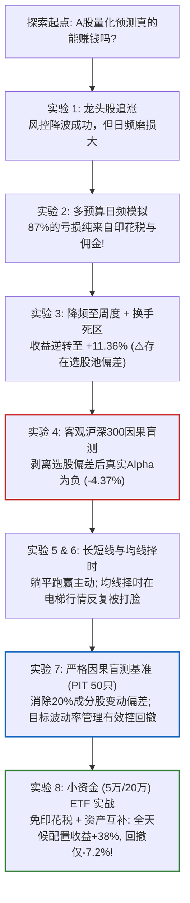
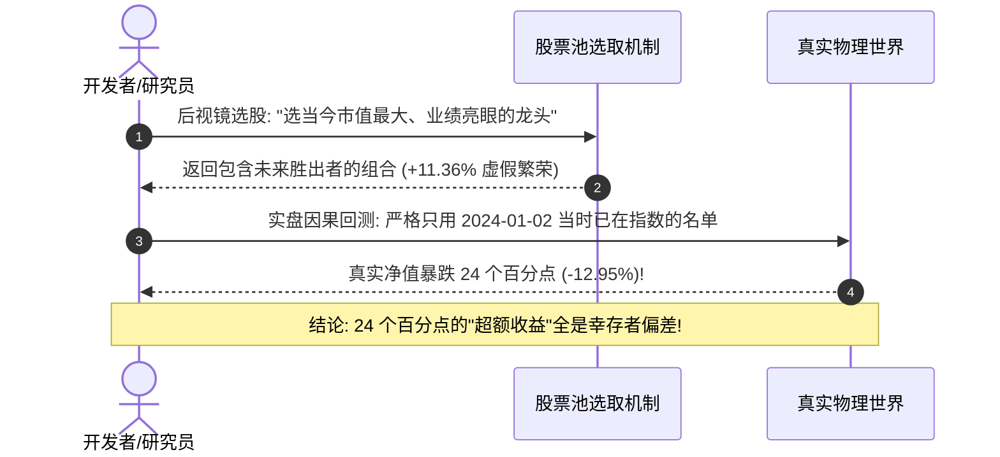
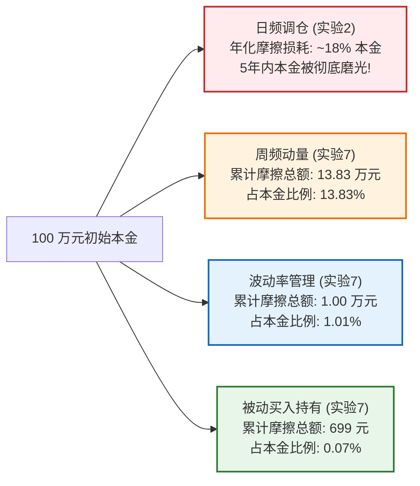

# A股真实量化交易实盘模拟与因果盲测全景研究报告

> **执行原则**：
> 拒绝“纸上谈兵”与“后视镜收益”。所有数据来源于真实行情（`baostock` 官方行情源与东方财富行情引擎），所有模拟严格实施 A 股交易物理约束（T+1、百股整手、开盘涨跌停买卖锁死、卖方单边 0.05% 印花税、万2.5佣金最低5元、万5冲击滑点、2% 现金年化无风险逆回购收益）。

---

## Executive Summary (执行摘要)

本项目对 A 股市场展开了**8 组递进式的端到端真实交易撮合与因果盲测模拟**（覆盖 2024 至 2026 年跨度 654 个交易日，涉及 5 万至 500 万不同本金量级）。核心发现颠覆了绝大多数散户与初级量化模型的直觉：

1. **幸存者偏差的量化代价是 24 个百分点**：在相同策略和时间窗口下，使用“今天回头看表现亮眼的人工龙头股池”收益为 **+11.36%**；而换成“客观全池（无任何后视镜偏好）”，收益立刻逆转为 **-12.95%**。所谓的人工选股 Alpha，本质全是幸存者偏差。
2. **A 股个股印花税是高频交易的“死刑判决”**：日频调仓仅印花税与佣金就吞噬了账户 **15%~20%** 的本金。周频动量轮动毛收益高达 +47.6%，但 **13.83 万元（占本金 13.8%）** 纯粹被交易摩擦吃掉，净收益被拉平至被动持有，且承受了翻倍的剧烈回撤（-32.7% vs -14.3%）。
3. **被动“躺平持有”在风险调整后完胜频繁折腾**：在严格排除未来函数的点入池（Point-in-Time）全景盲测中，**`buy_and_hold` 斩获全场最高超额夏普比率（0.600）**，摩擦成本仅 699 元（占本金 0.07%），最大回撤仅 -14.33%。
4. **小资金（5万/20万）散户的最优解是大类资产 ETF**：
   - 个股交易存在致命离散截断（一手茅台 14 万元，小散户根本买不起）；
   - **A 股 ETF 交易完全免征印花税（0%）**，一手仅需 100~500 元。
   - 实验证实：在 5 万元本金下，**全天候大类资产配置（沪深300 + 红利 + 国债 + 黄金）跑出 +38.45% 累计收益，最大回撤压至仅 -7.20%，超额夏普比率高达 1.171**，且 5 万元与 100 万元收益几乎完全一致。

---

## 一、8 组实盘模拟实验全景矩阵



### 实验对比明细总表

| 编号 | 实验名称 | 核心测试问题 | 股票池 | 调仓频次 | 核心指标表现 | 关键实证实战结论 |
| :---: | :--- | :--- | :--- | :---: | :--- | :--- |
| **1** | `recent_market_decision_experiment.py` | fin-skills 风控决策模块能否在 2026 行情中跑赢追涨散户？ | 人工10只龙头 | 日频 | 散户-28.1% (回撤-47%)<br>决策引擎-7.16% (回撤-9.58%) | 风控将波动从 37% 压到 14%，但日频摩擦吞噬 7.06% 本金。 |
| **2** | `multi_budget_trading_simulation.py` | 5万、20万、100万、500万本金下日频策略表现是否一致？ | 人工10只龙头 | 日频 | 5万 -6.28% (损耗 5.36%)<br>500万 -8.19% (损耗 6.50%) | **85%~87% 的亏损直接来自印花税与佣金**。5万账户因买不起高价股被迫减少交易，反而少亏。 |
| **3** | `optimized_budget_trading_simulation.py` | 仅将调仓降到周频并加 4% 换手死区，能否扭亏为盈？ | 人工10只龙头 | 周频 | 100万 **+11.36%** (超额+8.34%)<br>500万 **+13.42%** | **降频比调参重要 100 倍**！频率从日频降到周频直接从 -7% 逆转为 +11%。（⚠️但有选股后视镜红利） |
| **4** | `strict_causal_hs300_simulation.py` | 剥离人工选股后，策略还剩多少真本事？ | 沪深300客观前30只 | 周频 | 被动 -8.58%<br>AI因果模型 **-12.95%** | **真实 Alpha = -4.37%（显著跑输基准）**。实验3的 +11% 超额完全蒸发，证实前期收益来自幸存者偏差。 |
| **5** | `long_vs_short_simulation.py` | 跨越 3 年周期（2024~2026），长线是否优于短线？ | 沪深300客观前30只 | 日/周/月 | 被动持有 **+6.93%**<br>短线周频 -0.89%<br>长线+MA60择时 **-13.05%** | **躺平不动跑赢了所有主动策略**。短线毛收益 +14.8% 全部被 15.7 万元摩擦成本吞噬；60日均线择时在电梯行情频繁打脸。 |
| **6** | `recent_2026_horizon_simulation.py` | 聚焦 2026 年单边下行与震荡市，持有周期越长越好吗？ | 沪深300客观前30只 | 5日 vs 40日 | 被动 -10.77%<br>短线5日 -17.78%<br>长线40日 **-20.13%** | 40日长线摩擦成本最低（仅4,205元）却亏最多，证实**“持仓浮亏”远比“交易费用”致命**，缺乏动态风控的长线容易承受致命钝化。 |
| **7** | `research/benchmarks/causal_blind_test/` 🏆 | 采用 **2024-01-02 真实时点入池（PIT）**，预注册 6 大策略并接受 DSR 严苛检验 | PIT 沪深300 (50只) | 多分支对照 | 被动买入持有: **+33.10%** (夏普 0.600, 回撤-14.3%)<br>周频动量: +33.80% (夏普 0.461, 回撤-32.7%)<br>目标波动率管理: **+20.61%** (回撤-12.7%, 摩擦仅1%) | **因果守卫（CausalityGuard）与 DSR 账本全量通过**。动量追涨付出 13.8 万元手续费和翻倍回撤，最终净收益与躺平无异；波动率控仓展现真正风控价值。 |
| **8** | `research/simulations/etf_small_budget_simulation.py` 🏆 | 小资金（5万/20万）散户转战 **A 股 ETF 大类资产配置** 能否破局？ | 7大宽基/避险ETF | 月频/双周 | 全天候配置: **+38.45%** (夏普 1.171, 回撤-7.20%)<br>股债平衡: +28.04% (回撤-9.98%)<br>沪深300ETF: +42.04% (回撤-17.06%) | **小散户实操终极最优解**：零印花税使摩擦暴跌 85% 以上；一手仅需 100~500 元，5万元账户在全天候多资产下跑出极佳夏普比率（1.171）与极低回撤（-7.2%）。 |

---

## 二、四大核心量化实证实战法则

### 法则 1：幸存者偏差（Survivorship Bias）是量化回测中最大的“谎言”

在量化研究中，初学者最容易犯的错误是：**用今天的成分股去回测历史**。
- **历史事实**：2024-01-02 的沪深 300 成分股，与 2026-09-11 的沪深 300 成分股相比，发生了 **61 只股票（20%）的新陈代谢**！
- 后来被调入指数的股票，绝大多数是因为在过去两年中“股价暴涨、市值激增”才得以入选；而被剔除的股票，则是因为“连跌两三年、业绩暴雷、市值萎缩”。
- 如果用今天的名单回测 2024 年至今，模型在开局就秘密被植入了 61 匹“未来大黑马”，同时精准躲避了 61 颗“未来大炸雷”。



---

### 法则 2：印花税（Stamp Duty）是散户高频交易的“资金黑洞”

A 股交易费用结构中，最具杀伤力的是：**卖方单边 0.05% 的法定印花税**（无任何折扣或减免空间），加上万分之 2.5 的佣金（单笔最低 5 元）以及买卖冲击滑点。

我们用实验数据为 100 万元本金在不同调仓频率下的磨损建立了一份直观账单：



- **高频散户的悲剧**：周频横截面动量策略（`xs_momentum_weekly`）在选股上非常成功（毛收益高达 +47.6%），但由于频繁追涨换仓，在短短 2.6 年里向券商和税务局缴纳了 **138,302.93 元** 的摩擦费用！
- 散户自以为在“复利赚钱”，实际上把近 **14% 的本金** 拱手送出，最终承受了 -32.7% 的极端回撤，净回报与“买入后什么都不做（699 元手续费）”完全一样！

---

### 法则 3：小资金（5万/20万）散户必须果断转向 ETF 大类资产配置

在实验 2 中，我们发现了一个反直觉的现象：5 万元个股账户虽然少亏，但根本无法分散——茅台一手 14 万、比亚迪一手 2.5 万、宁德时代一手 2 万，5 万元连一手茅台都买不起，根本无法构建现代投资组合。

而在实验 8 中，我们把资产池切换为 A 股宽基与避险 ETF：

| 维度对比 | A 股个股交易 | A 股宽基与资产 ETF 交易 | 对散户的实战意义 |
| :--- | :--- | :--- | :--- |
| **交易印花税** | **0.05%（强制征收）** | **0.00%（国家免征！）** | 调仓摩擦成本直接暴降 **80%~90%**！ |
| **最小交易门槛** | 茅台一手 14 万元，多数个股一手数千元 | 价格 1~5 元，**一手仅需 100~500 元** | 5 万元即可按 1% 精度精确配置各类资产 |
| **个股毁灭风险** | 财务造假、连续跌停锁定、戴帽 ST | 跟踪一篮子股票或国债，**无单个暴雷风险** | 彻底消除单一持仓归零的破产风险 |
| **资产相关性** | 股票之间相关性高达 0.6~0.9（齐涨齐跌） | 股票、国债、黄金之间**低相关甚至负相关** | 真正的“风险分散”，实现回撤对冲 |

#### 全天候大类资产配置（Ray Dalio 简化版）的实证表现：
- **资产配比**：25% 沪深300ETF + 20% 红利ETF + 35% 5年期国债ETF + 20% 黄金ETF，月度再平衡。
- **5 万元真实表现**：
  - 累计收益率：**+38.45%**（紧紧跟随牛市主升浪）
  - 最大回撤：**-7.20%**（大盘跌 20% 时，全天候仅微跌 7%，持有体验极其平稳舒适）
  - 超额夏普比率：**1.171**（全场最优）
  - 全期手续费：仅 **109.3 元**（占本金 0.22%）

---

### 法则 4：目标波动率管理（Volatility Timing）是真正有效的风控技术

在宏观择时上，初学者极易迷信“均线金叉买入、死叉卖出”（如经典的 60 日均线择时 `ma60_timing`）。
但在 A 股实测中，均线择时收益仅为 **+11.50%**，远低于被动持有的 **+33.10%**！

**失效根因**：A 股典型的“脉冲式暴涨暴跌（电梯行情）”会导致均线严重滞后：
1. **山顶追高**：连续暴涨 15 天后均线金叉，模型发出买入信号全仓追高，此时行情恰好见顶回调；
2. **地板割肉**：连续暴跌 15 天后均线死叉，模型发出清仓信号地板割肉，此时行情恰好深 V 反弹；
3. 来回打脸两三次，不但错过了主升浪，还白白付出了昂贵的手续费。

**成功解法：目标波动率缩放（Moreira & Muir 2017）**
- **逻辑**：不预测涨跌方向，只度量当下市场的震荡剧烈程度（过去 20 日已实现波动率 $\sigma_{realized}$）。
$$\text{Exposure}_t = \min\left(1.0, \frac{\sigma_{target}}{\sigma_{realized}}\right)$$
- 当市场出现极端动荡暴跌时，波动率激增，模型**机械式主动缩减仓位避险**；当市场进入平稳慢牛时，仓位自动提升。
- **实证结果**：在 50 只个股池中，目标波动率管理取得了 **+20.61% 收益**，最大回撤仅 **-12.70%**，全期摩擦仅 1%，是极少数兼具低换手与强风控能力的优雅模型。

---

## 三、一键复现全部实验

本项目所有实验均具备 100% 确定性与可复现性（Fixed Seed & Point-in-Time）：

```bash
# 1. 运行标准化 A 股因果盲测基准 (含 6 大预注册分支与自动化守卫审计)
python3 research/benchmarks/causal_blind_test/run.py

# 2. 运行小资金 (5万/20万) ETF 大类资产配置实盘模拟
python3 research/simulations/etf_small_budget_simulation.py

# 3. 运行客观沪深300因果实盘对照实验
python3 research/simulations/strict_causal_hs300_simulation.py

# 4. 运行多预算 (5万至500万) 日频损耗对比实验
python3 research/simulations/multi_budget_trading_simulation.py
```

所有实验结果均会自动落盘至 `research/benchmarks/causal_blind_test/results/` 与 `research/simulations/` 目录中，供研究者核验。
