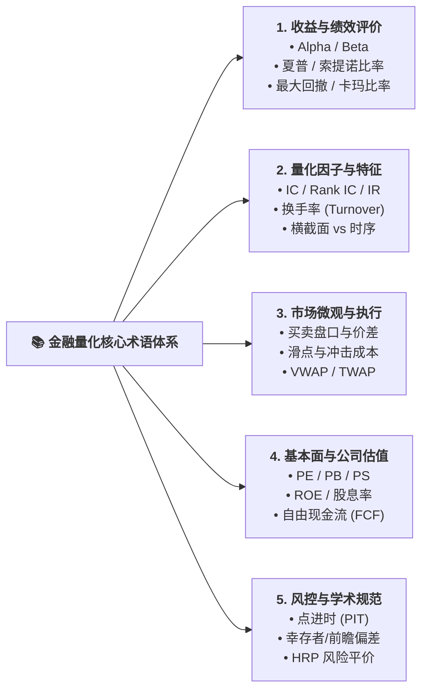
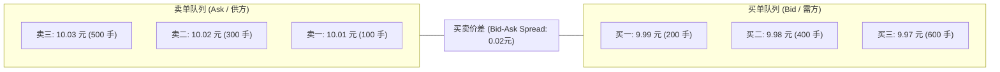

# 📖 经济金融与量化交易核心术语速查手册 (Financial & Quantitative Glossary for AI Practitioners)

> **导读**：本项目旨在架起人工智能（AI/ML）与金融量化（Quantitative Finance）之间的桥梁。
> 金融界有许多独特的专业黑话与衡量指标。为了让计算机背景、算法工程师以及量化小白能够零障碍阅读文献、分析策略和构建特征，本文档精选了最核心的 **50+ 经济金融与量化术语**。
> 每个术语均提供 **【大白话解读】**、**【数学定义】** 与 **【AI/机器学习通俗类比】**，助你快速建立专业的金融认知框架。

---

## 🧭 术语分类索引 (Glossary Map)

---

## 一、收益与投资绩效评价 (Return & Performance Metrics)

### 1. Alpha（阿尔法，超额收益）
* 📌 **大白话解读**：**凭真正本事赚到的超额利润**。比如大盘今年跌了 5%，但你的投资组合赚了 10%，那高出来的 15% 就是你跑赢大盘的 Alpha。
* 📐 **数学定义**：
  $$\alpha = R_p - \left[ R_f + \beta (R_m - R_f) \right]$$
  其中 $R_p$ 为投资组合收益，$R_f$ 为无风险利率，$R_m$ 为市场大盘收益。
* 🤖 **AI / 计算机类比**：类似于模型在剔除掉“简单多数类预测（Majority Baseline）”或“随机猜测”后，真正学到的有效特征泛化增益。

### 2. Beta（贝塔，系统性风险暴露）
* 📌 **大白话解读**：**随大流、看天吃饭的程度**。如果某股票的 Beta = 1.5，大盘涨 1%，它往往涨 1.5%；大盘跌 1%，它往往暴跌 1.5%。
* 📐 **数学定义**：
  $$\beta = \frac{\text{Cov}(R_p, R_m)}{\text{Var}(R_m)}$$
* 🤖 **AI / 计算机类比**：输入数据本身的全局均值漂移（Global Covariate Shift）。

### 3. Sharpe Ratio（夏普比率）
* 📌 **大白话解读**：**性价比之王**。每承担 1 单位的波动风险，能换来多少超额回报。夏普比率越高，说明收益越稳定，而不是靠心惊肉跳的大赌大赢赚来的。
* 📐 **数学定义**：
  $$\text{Sharpe} = \frac{\mathbb{E}[R_p - R_f]}{\sigma_p} \times \sqrt{252}$$
  （通常乘以 $\sqrt{252}$ 进行年化处理，252 为一年真实交易日天数）。
* 🏆 **工业界评价基准**：
  - `< 1.0`：较弱，很难覆盖实盘摩擦；
  - `1.0 ~ 2.0`：良好，合格的量化对冲基金；
  - `> 2.0`：顶级策略，极具投资价值。

### 4. Maximum Drawdown（Max DD，最大回撤）
* 📌 **大白话解读**：**从历史最高点跌到最低谷时，账户最多亏了百分之几**。衡量一个策略最黑暗时期会给投资者带来多大心理痛苦。
* 📐 **数学定义**：
  $$\text{MaxDD}_t = \max_{\tau \le t} \left( \frac{\max_{s \le \tau} V_s - V_\tau}{\max_{s \le \tau} V_s} \right)$$
* 🤖 **AI / 计算机类比**：类似于验证集损失（Validation Loss）最严重的退化尖峰（Worst-case Spike）。

### 5. Calmar Ratio（卡玛比率）
* 📌 **大白话解读**：**年化收益率与最大回撤的比值**。比如年化赚 20%，历史最大回撤只有 10%，卡玛比率就是 2.0。卡玛比率越高，说明回撤控制得越好。

---

## 二、量化因子与特征质量指标 (Quant Alpha & Feature Metrics)

### 6. IC (Information Coefficient，信息系数)
* 📌 **大白话解读**：**你的特征预测与未来真实股价涨跌之间的相关性**。
* 📐 **数学定义**：第 $t$ 期预测得分向量 $\hat{\mathbf{y}}_t$ 与未来真实收益率向量 $\mathbf{r}_{t+1}$ 之间的皮尔逊相关系数：
  $$\text{IC}_t = \text{Corr}(\hat{\mathbf{y}}_t, \mathbf{r}_{t+1})$$
* 🤖 **AI 视角**：在金融世界，**IC 能达到 0.03 ~ 0.05 已经是极其强大的有效特征**；不要用自然语言处理或计算机视觉中 0.8、0.9 的相关性标准来衡量金融时序数据。

### 7. Rank IC（秩相关系数）
* 📌 **大白话解读**：不比具体预测数值，而是比**排序（排名）**的一致性（斯皮尔曼等级相关）。防止个别极端暴涨暴跌的离群值（Outliers）扭曲了相关系数。

### 8. IR (Information Ratio，信息比率)
* 📌 **大白话解读**：**因子表现的稳定性**。IC 的均值除以 IC 的标准差：
  $$\text{IR} = \frac{\text{Mean}(\text{IC})}{\text{Std}(\text{IC})} \times \sqrt{252}$$
  IR 越高，说明这个 AI 因子不仅今天有用，而且天天表现稳定，不是“三天打鱼两天晒网”。

### 9. Turnover Rate（单边换手率）
* 📌 **大白话解读**：**你的投资组合换股票有多勤快**。如果今天把持仓里的股票全卖了换成新的，单边换手率就是 100%。换手率直接决定了你要给券商和国家交多少印花税与佣金。

### 10. Cross-Sectional vs Time-Series（横截面 vs 纯时序）
* **纯时序 (Time-Series)**：只盯着一只股票（如贵州茅台），看它过去 30 天走势预测它明天是涨是跌。
* **横截面 (Cross-Sectional)**：把全市场 500 只股票放在同一天纵向切片打分，挑出今天最强的前 10 只和最弱的 10 只（做多最强者，做空最弱者）。主流专业量化基本都以横截面为主。

---

## 三、市场微观结构与执行术语 (Market Microstructure & Execution)

### 11. Order Book（盘口订单簿 / L2 行情）
* 📌 **大白话解读**：交易所实时的买卖挂单排队队列。
  - **买一至买五（Bids）**：想买的人愿意出的最高价格；
  - **卖一至卖五（Asks）**：想卖的人愿意出的最低价格。

### 12. Bid-Ask Spread（买卖买卖价差）
* 📌 **大白话解读**：卖一价与买一价之间的差额。流动性越好的大盘蓝筹股，价差通常只有 1 分钱（0.01 元）；流动性枯竭的小盘股，价差可能高达数毛钱，一进一出立刻亏损。

### 13. Slippage（滑点）
* 📌 **大白话解读**：**理想价格与实际成交价格之间的偏差**。你想在 10.00 元买入，但由于网络延迟和买单冲击，最后撮合成交在 10.05 元，这 0.05 元就是滑点。

### 14. Market Impact（市场冲击成本）
* 📌 **大白话解读**：**你的大资金把股价买贵了**。如果你账户有 5000 万，直接市价单买入，会瞬间把卖一、卖二、卖三全部吃光，导致股价被你自己的买单强行推高 2%，这就是冲击成本。

### 15. VWAP / TWAP（成交量加权平均价 / 时间加权平均价）
* 📌 **大白话解读**：**大单智能拆单算法**。为了避免瞬间下大单砸乱盘口，算法会自动把 1000 万拆解成几百个小单，在全天按照历史成交量节奏（VWAP）或均匀时间节奏（TWAP）悄悄吃进。

---

## 四、公司基本面与估值指标 (Fundamentals & Valuation)

### 16. PE (Price-to-Earnings Ratio，市盈率)
* 📌 **大白话解读**：**回本年限**。当前公司股价除以每股盈利。如果 PE = 15，意味着按照公司目前的赚钱速度，你的投资需要 15 年通过净利润回本。PE 越低通常代表估值越便宜。
* 📐 **数学定义**：
  $$\text{PE} = \frac{\text{每股市价}}{\text{每股收益 (EPS)}} = \frac{\text{公司总市值}}{\text{年度净利润}}$$

### 17. PB (Price-to-Book Ratio，市净率)
* 📌 **大白话解读**：**股价相对于公司净资产的溢价**。如果 PB < 1（破净），意味着可以用低于公司账面净资产的价格买下这家公司，常见于银行、钢铁、煤炭等传统资产密集型行业。

### 18. ROE (Return on Equity，净资产收益率)
* 📌 **大白话解读**：**巴菲特最看重的赚钱能力指标**。公司用股东投的每一块钱，一年能净赚多少钱。长期来看，股票的年化收益率往往趋近于公司的 ROE。
* 📐 **数学定义**：
  $$\text{ROE} = \frac{\text{净利润}}{\text{股东权益}} \times 100\%$$

### 19. Dividend Yield（股息率 / 现金分红率）
* 📌 **大白话解读**：**每年拿到的真金白银利息**。如果股价 10 元，公司每股派发 0.5 元现金红利，股息率就是 5.0%，高于很多银行定存。在熊市中，高股息股票具有极强的防御抗跌属性。

---

## 五、量化风控与学术防作弊术语 (Risk & Integrity)

### 20. Point-in-Time (PIT，点进时数据)
* 📌 **大白话解读**：**绝对还原历史当时真实可见的数据状态**。
* ⚠️ **学术大坑**：上市公司在 2024 年发布了 2023 年年报，但在 2025 年因为审计问题“追溯调整修补了 2023 年利润”。如果在回测 2024 年时直接使用修补后的数据，就犯了前瞻作弊。真正 PIT 数据库会严格记录：2024 年当时市场上能看到的数据到底是哪一个版本。

### 21. Survivorship Bias（幸存者偏差）
* 📌 **大白话解读**：**只看活下来的赢家，忽略死在路上的炮灰**。
* 在 2026 年挑选“过去涨得最好的 10 只股票”做历史回测，就是典型的幸存者偏差。回测必须包含历史上退市的、摘牌的、暴雷的所有客观成分股。

### 22. Look-ahead Bias（前瞻偏差 / 未来函数）
* 📌 **大白话解读**：**在昨天偷偷看了明天的答案**。
* 比如在构建特征时误用了当日全天的收盘价或最高价去决定上午开盘该买什么，导致特征带有未来信息。

### 23. HRP (Hierarchical Risk Parity，分层风险平价)
* 📌 **大白话解读**：机器学习图聚类在资产配置中的应用。利用相关性层次聚类，把资产分为不同产业集群，把资金风险均匀分配给各个板块，**防止投资组合在单一概念（如AI板块、新能源）过度扎堆爆仓**。

### 24. Kelly Criterion（凯利准则）
* 📌 **大白话解读**：**决定这把下注多少的数学神律**。根据你的胜率和盈亏比，精确计算出能让账户财富实现最大几何级数复利增长的最优仓位比例。

---

## 💡 常用指标速查对照总表

| 术语简称 | 英文全称 | 中文译名 | 优选方向 | 核心应用场景 |
| :--- | :--- | :--- | :---: | :--- |
| **$\alpha$** | Alpha | 阿尔法 (超额收益) | 越高越好 | 衡量策略独立于大盘的选股能力 |
| **$\beta$** | Beta | 贝塔 (市场联动) | 视需求定 | 衡量策略对大盘涨跌的敏感程度 |
| **SR** | Sharpe Ratio | 夏普比率 | 越高越好 | 评估每单位风险换取的回报性价比 |
| **MaxDD** | Maximum Drawdown | 最大回撤 | 越小越好 | 评估策略极端行情下的风险承受底线 |
| **IC** | Information Coefficient | 信息系数 | $|IC| > 0.03$ | 评估特征对未来收益的线性预测能力 |
| **Rank IC** | Rank IC | 秩相关系数 | $> 0.03$ | 评估因子排序单调性（防离群值干扰） |
| **IR** | Information Ratio | 信息比率 | $> 0.5$ | 衡量因子超额收益的月度稳定性 |
| **Turnover** | Turnover Rate | 换手率 | 越低越好 | 监控调仓频率，控制印花税与滑点消耗 |
| **ROE** | Return on Equity | 净资产收益率 | $> 15\%$ | 筛选长期具备高盈利护城河的企业 |
| **PE** | Price-to-Earnings | 市盈率 | 相对行业偏低 | 评估股票当前价格是否被低估或泡沫化 |
| **PIT** | Point-in-Time | 点进时约束 | 必须严格满足 | 确保历史回测绝不引用未来修正数据 |

---
*本文档由 `stock_prediction` 核心研究团队维护，持续扩充中。*
