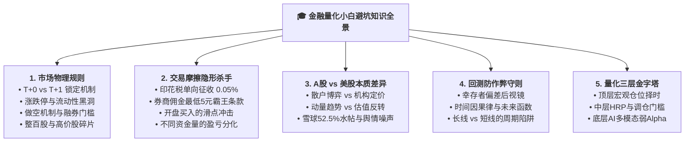
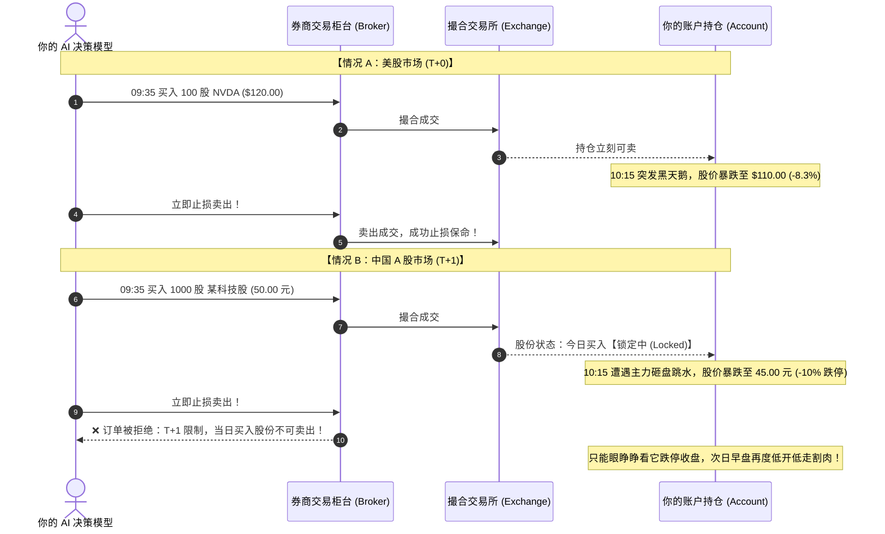
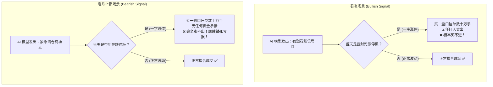
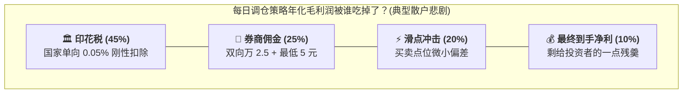
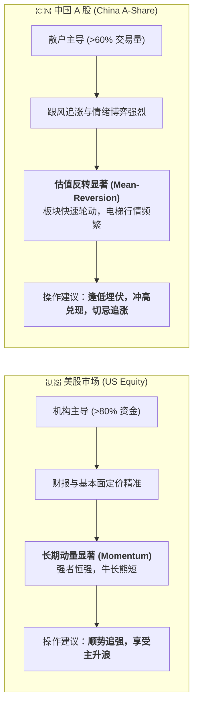
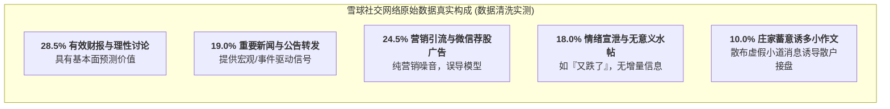
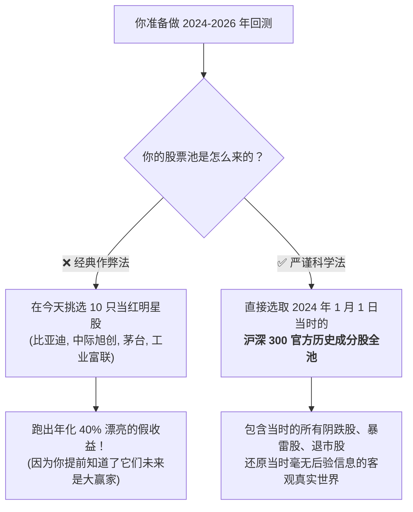
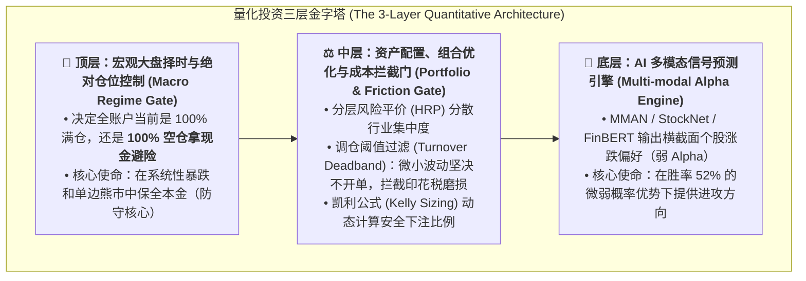

# 📊 金融量化与实盘交易背景知识指南 (Quantitative Finance Primer for AI Practitioners)

> **导读**：本项目（`stock_prediction`）基于多模态深度学习（如 MMAN、CapTE）预测金融市场走势。然而在真实量化投资中，**“学术模型的准确率”与“实盘能否赚到真金白银”之间存在着巨大的鸿沟**。
> 本文档专为计算机背景、算法工程师以及开源社区初学者编写。通过大量**对比图表、状态流程图、真实账本与机制推演**，帮助你一站式搞懂金融市场的底层物理规则，避免陷入“回测天下无敌，实盘一触即溃”的陷阱。

---

## 🧭 知识全景架构 (Knowledge Roadmap)

---

## 一、市场物理规则：为什么真实交易不是打游戏？

在很多深度强化学习或模拟器里，智能体可以无摩擦地每秒买卖。但在真实的撮合交易所中，法律与交易制度构建了一道道不可逾越的物理壁垒。

### 1.1 T+0 vs T+1：A 股的“当天不可撤悔”机制

* **美股 / 港股（T+0 回转交易）**：当天买入，随时可以止损卖出。
* **中国 A 股（T+1 结算制度）**：在第 $t$ 日买入的股票，**当天系统物理锁死，绝对禁止卖出**，必须等到 $t+1$ 日开盘才解冻。

> 💡 **给算法小白的启示**：
> 在 A 股做量化，“买入”是一个沉重的承诺。一旦在开盘追高买入假突破，当天就彻底失去了风险处置权。因此，**A 股模型必须具备极其强大的“防追高”与“假突破过滤”能力**。

---

### 1.2 涨跌停限制与流动性黑洞

A 股主板股票涨跌幅限制通常为 **±10%**（创业板/科创板为 ±20%，ST 股票为 ±5%）。在极端行情下，涨跌停会制造完全不可成交的“流动性黑洞”：

| 现象类型 | 散户 / 假量化代码的错误假设 | 真实市场的残酷现实 |
| :--- | :--- | :--- |
| **一字涨停追买** | 假设能以当日收盘价买入，并在第二天吃到溢价 | 买单挂在队尾，全天成交量极小，**开盘买不进，散户能买进时往往是主力开板出货接盘** |
| **一字跌停抛售** | 假设看到破位能立刻止损，控制回撤在 -5% 以内 | 跌停板无任何买家承接，**卖单整天排队排不出去，只能连续吃 2~3 个跌停板断崖式亏损** |

---

### 1.3 做空（Short-Selling）机制差异

| 比较维度 | 美股市场 (US Market) | A 股市场 (China A-Share) | 对量化策略的决定性影响 |
| :--- | :--- | :--- | :--- |
| **个股融券做空** | 极度便捷，券源丰富，成本低廉 | 融券券源高度稀缺，且受政策严格监管，散户几乎无法参与 | **A 股无法赚取“单边做空下跌”的利润** |
| **衍生品对冲** | 反向 ETF、个股期权、指数期权工具完备 | 仅有股指期货（IF/IC/IM）和少数 ETF 期权，且资金门槛高达 50 万 | 熊市中中小资金很难进行完全市场中性化对冲 |
| **熊市生存策略** | 多空对冲（Long-Short），做空垃圾股获利 | **只有一种保命方式：100% 清仓空仓，持有现金** | **“持币不买”是 A 股最重要的超额收益来源** |

---

## 二、交易摩擦隐形杀手：为什么高胜率依然会巨亏？

在真实交易中，**“换手率（Turnover）”是一把无情的绞肉机**。

### 2.1 印花税与券商佣金的真实账本

以当前 A 股标准费率测算：
1. **印花税**：**0.05%（单向征收，仅卖出时收取）**
2. **券商佣金**：**万分之 2.5（0.025%）**，**单笔最低收费 5 元**
3. **滑点与冲击**：约 **万分之 5.0（0.05%）**

#### 真实测算：不同调仓频率在 100 万元账户上的年化摩擦损耗

下表清晰展示了为什么**“天天换手的 AI 策略必死无疑”**：

| 调仓节奏 | 平均持仓天数 | 年化单边换手率 | 100万本金年均交易笔数 | 一年给券商和国家交的税费 | 本金被机械磨损比例 | 策略需要多大毛收益才能保本？ |
| :--- | :---: | :---: | :---: | :---: | :---: | :---: |
| **超高频（每日调仓）** | 1~2 天 | 800% ~ 1200% | 约 500 ~ 800 笔 | **约 150,000 ~ 200,000 元** | **-15% ~ -20%** | **至少 +20% 才能打平！** |
| **短线波段（周度调仓）** | 5 天 | 200% ~ 300% | 约 150 ~ 200 笔 | **约 35,000 ~ 50,000 元** | **-3.5% ~ -5.0%** | **+5% 才能保本** |
| **中长线（月度/双月调仓）** | 20~40 天 | 40% ~ 80% | 约 30 ~ 50 笔 | **约 6,000 ~ 12,000 元** | **-0.6% ~ -1.2%** | **+1.2% 即可享受净利润** |

> 💡 **黄金法则**：
> **如果你的 AI 每次预测的超额利润只有 0.4%，而买卖一次的硬性成本需要 0.15%，你多调仓一次就是给券商打工一次。“管住手，降低换手频率”，比提升 1% 的模型准确率管用十倍！**

---

### 2.2 资金规模的残酷现实：5 万元 vs 500 万元

很多小白误以为：“策略在 500 万账户上赚 10%，在 5 万账户上肯定也能赚 10%。”
**大错特错！在 A 股，资金体量直接改变了策略的物理可行性**：

| 维度对比 | 5 万元小资金账户 (小散户) | 500 万元大资金账户 (量化机构) | 底层原因分析 |
| :--- | :--- | :--- | :--- |
| **高价股准入门槛** | ❌ **基本买不起** (茅台1手13万，中际旭创1手9万) | ✅ **随心配置** (任意配置 5%~10% 权重) | A 股必须整百股买入，小资金被迫放弃全市场最优质的高价成长龙头 |
| **最低 5 元佣金陷阱** | ⚠️ **实际费率被暴击放大** (买2000元股票收5元，实际佣金率 **0.25%**，高出10倍) | ✅ **享受极致万 2.5 最低费率** (每笔交易额数万元，完全均摊) | 固定金额收费对小资金存在毁灭性的边际惩罚 |
| **现金碎片拖累 (Cash Drag)** | ⚠️ **10%~15% 资金被迫闲置** (凑不齐一手只能躺在现金里) | ✅ **资金利用率 > 99.5%** (碎屑资金占比忽略不计) | 小资金账户的组合权重严重失真变形 |

---

## 三、A 股 vs 美股的量化本质差异

直接把美股的开源论文或策略照搬到 A 股，往往会遭遇滑铁卢。两地市场的运行逻辑截然相反：

### 3.1 核心因子有效性对照表

| 量化因子 | 美股表现 (US Market) | A 股表现 (China A-Share) | 为什么会这样？ |
| :--- | :---: | :---: | :--- |
| **中短期动量 (Momentum)** | **极强 🟢** | **较弱甚至为负 🔴** | A 股炒作题材往往只有 3~5 天生命周期，追涨进去正好赶上主力资金“利好出尽砸盘”。 |
| **短期反转 (Reversal)** | 中等 🟡 | **极强 🟢** | 散户恐慌杀跌往往导致优质股票超跌，随后的均值回归弹性极高。 |
| **红利与低波动 (Dividend/Low-Vol)** | 稳健 🟢 | **王者表现 👑** | 在弱势震荡市中，高股息央国企由于现金流充裕，成为全市场唯一避风港。 |

### 3.2 社交舆情中的“52.5% 水帖与广告陷阱”

本项目核心特色是融合**雪球、社交网络多模态文本**。但在实际处理 A 股数据时，必须建立严苛的清洗管线：

* **原始舆情 (Raw Data)**：直接把贴吧/雪球的情绪得分塞进模型，模型会被水帖和诱多小作文严重误导，预测结果退化为掷硬币。
* **干净舆情 (Clean Data)**：在本项目中，经过去除 52.5% 营销广告和水帖后，MMAN 模型的马修斯相关系数（MCC）**直接翻倍（从 +0.0284 提升至 +0.0592）**！

---

## 四、量化回测“防作弊”守则：如何不被虚假的高收益欺骗？

在量化研究中，**写出一个在历史数据上 100% 暴赚的回测极其容易，写出一个在未来实盘不亏钱的模型难如登天**。

### 4.1 幸存者偏差（Survivorship Bias）：不要拿后视镜写童话

### 4.2 前瞻偏差与时间因果律（Look-ahead Bias）
* **未来函数**：在第 $t$ 天早上 9:15 决定买入哪只股票时，**你的模型特征绝对不能看到当天 $t$ 日的收盘价、最高价或成交量**！
* **公告发布时间戳**：上市公司在 $t$ 日晚上 20:00 发布年报，这个年报内容最早只能在 $t+1$ 日开盘时被模型读取，坚决不能穿越回 $t$ 日白天盘中。

---

## 五、总结：AI 量化投资的三层金字塔

真正能在金融市场中长期生存的量化架构，**AI 模型只是地基，风控和仓位才是定海神针**：

### 🎯 写给 AI 小白的三句结语：
1. **敬畏规则**：T+1 决定了你必须谨慎开单，印花税决定了你不能频繁折腾。
2. **拒绝自欺**：不用后视镜挑牛股，不用未来数据测收益，真实的 52% 胜率远比虚假的 80% 胜率有价值得多。
3. **风控第一**：再强大的 AI 预测，也比不上在大盘雪崩时“空仓持有现金”来得从容。

---
*本文档由 `stock_prediction` 核心研究团队维护，数据实测与验证基于 `fin-skills` 严苛因果守卫。*
