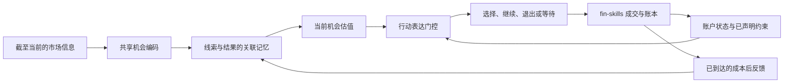

# 从果蝇觅食到交易控制：机制、模型选择与可否证的嫁接方案

研究日期：2026-09-21（America/New_York）。这是第一轮有检索记录的深入定向研究，
用于作架构决定；不是穷尽性系统综述，也不是新的收益实验。
原始文献由助手阅读，人工学术复核尚未完成。阅读范围与访问限制见
[证据说明](evidence_notes.json)、[来源清单](source_manifest.json)和[检索记录](search_log.json)。

**建议把研究问题收窄为：代理能否记住机会的价值，在约束改变时暂缓行动，并在短暂噪声、
真实失效和旧机会重现之间作出不同反应。** 先验证这些行为，再决定哪些神经机制值得保留。
目前最有依据的生物启发是“机会记忆与当前行动意愿分开”和“持续、退出分别受调节”。
它们是待检验的工程假设，尚无交易优势证据。

模型方面，优先复现 Bennett 等的正负价值学习模型作为最小参照；Gkanias 等的动机回路
作为竞争性记忆模型。原有 Huang、Luo 等模型保留用于短长期记忆门控的特定检验。
现阶段不把整脑连接组设为交易学习器，也不把几篇论文的模块直接合并称作完整果蝇大脑。

## 一、先理解行为：果蝇并非只在“追好味道、逃坏味道”

**内部需求会改变觅食中的不同决定。** Corrales-Carvajal 等让成年雌蝇频繁遇到酵母和蔗糖斑块，区分接触、停留与离开。氨基酸缺乏及交配状态对这些阶段的作用不同；酵母接触总数并未随这些状态显著增加。该任务重点是遇到食物后的营养选择，不能直接当作远距离搜寻模型。[E001] <!-- [claim:C001] [evidence:E001] -->

**停止追逐不等于忘记。** Krashes 等在训练后操纵饥饱及相关神经活动，表明 dNPF 与多巴胺回路能调节食欲性记忆的表达。实验特意先让果蝇有效学习，再研究提取阶段；它没有证明内部状态只影响提取、永不影响学习。[E003] <!-- [claim:C002] [evidence:E003] -->

**饥饿有时让它坚持没有兑现的食物线索。** Sayin 等在跑球追踪气味任务中发现，饥饿果蝇会在重复、无食物回报的试次中增强追踪；相关蘑菇体输出与多巴胺回路参与持续行为。激活 VPM4 等章鱼胺通路可压制追踪，但在该实验中阻断这些神经元输出没有改变追踪，因而不能把激活结果写成普遍必需的“退出开关”。[E002] <!-- [claim:C003] [evidence:E002] -->

**有吸引力与得到所需资源可以分离。** Huetteroth 等区分了甜味与营养性强化所涉及的多巴胺通路和记忆生理约束；这不是简单的“即时奖励等于甜味、延迟奖励等于营养”。研究也观察到某些条件下营养相关记忆可很快表达，不能据此要求交易学习等到平仓才获得反馈。[E004] <!-- [claim:C004] [evidence:E004] -->

**线索和结果的先后顺序可能改变学到的方向。** Handler 等通过气味、强化时间控制及多巴胺受体实验，研究双向可塑性与行为反转。这要求我们认真处理反馈归属于哪一次观察；论文没有给出把生物秒数换算成交易日的方法。[E005] <!-- [claim:C005] [evidence:E005] -->

**行为上的消退不必是把旧记忆擦掉。** Felsenberg 等在厌恶记忆消退任务中发现，原有负面记忆与新的正面消退记忆可并存并相互竞争。这个结果限定于所研究的任务与回路，不能推广为一切遗忘均保留可随时恢复的旧知识。[E006] <!-- [claim:C006] [evidence:E006] -->

**觅食导航也没有单一通用算法。** Behbahani 等用环形通道和光遗传虚拟食物获得路径积分的行为证据；Goldschmidt 等的真实食物研究则报告，搜索随时间扩展，虚拟糖刺激没有相同变化，且其所测导航干预中湿度感受影响突出。后者本轮只读到正式摘要，全文入口出现验证码。因此这里只把它作为任务依赖性的提醒，不据此宣布罗盘或路径积分无效。[E012][E013] <!-- [claim:C007] [evidence:E012,E013] -->

Whitehead 等关于代谢状态、味觉与探索的工作，本轮找到的是预印本版本；其连续摄食与运动测量提供了补充线索，但不承担本报告的关键机制结论。[E014] <!-- [claim:C008] [evidence:E014] -->

上述结果改变了嫁接的出发点：可以研究“线索—结果记忆如何在当前需求下影响行为”，
却不能直接假定果蝇在最大化类似金融收益的单一标量。对金融而言，饥饿式坚持甚至可能
是应当限制的行为，必须与及时退出一同检验。

## 二、候选模型回答的是不同问题

下表中的选择是工程判断，不是论文已经证明的金融适用性。

| 候选 | 原研究覆盖什么 | 主要缺口与本项目用途 |
|---|---|---|
| **Bennett、Philippides、Nowotny：预测误差模型** | 正负价值、多个线索选择、变化的强化；比较受约束与扩展模型 | 原任务近似多臂选择，没有持仓时长、退出成本或资金状态；适合先检查“线索编码与价值学习”的接法。[E009] <!-- [claim:C009] [evidence:E009] --> |
| **Gkanias 等：Incentive Circuit** | 易变、受约束及长期记忆的相互作用，正负动机与气味场景行为 | 部分连接功能和记忆角色仍是模型预测；适合作为记忆反转、保留与重现的竞争假设。[E008] <!-- [claim:C010] [evidence:E008] --> |
| **Huang、Luo 等：短长期记忆交互** | 厌恶条件学习中的双向效价、反馈和长期可塑性门控 | 所复现模型并非完整觅食回路；短时记忆影响后续训练中的长期记忆形成，不能简写成短期值自动复制到长期值。[E007] <!-- [claim:C011] [evidence:E007] --> |
| **Jiang、Litwin-Kumar：异质多巴胺与循环网络** | 用任务优化寻找多巴胺门控可塑性的网络解，涵盖价值、创新异及导航任务 | 外层用梯度优化，内层才是局部可塑性；更灵活，但训练分布、目标和普通循环网络对照不可省略。[E010] <!-- [claim:C012] [evidence:E010] --> |
| **Shiu 等：连接组全脑动力学** | 从感觉输入预测摄食启动、梳理等活动，并检验具体预测 | 模型忽略神经调质、神经肽等，并简化神经元和受体动力学；不能据其感觉运动预测能力推定具备可用的金融学习与动机系统。[E011] <!-- [claim:C013] [evidence:E011] --> |

两个不能混淆的模型问题：Gkanias 的长期记忆叙述包含短期向长期的转移；Huang 的关键机制是后续训练中的门控，研究的回路也不同。Gkanias 在自己的回路中替换可塑性规则所做的 RPE 对照，亦不能否定所有预测误差模型或 Bennett 的整套模型。[E007][E008][E009] <!-- [claim:C014] [evidence:E007,E008,E009] -->

Jiang 的论文还给出一个很有用的反例：训练后关闭导航期间的可塑性会损害所得到的模型，但从训练开始就禁用该阶段可塑性，可以得到表现相近的网络。因此，单次“拔掉模块后变差”不足以证明那个模块是解决任务所必需的；我们的消融也必须包含重新训练的替代架构。[E010] <!-- [claim:C015] [evidence:E010] -->

### 代码核查带来的额外结论

本轮阅读了 Bennett 作者仓库的 `mb_mv_a.m`、Gkanias 的 `circuit.py`、Jiang 的训练代码及 README；没有运行这些新候选。Bennett 和 Gkanias 仓库标注 GPL-3.0；Bennett 原实现是 MATLAB，Jiang 训练脚本使用 PyTorch 的梯度优化。版本、定位和阅读范围记录于代码来源中。[E022][E023][E024] <!-- [claim:C016] [evidence:E022,E023,E024] -->

从 Bennett 默认、无干预的代码可以直接推导一个普通学习器对照。令同一线索的 KC 活动为
向量 `k`，两个 MBON 输出之差为 `q`，实际强化为 `r`，`δ = r − q`，共同的 KC→DAN 输入
为 `b`。当神经元及权重均未触发非负截断时：

```text
d+ = b + δ                 d− = b − δ
w+ ← w+ + ε k (d+ − d−)    w− ← w− − ε k (d+ − d−)
q' = q + 4 ε ||k||² (r − q)
```

这是依据作者代码作出的代数推导：在上述条件下，对当前线索的更新可化为带有效学习率的 delta rule。共享特征还会影响其他线索；边界截断、不同输入及神经干预不在这项局部等价结论内。应将同编码、同有效步长的普通线性预测误差学习器作为必要对照，不能把多巴胺名称本身当成新算法。[E022] <!-- [claim:C017] [evidence:E022] -->

## 三、哪些对应值得尝试，哪些对应应放弃

| 生物中的功能 | 可检验的交易对应（工程假设） | 类比失效处 |
|---|---|---|
| 外部线索及其学到的价值 | 资产、策略、可观察市场上下文共同构成的机会表征 | 气味通道不等于 BUY/SELL；先天趋向气味不等于先验预测价格能力 |
| 记忆表达随内部状态变化 | 相同机会记忆，在资金、流动性和风险容量变化时产生不同参与意愿 | 饥饿与现金不足没有等价关系；亏损后更冒险不在方案内 |
| 持续追踪与退出受不同信号影响 | 将短暂信号缺失、负面反馈和更好替代机会分开处理 | 不能把所有坏消息解释成应忽略的噪声 |
| 正负结果的关联与重新估值 | 学习线索之后实际发生的成本后结果；检验失效与再现 | 未发生的惩罚有特定生物语境，不能变成凭空发放的金融奖励 |
| 重访曾有价值的食源 | 对历史有效、当前重新获得支持的机会恢复关注 | 价格空间没有天然地理坐标；不默认引入路径积分 |
| 搜索新机会 | 观察、计算或比较未持有的候选策略 | 看行情通常不必下单；固定概率随机交易不是搜索的生物复现 |
| 摄食改变资源状态 | 账户约束由真实账本更新 | 小规模成交通常不会像吃食物那样耗尽机会；不强加斑块耗竭模型 |

果蝇的蘑菇体输出群体可影响吸引、排斥和行动选择；Aso 等强调群体效价及组合效应，并非某个 MBON 直接指定一段固定运动程序。因此，交易动作应由明确的决策接口产生，不能用神经元名字替代动作语义。[E015] <!-- [claim:C018] [evidence:E015] -->

## 四、建议的最小架构

**研究对象先固定为成本下的机会参与、持续与退出。** 保留一个共享代理；机会是
`(资产, 预先定义的策略, 当时可观察的上下文)`。先限制为不加杠杆的单机会持有加现金，
避免仓位优化掩盖机制问题。一个机会加现金足以检验持续与退出；需要检验选择、重访时，
再使用多个候选机会。



图表示工程接口，不表示已验证的神经连接。实现应逐步增加机制：

1. **共享感知与关联记忆。** 同类机会共享编码；先用固定、因果可得的特征，比较 Bennett
   与等价普通学习器。不能每个离散状态复制一颗独立“大脑”，又声称获得了共享经验。
2. **内部状态先作用于行动表达。** 在受控测试中保持关联权重不变，只改变资源状态，
   观察行动能否改变并恢复。硬性账户限制由独立规则执行；新增门控必须与拥有相同限制和
   状态输入的普通策略比较。不会因为约束存在就把收益改善归功于果蝇。
3. **持续和退出使用可比较的后续价值。** 等待、离开、转向另一机会都继续进入同一个
   决策过程；平仓不自动终止学习目标。保持也有市场风险和机会成本，退出也有成交成本。
4. **只有任务显示需要时才加特殊记忆动力学。** 先比较普通快慢记忆与 Gkanias 的竞争
   记忆，再单独考察 Huang 的长期可塑性门控。不要一开始把全部机制叠加。

账户状态应保留为资金、风险容量、流动性等明确变量，不压成一个名叫“饥饿”的数。
门控后的行动倾向也不能直接替代原来的价值预测反馈给记忆：否则仅仅收紧风险限制，
就可能制造“结果好于预期”的虚假学习信号。最小实现先分开未门控的机会预测与门控后的
行动分数；这项拆分是工程选择，不声称已复现 dNPF 的完整神经作用。

### 金融目标和生物输入必须分开定义

金融账本提供每个已完成时间步的 `r_t = log(W_t / W_{t−1})`，其中净值已经计入所声明
的成交成本、现金收益及适用的持有费用。这是拟采用的工程目标。固定终点时，逐步
对数收益相加与最大化终点净值一致；若引入折扣，则优化目标改变，不能省略说明。
破产或不可行状态须事先规定终止及处理方式，不能对非正净值取对数。

若使用持续若干步的选项，标准半马尔可夫更新包含期间奖励和结束后的延续价值：`Y = Σ[j=1..τ] γ^(j−1) r_(t+j) + γ^τ V(s_(t+τ))`。这是普通 options/SMDP 框架的应用，不是果蝇特有定理。[E016] <!-- [claim:C019] [evidence:E016] -->

第一阶段先使用固定终点、`γ = 1` 的有限任务，并将剩余时间纳入状态，真正终点才令
延续价值为零。持仓终止与整个任务终止分开。最小方案让关联模块预测所选机会的单步
已到达结果，普通持续/退出控制器负责带账户状态的延续估值；关联输出只是控制器的输入，
不是完整的动作价值。Bennett 原模型学习单次强化，若进一步向它输入上述带延续项的目标，
就已经增加了工程信用分配机制，必须单列对照，不能称为原样移植。

反馈可见性也须固定：真实成交后的账户变化和未持有机会的价格观察分别记录。
若计算未持有策略的假想收益，必须标为基于同一执行假设的模拟反馈，并让所有对照同样
使用；不能把它当作已经成交、无误差的回执。账户奖励始终只来自实际模拟账本。

同样，“正负双通道”可以是一个标量学习目标的表示方法，但不能把预测信号也发成奖励，
或将已计入净收益的成本再次当惩罚扣除。是否使用预测误差、如何缩放、是否截断、
eligibility trace 归属哪次线索，均须在接市场数据前冻结，并与普通学习器保持一致。
神经模拟积分步长、市场经过时间、收到反馈的次数分别记录，不再用更新次数冒充市场时间。

## 五、我们的库具体承担什么

当前库已经有账户执行与检查组件，但在线记忆接口仍需按实际能力设计。`engine.run` 的 `signal(panel)` 在交易循环前计算；循环内的 `SizingContext` 提供截至当前的历史、净值等，却不提供完整成交回执，`prev_weights` 是上一步目标权重而非当前实际持仓。因此，不能直接宣称现有 signal API 已提供完整的在线强化学习环境。[E020] <!-- [claim:C020] [evidence:E020] -->

| 现有位置 | 本方案使用方式 | 需要核实或补足 |
|---|---|---|
| `fin_skills/data/safe_asof.py` | 按可获知时间接入数据 | 发布时间、修订与容许陈旧度仍须在数据协议中声明 |
| `fin_skills/engine/spec.py` | 显式设置交易日历、成交延迟和成本 | 成本不能沿用默认零值当现实假设 |
| `fin_skills/engine/execute.py`、`costs.py` | 统一成交、账户及成本后净值 | 在线学习需要明确、可核对的观察与成交反馈接口 |
| `fin_skills/engine/sizing.py` | 原型可利用逐步回调读取已发生历史与净值 | 回调有状态时要能重置；目标权重不可冒充成交状态 |
| `fin_skills/api/guards/` | 检查因果性、成本、试验记录及报告约定 | 通用 signal 检查不能自动证明有状态控制器无泄漏，需专门的前缀重放检查 |

以上位置及接口说明来自本仓库固定研究基线的源码阅读；它们是待接入组件，并非本轮已经完成的新环境。[E020] <!-- [claim:C021] [evidence:E020] -->

接口的首个验收条件应是：相同历史前缀、相同初始记忆和随机状态得到相同决策；
修改未来数据不会改变前缀结果；费用与成交回执能逐项回到账本。通过后才做机制比较。

## 六、能推翻方案的实验

所有任务先固定信息、动作、成本、反馈规则和训练预算。同一个训练方案面对混合条件，
在未用来调参的生成参数与随机路径上比较；不能每种情形单独调到最优后计算“成功率”。
下面是拟检验的预测，尚无实验结果。

| 检验 | 控制变化 | 可被推翻的预测与否证条件 |
|---|---|---|
| 记忆表达与存储分离 | 学习后固定关联权重，改变再恢复资源状态 | 行动可暂缓后恢复；若必须重写记忆才恢复，则未实现所声称的分离 |
| 短暂失联与真实失效 | 外观相近的短暂线索缺失，或随后结果分布持续恶化 | 短暂失联少误退、真实失效及时退出；若仅延长所有持有，就是惯性，不是识别 |
| 原机会重现 | 机会 A 有效→失效→再次有效；不透露隐藏状态标签 | 在可观察证据支持时恢复较快；若长期保留只增加错误重入，则保留机制不合用 |
| 诱因与兑现分离 | 显眼信号不变，成本后结果转差 | 记忆能降值；若仍被强特征持续吸引，接法失败 |
| 退出的延续价值 | 当前持仓路径相同，替代机会或现金条件不同 | 决策随真实可用的替代条件变化；若只依赖单笔累计盈亏，目标仍被截断 |
| 时间与延迟 | 相同反馈内容，改变其合法到达间隔 | 比较真实时间衰减与按更新次数衰减；若优势只依赖任意时钟比例，不作生物解释 |
| 零信息负对照 | 信号与未来结果独立，或按预声明方案打乱对应 | 不应产生稳定的样本外超额收益；若出现，先排查信息泄漏、成本和试验选择 |

对照按问题分层，避免只拿一个弱学习器陪跑：

- **普通价值学习器**使用相同机会编码和有效更新步长，先检验 Bennett 的局部等价区间。
- **普通持续/退出控制器**使用相同延续目标和资源状态，检验改好目标本身带来的改善。
- **普通快慢记忆与循环网络**获得相同历史、参数或计算预算，检验额外记忆容量的作用。
- **具体机制消融**分别去掉表达门控、相互作用或时间痕迹；既做训练后关闭，也做从头
  重新训练的替代版本。若论点涉及生物连接，随机对照须尽量保留度数、稀疏度和符号等
  相关结构，而非把网络随意破坏后比较。

机制阶段以误退出、失效后的滞留、恢复速度和净收益的联合变化判断功能。市场阶段的
主结果遵循用户要求，报告成本后累计收益；其他量用于解释结果，不能替代收益优势。
一条历史路径的多个种子不算多个独立市场样本。开发、验证、最终测试按时间与数据来源
提前冻结，所有尝试进入记录；市场中的现金、买入持有和普通策略对照均保留。

**停止条件：** 若修正目标和成本后普通控制器已解释改善，不能归因于果蝇；若特殊记忆
在重新训练的普通对照前没有稳定增益，就停止扩大神经网络。机制成立而净收益无优势时，
如实记录“机制有效、交易增益未证实”。

## 七、创新性及旧结果怎样定位

层次化持续动作已有 options 框架；有交易成本的循环强化交易也有早期原始工作。把持仓叫作一个 option，或把盈利叫作 reward，不构成新增贡献。[E016][E017] <!-- [claim:C022] [evidence:E016,E017] -->

Lee 等近期的 Perspective 讨论了内外状态分解及内感受式人工智能；这是相关理论先例，不是果蝇交易有效的实验证据。本轮读取正式版本的摘要和文献类型，全文为订阅内容。[E018] <!-- [claim:C023] [evidence:E018] -->

公开的 FlyAlpha 仓库已经描述市场输入、果蝇启发的脉冲与蘑菇体可塑性、交易输出及消融研究；README 明确把其合成示例与市场优势分开。我们只核查其仓库和研究主张，没有复现其结果，因此既不能声称“首次果蝇交易”，也不能拿该项目作盈利证据。[E019] <!-- [claim:C024] [evidence:E019] -->

可争取的贡献应具体到：在相同金融目标与信息下，**某个有原始行为依据的记忆—状态—
行动关系，是否能更好处理机会短暂中断、真实失效和恢复**。如果不能胜过对应的普通方法，
就不保留“生物启发带来性能优势”的主张。

已有结果仍是失败的开发实验：已提交摘要中，五个种子的果蝇适配器在 5 bps 成本下平均累计收益为 −11.56%，普通学习器为 −7.49%；固定相同动作按零费用回放时，果蝇为 −2.40%。本轮重新从摘要计算了这些均值；没有重训、没有新增收益结果。[E021] <!-- [claim:C025] [evidence:E021] -->

该结果不能辨别是信号弱、探索与换手、退出目标、输入编码还是记忆机制造成差异。
退出目标主要含费用，也不代表一定学不会避损：它仍可能优于更负的保持目标。
更准确的问题是没有评价退出后的现金与替代机会。完整限制保留在
[前一轮记录](../../FLY_TRADING_RESEARCH_STATUS.md)。旧 ECB 数据继续属于开发数据。

## 八、接下来先做什么，以及尚未解决什么

下一阶段的最小工作包是：**复现 Bennett 原作者任务并验证普通 delta-rule 对照；建立
能读取真实账户反馈的持续/退出环境；再做“记忆固定、状态改变”的行为检验。**
此时若接口或对照不通过，就修正该处，不启动又一轮市场调参。

还没有解决的具体问题是：

- 哪些市场特征真的能预测成本后结果，仍需独立的信号检验；果蝇机制不会提供免费先验。
- 生物回路输出如何校准为金融估值、连续任务的延续目标如何进入局部可塑性，尚未验证。
- Gkanias 部分功能性预测、不同模型的组合兼容性，以及真实食物局部搜索最新研究的全文
  方法，尚需进一步核查。不能用模型名称掩盖这些缺口。
- 多篇模型复现了重叠的经典任务，这不足以决定哪一个在新任务中更好；需要共同任务检验。

后续计算继续使用 Beacon RADFM：代码、环境、缓存、临时文件、日志与结果都放在
`/beacon-projects/radfm/wy891/` 下。本轮只完成研究与记录，没有提交新的训练任务。

## 来源链接

完整书目信息、阅读定位与状态见配套清单。以下引用均指向原始论文、作者存档或作者代码。

[E001]: https://elifesciences.org/articles/19920
[E002]: https://pmc.ncbi.nlm.nih.gov/articles/PMC6839618/
[E003]: https://pmc.ncbi.nlm.nih.gov/articles/PMC2780032/
[E004]: https://pmc.ncbi.nlm.nih.gov/articles/PMC4372253/
[E005]: https://pmc.ncbi.nlm.nih.gov/articles/PMC9012144/
[E006]: https://pmc.ncbi.nlm.nih.gov/articles/PMC6198041/
[E007]: https://pmc.ncbi.nlm.nih.gov/articles/PMC11525173/
[E008]: https://elifesciences.org/articles/75611
[E009]: https://www.nature.com/articles/s41467-021-22592-4
[E010]: https://journals.plos.org/ploscompbiol/article?id=10.1371/journal.pcbi.1009205
[E011]: https://www.nature.com/articles/s41586-024-07763-9
[E012]: https://pubmed.ncbi.nlm.nih.gov/41856102/
[E013]: https://pmc.ncbi.nlm.nih.gov/articles/PMC8551043/
[E014]: https://pmc.ncbi.nlm.nih.gov/articles/PMC11118379/
[E015]: https://pmc.ncbi.nlm.nih.gov/articles/PMC4273436/
[E016]: https://people.cs.umass.edu/~barto/courses/cs687/Sutton-Precup-Singh-AIJ99.pdf
[E017]: https://pubmed.ncbi.nlm.nih.gov/18249919/
[E018]: https://www.nature.com/articles/s42256-026-01296-8
[E019]: https://github.com/TanaeemDar/FlyAlpha/tree/350d60ad2062464a36b50f8e1db9e68dfffb57f2
[E020]: https://github.com/howard-lynn-ye/fin-skills/tree/3efd3d3fa319c03b0808cb61b6c64cff1ec2128f/fin_skills/engine
[E021]: ../../../benchmarks/fly_paper/evidence/market_v1.json
[E022]: https://github.com/BrainsOnBoard/paper_RPEs_in_drosophila_mb/blob/7ec52afb9bd7bb748d94d60dea9f483645a2ce8e/mb_mv_a.m
[E023]: https://github.com/InsectRobotics/IncentiveCircuit/tree/1610c80072fe8bb59bd397e7a61f716393a509b9
[E024]: https://github.com/alitwinkumar/jiang_litwin-kumar_mb_rnn/tree/a16f86a3e9e476eff6860c3c0e0e1bbe729d7f85
