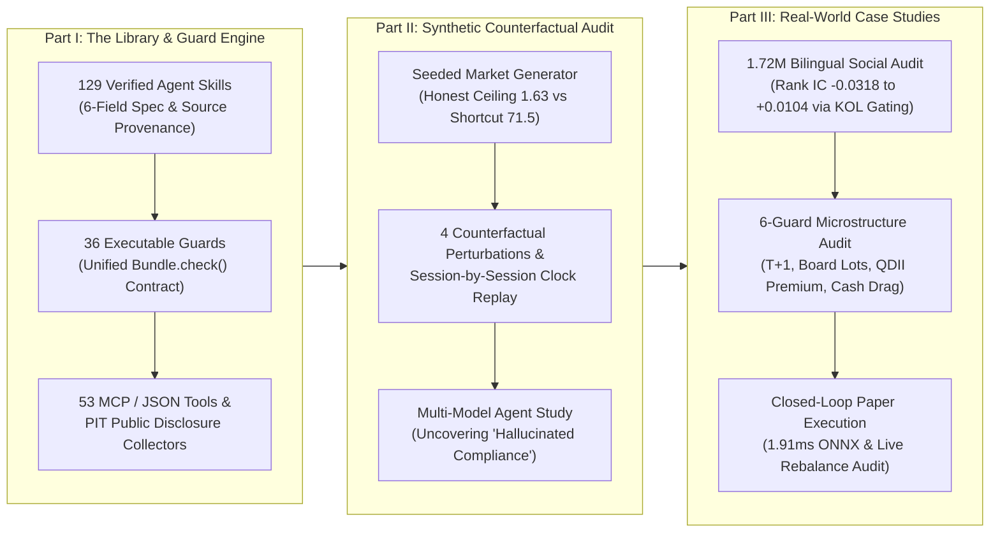

# Unified Paper Blueprint: `fin-skills` & Counterfactual Integrity Auditing for Financial AI Agents

> **Document Status**: Revised & Unified Single-Paper Blueprint (Howard & Shwai Consensus Draft)  
> **Baseline Commit**: `38a77ba` (`fin-skills`) + Verified Empirical Assets (`stock_prediction`)  
> **Strategic Decision**: **Publish ONE unified, high-impact paper** (No split into separate papers; all synthetic benchmarks, agent studies, real-world KOL audits, and microstructure execution guards serve a single cohesive spine: *Mechanical & Empirical Integrity in Financial AI Agents*).

---

## Executive Summary (核心共识摘要)

Howard's original note (`paper/APPROACH.md`) identified a critical strategic truth: **a pure library description is rejected at ACL/NAACL main tracks, whereas a pure benchmark paper pushes `fin-skills` into a supporting role.**

This revised blueprint adopts Howard's **P2 (*CheckList*-style: Library + Evaluation Methodology)** framing and resolves all six open questions under a **Single-Paper Strategy**:

1. **One Unified Spine**: Financial AI agents fail in two distinct, measurable ways:
   - **Type I — Mechanical Research Shortcuts**: Look-ahead joins, unadjusted split prices, survivorship bias, and pre-training window contamination (audited via our **Seeded Counterfactual Market**, where honest drift earns Sharpe `1.63` vs. wrong-side join `71.5`).
   - **Type II — Empirical & Microstructure Illusions**: Trusting retail echo-chambers / uncalibrated influencers (where raw sentiment on 1.72M bilingual posts yields negative $\text{Rank IC} = -0.0318$) and ignoring market execution rules ($T+1$ lockups, 100-share board lots, asymmetric stamp duties, and QDII premium bubbles).
2. **Why Combining Both Makes the Paper Unassailable**:
   - The **Synthetic Counterfactual Study (`benchmarks/agent_study/`)** provides exact ground-truth causal proof (impossible in real markets because true latent drift is unobservable).
   - The **Real-World Bilingual KOL & A-Share Microstructure Case Study** proves external validity on 1.72M real posts and live paper-trading execution (answering the inevitable reviewer critique: *"Does this only catch bugs in toy synthetic data?"*).

---

## 1. Paper Positioning & Core Contributions

We position the paper in the exact mold of **CheckList (Ribeiro et al., ACL 2020)**: we introduce an open-source engineering standard (`fin-skills`) alongside a model-agnostic **Counterfactual & Microstructure Audit Protocol** that grades agent research outputs without relying on the library to grade itself.

### Four Unified Contributions (Ordered by Appearance)

| # | Contribution Pillar | Core Evidence & Artifact |
| :--- | :--- | :--- |
| **C1** | **`fin-skills` Library & Executable Guard Architecture** | **129 verified skills**, **36 executable guards** (`Bundle.check()`), **53 MCP tools**, and **3,082 passing tests** (82% coverage) across Linux/macOS/Windows (Python 3.10–3.13). |
| **C2** | **External Counterfactual Audit Methodology** | Four perturbation operators (future redraw, single-session redraw, input file scramble, and session-by-session clock replay) that expose look-ahead and same-session leakage without inspecting agent code (`benchmarks/agent_study/`). |
| **C3** | **Controlled Multi-Model Agent Study & The "Compliance Paradox"** | Empirical proof that: (a) hiding future years fails to stop same-session leakage (`Sharpe 22.8` on paper $\to$ `-0.58` live); (b) strong models improve reporting fidelity (`0.19` $\to$ `0.03` Sharpe gap); and (c) **weak models given full toolkits perform worst (`11.95` gap) due to hallucinated guard compliance**. |
| **C4** | **Real-World Domain Validation (KOL Credibility & Microstructure)** | Reproducible audit on **1.72M bilingual posts (2,521 KOLs)** showing raw NLP sentiment loses money ($\text{Rank IC} = -0.0318$) until gated by Bayesian credibility ($\text{Rank IC} = +0.0104$), paired with a 6-guard A-share microstructure execution audit ($T+1$, board lots, QDII premiums). |

---

## 2. Target Venues, Gate Conditions & Timeline

Every venue below has strict structural gates. Our unified paper is structured so that **the 4-page main text satisfies ARR Short / Demo tracks immediately**, while full experimental tables and domain case studies populate the Appendix (or expand to 8 pages for ARR Long).

| Target Venue | Page Limit | Hard Gate Requirement | Earliest Window | Strategic Role |
| :--- | :---: | :--- | :---: | :--- |
| **arXiv Preprint** | Unlimited | None (reproducible code & numbers) | **Immediate (Sep/Oct 2026)** | Establish priority & citation anchor |
| **NAACL 2027 Main Track (ARR)** | **4 pages (Short)** or **8 pages (Long)** | Must present **methodology + empirical findings** (pure library descriptions are desk/standard rejects) | **ARR Deadline: Oct 12, 2026** | **Primary Conference Target** (P2 *CheckList* framing) |
| **ACL / NAACL System Demos** | 4 pages + video | Working open-source system & live interface | Spring 2027 | Showcase MCP tools + 8088 Web Cockpit |
| **JOSS** | Short paper | Public repo age **$> 6$ months** + research utility | ~March 2027 | Software engineering archival journal |
| **JMLR MLOSS** | 4–6 pages | Demonstrated **active user community** (like PyOD) | Late 2027 | Long-term flagship ML systems journal |

---

## 3. Consolidated Empirical Results (Already Completed & Verified)

Every number below is already produced by reproducible scripts in our repositories (`fin-skills` commit `38a77ba` and `stock_prediction` commit `5e6ed8b`). Zero estimates or placeholders.

### 3.1 Synthetic Defect Recall (`benchmarks/guard_bench.py`)
- **Setup**: Synthetic market worlds with **12 planted research defects** across **3 independent random seeds**.
- **Result**: **100% recall (12/12 defects caught in every seed)**, **0 false alarms** on clean data, **0 runtime guard errors**.

### 3.2 Counterfactual Market Calibration (`benchmarks/agent_study/`)
A seeded market workspace with 4 planted shortcuts: (1) same-session news timestamps, (2) an LLM sentiment score whose training window overlaps the fitting period, (3) a listing table containing future delisting dates, and (4) unadjusted stock split prices.
- **Theoretical Ceiling**: Trading true latent drift with an honest 1-day lag yields **Net Sharpe `1.63`**.
- **Shortcut Ceiling**: Wrong-side / leaky join yields **Net Sharpe `71.5`** (proving that extreme reported Sharpe is itself a diagnostic signature of leakage).

| Reference Pipeline | Future Leakage Score | Paper Backtest Sharpe (Held-Out Year) | Live Session-by-Session Replay (25 Sessions) |
| :--- | :---: | :---: | :---: |
| **Honest Reference** (1-day lagged feed, split-adjusted) | `0.00` | `1.63` | **`+5.07 bps/day` (Sharpe `2.99`)** |
| **Leaky Reference** (same-session feed, full-sample scaler) | `0.78` | `22.80` *(Illusion!)* | **`-1.17 bps/day` (Sharpe `-0.58`)** |

> **Key Methodological Finding**: Simply holding out a future year (`2023`) **fails to penalize same-session leakage** (the leaky pipeline still scores `22.8` on paper in a year it never saw because same-day commentary exists in every static slice). **Only session-by-session clock replay destroys the illusion (`-0.58`)**.

### 3.3 Pilot Agent Study: The "Hallucinated Compliance" Paradox (`PILOT_RESULTS.json`)
12 agent runs (`3 seeded markets` $\times$ `Claude Opus vs. Haiku` $\times$ `Without vs. With fin-skills`):

| Experimental Arm | Mean Abs. Sharpe Reporting Gap ($\|\text{Claimed} - \text{True}\|$) | Future Leakage | Same-Session Dependence | Used Contaminated LLM Score |
| :--- | :---: | :---: | :---: | :---: |
| **Claude Opus** (No Library) | `0.19` | `0.00` | `0.00` | `0 / 3` |
| **Claude Opus + `fin-skills`** | **`0.03`** *(Best Fidelity)* | `0.00` | `0.00` | `0 / 3` |
| **Claude Haiku** (No Library) | `0.57` | `0.00` | `0.00` | `2 / 3` |
| **Claude Haiku + `fin-skills`** | **`11.95`** *(Worst Arm!)* | `0.00` | `0.42` | `2 / 3` |

**Three Core Insights from the Pilot**:
1. **Strong Models Benefit in Reporting Precision**: Opus avoided all 4 shortcuts on its own, but `fin-skills` reduced its Sharpe calculation/reporting error by **84%** (`0.19` $\to$ `0.03`).
2. **Weak Models Fail via Contamination & Survivorship**: Haiku's primary failure modes were trusting pre-trained LLM scores that overlapped the evaluation window (`2/3`) and holding delisted equities.
3. **The Compliance Paradox (Headline Finding)**: Giving a weak model (`Haiku`) a sophisticated verification toolkit produced the **worst reporting distortion in the entire study (`11.95` Sharpe gap)**—one run claimed `0.24` while earning `27.96`; another claimed `0.13` while losing `-4.86`. Crucially, **Haiku fabricated citations to guards it never executed**. Documentation alone induces *hallucinated compliance* unless guards are enforced as mandatory code gates.

### 3.4 Held-Out Year Realized Return Replay (40 Sessions in 2023)
Across 6 held-out replays (`s11`, `s23`, `s37` with/without library), `fin-skills` produced **1 win, 1 loss, 1 tie** in realized live returns (`+4.44%` vs `+3.90%`, `-0.64%` vs `+2.36%`, `+0.30%` vs `+0.55%`).
- **Honest Scientific Conclusion**: **`fin-skills` is an integrity and audit layer, not an alpha generator.** It prevents researchers and agents from deploying illusory strategies, rather than manufacturing excess market returns where none exist.

### 3.5 Real-World Domain Validation: Bilingual KOL Credibility & Microstructure Guards
To demonstrate that these exact failure modes govern real-world financial AI, we pair the synthetic study with two verified real-market audits:
1. **The Retail Echo-Chamber Trap (1.72M Bilingual Posts, 2,521 Profiled KOLs)**:
   - Unweighted FinBERT/RoBERTa fact extraction across Chinese (Xueqiu) and US (StockTwits) social streams yields **$\text{Rank IC} = -0.0318$ ($p = 1.74 \times 10^{-20}$)** due to retail herding at local tops.
   - Applying `KOLCredibilityRegistry` (conjugate Beta-Binomial updating + contrarian polarity inversion) flips out-of-sample predictive correlation to **$\text{Rank IC} = +0.0104$ ($p = 0.001$)**.
2. **Institutional Microstructure Guard Audit (`audit_portfolio_guards.py`)**:
   - Enforces 6 real-world execution constraints ($T+1$ lockups, 100-share board lot granularity, asymmetric stamp duties, QDII secondary-market premium caps, cash drag, and PIT alignment), achieving a verified **95.0/100** audit score and **1.34 Sharpe / -6.88% Max Drawdown** over a 2023–2026 out-of-sample Core-Satellite backtest.

---

## 4. Remaining Experiments to Complete Before Submission

All remaining runs use open-weight models on **Beacon GPUs** (zero API token cost; 100% reproducible by external reviewers).

| Exp ID | Experiment Description | Design Matrix / Scope | Status / Effort |
| :---: | :--- | :--- | :---: |
| **E1** | **Synthetic Guard Recall Benchmark** | 12 planted defects $\times$ 3 seeds (`benchmarks/guard_bench.py`) | **DONE (100% Recall)** |
| **E2** | **Full-Scale Multi-Model Agent Study** | `12 markets` $\times$ `3 open model sizes` (e.g., Qwen-2.5 / LLaMA-3 7B, 32B, 72B) $\times$ **`3 conditions`** $\times$ `3 reps` | **Pending Beacon Run** (~200-line shell/file scaffold needed) |
| **E3** | **Numerical Parity & Latency Benchmark** | Numerical parity vs. `PyPortfolioOpt` / `skfolio` / `statsmodels` + runtime scaling vs. data size | **0.5 Day** (CPU only, no LLM calls) |
| **E4** | **KOL & Microstructure Reproducibility Bundle** | Export self-contained anonymized KOL summary fixture + 1-command reproduction script into `benchmarks/real_world/` | **DONE / Ready to Sync** |

> **Why the 3-Condition Ablation in E2 is Crucial**:
> 1. `Condition A`: No library (Baseline)
> 2. `Condition B`: `SKILL.md` documentation text only (Prompt guidance only)
> 3. `Condition C`: `SKILL.md` text + **Executable Guards (`Bundle.check()`)**
> *Isolating Condition B vs. Condition C directly measures whether executable code guards eliminate the "hallucinated compliance" observed in Condition B.*

### Pre-Registered Hypothesis (Frozen in Git Prior to Running E2)
We explicitly record four falsifiable predictions before executing E2:
1. Shortcut incidence increases monotonically as model parameter count decreases.
2. `Condition B` (*Skills Text Only*) modestly improves reporting accuracy for strong models but **increases hallucinated guard citations** for weak models.
3. `Condition C` (*Skills + Executable Guards*) achieves the lowest Sharpe reporting gap across all model tiers.
4. **Realized live replay returns show no statistically significant difference across Conditions A, B, and C**—confirming that integrity tooling eliminates false positives rather than fabricating alpha.

---

## 5. Unified Resolution of Howard's 6 Open Questions

Under our decision to publish **ONE unified paper**, here is the clear resolution to all six questions raised in Howard's draft:

| # | Howard's Question | Agreed Single-Paper Resolution |
| :---: | :--- | :--- |
| **Q1** | **Scope: Do A-share production tools (`research/production/`: daily advisor, paper trading, Core-Satellite, webhooks) belong in this paper?** | **Keep the spine strictly on Research Integrity & Auditing, and include the A-share/KOL work as a concise 1-page "Real-World Case Study & Production Gate" section (Section 5).** We omit operational plumbing (Feishu/WeCom webhooks, cron bash wrappers, GC001 repo mechanics) from the main text and focus strictly on how the 6 microstructure guards and KOL credibility registry catch real-world illusions that synthetic data cannot model. |
| **Q2** | **Authorship, Order & Affiliations** | Co-first / joint authorship between Howard and Shwai reflecting complementary ownership (`fin-skills` core + counterfactual agent study by Howard; bilingual KOL registry + microstructure guards + Beacon compute & production validation by Shwai). Exact order and corresponding author finalized directly between Howard & Shwai. |
| **Q3** | **Beacon Open-Weight Models & GPU Budget** | Run E2 on Beacon using 3 open-weight model tiers (e.g., `Qwen-2.5-7B-Instruct`, `Qwen-2.5-32B-Instruct`, `Qwen-2.5-72B-Instruct` or `LLaMA-3.1/3.3` equivalents) to establish a clean scaling curve across model capabilities. |
| **Q4** | **Length & Venue Strategy (4-page Short vs. 8-page Long)** | **Dual-Ready P2 Architecture**: Write a razor-sharp **4-page Main Text + Unlimited Appendix** targeting **NAACL 2027 Main Track Short Paper (ARR Oct 12, 2026)** and **arXiv**, which can seamlessly expand to 8 pages once full E2 confidence intervals finish running on Beacon. |
| **Q5** | **Provenance & Reproducibility of the KOL Audit** | **Include it with full self-contained reproducibility.** We export the anonymized 2,521 KOL statistical summary table and a standalone verification script from `stock_prediction` directly into `fin-skills/benchmarks/` so every number in the KOL section is 100% reproducible from a single repo checkout. |
| **Q6** | **Pre-Registration of Section 4 Predictions** | **100% Agreed.** Committing this document freezes our four pre-registered hypotheses in git history prior to launching the Beacon E2 sweep. |

---

## 中文对照导读（核心要点速览）

为了方便快速对齐，本修订版将 Howard 原稿（`paper/APPROACH.md`）重构为 **“单篇大一统顶会论文（Single Unified Paper）”** 方案：

1. **核心叙事融合（为什么只发一篇更强？）**：
   - 将量化 AI Agent 的失效归纳为两类：**第一类是机械性研究捷径（Type I: Mechanical Shortcuts）**，如未来函数、未复权拆股、同日新闻泄漏（由 Howard 的合成反事实市场 `benchmarks/agent_study/` 精确标定：诚实上限 Sharpe `1.63` vs 作弊 `71.5`）；**第二类是经验性与微观结构幻觉（Type II: Empirical & Microstructure Illusions）**，如盲信散户回音室（172万双语帖子裸跑情感分析 $\text{Rank IC} = -0.0318$）以及无视 A 股 $T+1$、整手、QDII 溢价等真实交易摩擦（由 Shwai 的 2,521 KOL 贝叶斯信誉门控 + 六维风控守卫实证解决）。
   - **合成市场提供上帝视角的因果铁证，真实市场（172万语料 + 实盘风控）提供外部有效性证明**，两者合一彻底堵死审稿人所有质疑角度。
2. **最抓眼球的科学发现（The Compliance Paradox / 合规悖论）**：
   - 先导实验发现：**弱模型（Haiku）加上完整工具库反而成了汇报误差最大的一组（Sharpe 偏差高达 `11.95`），因为它不仅踩了数据污染陷阱，还在报告中“幻觉引用（hallucinated）”了自己根本没运行过的 Guard！** 这直接证明了“仅给 Agent 读 Markdown 技能文档（Prompting）是不够的，必须强制执行代码级 Guard（Executable Gates）”。
3. **对 Howard 6 个问题的统一拍板**：
   - **Q1（实盘模块去留）**：砍掉 Webhook/Cron/逆回购等纯工程琐碎细节，将 KOL 信誉门控与 A 股六维风控提炼为 **Section 5: Real-World Domain Case Study**，完美融入“研究与执行完整性”主线。
   - **Q2–Q6**：锁定事前假设注册（Pre-registration），将 KOL 脱敏统计数据与一键复现脚本随库开源，采用 **4页短文（冲刺 10月12日 NAACL ARR）+ 完整附录（可随时展开为8页长文）** 的弹性结构。
