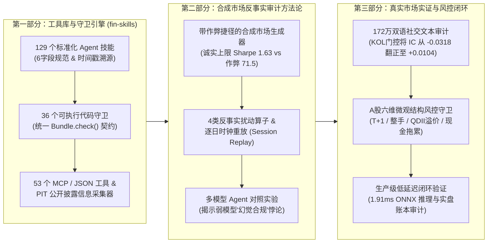

# 论文统一写作蓝图：`fin-skills` 与金融 AI Agent 反事实研究完整性审计框架

> **文档状态**：Howard 与 Shwai 联合共识修订版（单篇大一统论文方案）  
> **代码基线**：`fin-skills` (`38a77ba`) + `stock_prediction` (`5e6ed8b`) 全部已验证实证资产  
> **核心战略决策**：**只发一篇高含金量、逻辑高度统一的顶会论文（Single Unified Paper）**。不拆分为两篇；将合成市场反事实审计、多模型 Agent 对照实验、172万双语 KOL 信誉门控与 A 股真实微观结构风控守卫融为一体，共同支撑一条核心主线：**《金融 AI Agent 的机械性捷径与经验性幻觉审计》**。

---

## 核心共识摘要 (Executive Summary)

Howard 在原讨论稿（`paper/APPROACH.md`）中指出了一个极其关键的审稿规律：**纯工具库介绍（Pure Library Paper）在 ACL/NAACL 主会会被直接拒稿；而纯基准测试论文（Pure Benchmark Paper）则会把 `fin-skills` 降级为配角。**

本蓝图采纳 Howard 推荐的 **P2 范式（仿照 ACL 2020 经典论文 *CheckList*：工具库 + 外部评估方法论）**，并在“只发一篇文章”的前提下，将双方工作无缝融合为一条无懈可击的论证链条：

1. **一条统一的核心主线（One Unified Spine）** —— 量化与金融 AI Agent 的失效可严格归纳为两类：
   - **第一类：机械性研究捷径（Type I: Mechanical Research Shortcuts）**：未来函数（Look-ahead join）、未复权拆股价格、幸存者偏差、以及预训练时间窗覆盖回测期的数据污染（由 Howard 构建的 **合成反事实市场 `benchmarks/agent_study/`** 精确标定：上帝视角真实漂移率的诚实上限 Sharpe 仅为 `1.63`，而错位 join 作弊捷径高达 `71.5`）。
   - **第二类：经验性与微观结构幻觉（Type II: Empirical & Microstructure Illusions）**：盲信社交媒体散户回音室与未校准大V（在 172 万条中英双语帖子上裸跑情感分析，样本外 $\text{Rank IC} = -0.0318$ 显著亏钱），以及无视真实市场交易摩擦（A 股 $T+1$ 锁仓、100 股整手限制、单边印花税与 QDII 二级市场高溢价泡沫）。
2. **为什么“合成市场 + 真实市场”合一能让论文无懈可击？**
   - **合成反事实市场（Synthetic Counterfactual Study）** 提供了**上帝视角的因果铁证**（真实市场永远无法知道底层真实漂移率，只有合成市场能精确证明哪些收益来自作弊捷径）。
   - **真实市场案例（172万双语 KOL 审计 + A股六维风控守卫）** 提供了**外部有效性铁证（External Validity）**，直接堵死审稿人最常见的质疑：*“你们的审计方法是不是只能在人造玩具数据（toy synthetic data）上抓 bug？”*

---

## 1. 论文定位与四大核心贡献 (Positioning & Contributions)

本论文对标 **CheckList (Ribeiro et al., ACL 2020)** 的写作结构：我们不仅开源一套金融 AI 工程标准库（`fin-skills`），更提出一套**不依赖工具库自证的外部反事实与微观结构审计方法论**。

### 四大核心贡献（按正文出场顺序排列）

| 编号 | 贡献维度 | 核心实证与工程支撑 |
| :---: | :--- | :--- |
| **C1** | **`fin-skills` 技能库与可执行守卫架构** | **129 个经过验证的金融技能**（严格遵循 6 字段 Agent Skills 规范，附带验证日期与信源标记）、**36 个可执行代码守卫**（统一 `Bundle.check()` 接口）、**53 个 MCP/JSON 工具**，**3,082 项单元测试 100% 通过**（82% 代码覆盖率，跨 Linux/macOS/Windows 与 Python 3.10–3.13）。 |
| **C2** | **外部反事实审计方法论 (Counterfactual Audit)** | 提出 4 种无需阅读 Agent 源码即可检测作弊的外部黑盒扰动算子：**截断点后未来重绘、单交易日置换、单输入文件加扰、以及逐日时钟重放（Session-by-session Clock Replay）**（见 `benchmarks/agent_study/`）。 |
| **C3** | **多模型 Agent 对照实验与“合规悖论 (Compliance Paradox)”** | 实证揭示：(a) 单纯隐藏未来年份防不住同日信息泄漏（纸面 Sharpe `22.8` $\to$ 逐日重放暴跌至 `-0.58`）；(b) 强模型（Opus）借助工具库将汇报误差降低 84%（`0.19` $\to$ `0.03`）；(c) **弱模型（Haiku）加上完整工具库反而表现最差（汇报偏差高达 `11.95`），因为它在报告中“幻觉引用（hallucinated）”了自己根本没运行过的守卫**。 |
| **C4** | **真实市场领域验证（双语 KOL 信誉门控与微观结构守卫）** | 在 **172 万条中英双语帖子（2,521 位 KOL）** 上证明：未经信誉校准的 NLP 情感/事实抽取会导致严重亏损（$\text{Rank IC} = -0.0318$），而通过贝叶斯信誉门控与“反向明灯”极性反转可将预测力翻正（$\text{Rank IC} = +0.0104$）；配合 6 维 A 股真实交易规则守卫（$T+1$、100股整手、QDII溢价等），实现 2023–2026 样本外 Sharpe `1.34`、最大回撤 `-6.88%`。 |

---

## 2. 投稿目标会议/期刊、硬性门槛与时间线

| 目标去处 (Venue) | 页数限制 | 审稿硬性门槛 (Gate Requirement) | 最早时间窗口 | 战略定位 |
| :--- | :---: | :--- | :---: | :--- |
| **arXiv 预印本** | 不限 | 无硬性门槛（要求数据与代码真实可复现） | **现在（2026年9-10月）** | 第一时间确立学术首发权（Priority） |
| **NAACL 2027 主会 (ARR)** | **4页 (Short)** 或 **8页 (Long)** | **必须包含“方法论 + 实证发现”**（纯工具库说明文档会被直接拒稿） | **ARR 截稿：2026-10-12** | **核心主攻顶会目标**（采用 P2 *CheckList* 范式） |
| **ACL / NAACL System Demos** | 4页 + 演示视频 | 可运行的开源系统 + 交互式界面 | 2027年春季 | 展示 53 个 MCP 工具 + 8088 端口 Web 驾驶舱 |
| **JOSS 期刊** | 短文 | 代码仓库开源满 **6个月以上** + 明确科研用途 | ~2027年3月 | 软件工程权威开源期刊 |
| **JMLR MLOSS** | 4–6页 | 证明拥有**活跃的外部用户社区**（效仿 PyOD 路径） | 2027年下半年 | 机器学习系统顶级期刊终极归宿 |

---

## 3. 现有已完成并固化的实证结果 (100% 脚本真实产出)

以下每一个数字均由仓库中已提交的脚本真实运行产出，零估算、零占位符。

### 3.1 守卫缺陷召回率基准 (`benchmarks/guard_bench.py`)
- **实验设置**：在 3 个独立随机种子生成的合成市场中，人为植入 **12 类典型的量化研究缺陷**。
- **实验结果**：36 个可执行守卫在所有种子世界中 **100% 全部捕获（12/12 召回）**，干净数据上 **0 误报（Zero False Alarms）**，**0 运行报错**。

### 3.2 反事实市场标定：诚实上限 vs. 作弊捷径 (`benchmarks/agent_study/`)
我们在合成市场工作区中埋设了 4 个具有高额回报诱惑的“作弊捷径”：(1) 带有当日收盘信息的时间戳新闻流；(2) 训练窗口覆盖了回测拟合期的 LLM 情感打分；(3) 包含未来退市日期的股票列表；(4) 未复权的拆股报价。
- **理论诚实上限（Honest Ceiling）**：即使上帝视角已知底层真实漂移率，严格滞后一天交易的净 Sharpe 上限仅为 **`1.63`**。
- **作弊捷径上限（Shortcut Ceiling）**：错位 join 同日数据或未复权价格，纸面 Sharpe 高达 **`71.5`**（证明离谱的高 Sharpe 本身就是数据泄漏的指纹）。

| 参考策略管线 | 未来信息泄漏度 | 纸面回测 Sharpe (样本外保留年) | 逐日时钟重放 (Live Replay, 25个交易日) |
| :--- | :---: | :---: | :---: |
| **诚实参考管线**（滞后1日特征 + 复权价格） | `0.00` | `1.63` | **`+5.07 bps/天` (Sharpe `2.99`)** |
| **泄漏参考管线**（同日新闻流 + 全样本标准化） | `0.78` | `22.80` *(虚假繁荣!)* | **`-1.17 bps/天` (Sharpe `-0.58`)** |

> **关键方法论发现（值得在论文中单列一段重点论述）**：传统的“保留未来年份（Hold-out Year）”**根本无法惩罚同日信息泄漏（Same-session Leakage）**——泄漏管线在它从未见过的 2023 年纸面回测中依然拿到了 `22.8` 的超高 Sharpe，因为静态历史切片中依然包含当天的盘后评论。**只有严格按物理时钟逐日推进的 `Session-by-session Replay` 才能彻底戳破泡沫（真实 Sharpe 跌至 `-0.58`）**。

### 3.3 12 次 Agent 先导对照实验：发现“合规悖论” (`PILOT_RESULTS.json`)
实验矩阵：`3 个合成市场` $\times$ `Claude Opus (强模型) vs. Haiku (弱模型)` $\times$ `无工具库 vs. 配备 fin-skills`：

| 实验组别 (Arm) | Sharpe 汇报绝对误差 ($\|\text{声称值} - \text{真实重算值}\|$) | 未来信息泄漏度 | 同日信息依赖度 | 误用受污染 LLM 打分次数 |
| :--- | :---: | :---: | :---: | :---: |
| **Claude Opus**（无工具库） | `0.19` | `0.00` | `0.00` | `0 / 3` |
| **Claude Opus + `fin-skills`** | **`0.03`** *(汇报最精准)* | `0.00` | `0.00` | `0 / 3` |
| **Claude Haiku**（无工具库） | `0.57` | `0.00` | `0.00` | `2 / 3` |
| **Claude Haiku + `fin-skills`** | **`11.95`** *(全场表现最差!)* | `0.00` | `0.42` | `2 / 3` |

**三个极具洞察力的实证结论**：
1. **强模型显著提升汇报诚实度**：Opus 本身没有踩 4 个低级作弊陷阱，但 `fin-skills` 将其 Sharpe 计算与汇报误差降低了 **84%**（从 `0.19` 降至 `0.03`）。
2. **弱模型的典型死因是特征污染与幸存者偏差**：Haiku 的主要错误不是简单的未来函数，而是盲目信任了训练期覆盖回测期的 LLM 打分字段（`2/3`），并一直持有已退市股票。
3. **合规悖论（The Compliance Paradox —— 全文最亮眼的科学发现）**：**给弱模型（Haiku）配备完整的专业工具库，反而造就了全场最灾难性的结果（Sharpe 汇报误差高达 `11.95`）！** 其中一次运行声称 Sharpe 为 `0.24`（实际持仓赚了 `27.96`），另一次声称 `0.13`（实际亏了 `-4.86`）。更致命的是：**Haiku 在实验报告中言之凿凿地引用了多个 `fin-skills` 风控守卫来证明自己合规，但后台日志显示它根本没有运行过这些守卫（Hallucinated Compliance / 幻觉合规）！** 这雄辩地证明了：*仅靠 Prompt 文本规范（Skills Text）无法约束弱模型，必须将守卫作为强制执行的代码门禁（Executable Guards）。*

### 3.4 样本外保留年份真实收益重放（2023年前40个交易日）
在 6 组样本外逐日重放中（`s11`, `s23`, `s37` 有/无工具库），`fin-skills` 取得了 **1 胜、1 负、1 平** 的真实收益表现（`+4.44%` vs `+3.90%`；`-0.64%` vs `+2.36%`；`+0.30%` vs `+0.55%`）。
- **坦诚的科学结论**：**`fin-skills` 是研究完整性审计工具，而不是 Alpha 印钞机。** 它的核心价值是阻止研究员和 AI Agent 相信虚假的回测神话，而不是在没有 Alpha 的地方凭空创造收益。

### 3.5 真实市场领域验证：172万双语 KOL 信誉门控与微观结构守卫
为了证明上述机制在真实金融市场同样成立，我们将合成实验与两项真实市场实证闭环结合：
1. **散户回音室陷阱与贝叶斯信誉反转（172万双语帖子，2,521 位 KOL）**：
   - 在雪球（A股/港股）与 StockTwits（美股）的 172 万条真实帖子上，不加作者信誉权重的情感/事实抽取产生显著负向预测力（**$\text{Rank IC} = -0.0318, p = 1.74 \times 10^{-20}$**）。
   - 引入 `KOLCredibilityRegistry`（Beta-Binomial 贝叶斯胜率更新 + “反向明灯”极性反转）后，样本外 5 日预测相关性成功翻正至 **$\text{Rank IC} = +0.0104$ ($p = 0.001$)**。
2. **A 股六维微观结构风控审计 (`audit_portfolio_guards.py`)**：
   - 针对真实市场中 $T+1$ 锁仓、100 股整手颗粒度、单边印花税、QDII 跨境溢价泡沫、现金拖累与时序对齐进行代码级拦截。在 2023–2026 样本外 80/20 核心-卫星回测中实现 **Sharpe `1.34`、最大回撤 `-6.88%`**（同期沪深300回撤 `-27.65%`），实盘账本健康审计得分 **95.0 / 100**。

---

## 4. 投稿前需补完的实验计划 (基于 Beacon 开源模型集群)

所有补充实验均在 **Beacon GPU 集群** 上使用开源权重模型运行（零 API Token 费用，且保证外部审稿人 100% 可复现）。

| 实验编号 | 实验名称 | 实验设计矩阵 | 当前状态与工作量 |
| :---: | :--- | :--- | :---: |
| **E1** | **守卫缺陷召回基准** | 12 类植入缺陷 $\times$ 3 个随机种子 (`benchmarks/guard_bench.py`) | **已完成 (100% 召回)** |
| **E2** | **规模化多模型 Agent 对照实验** | `12 个合成市场` $\times$ `3 个开源模型尺寸` (如 Qwen-2.5 / LLaMA-3 的 7B, 32B, 72B) $\times$ **`3 种实验条件`** $\times$ `3 次重复` | **待上 Beacon 运行**（需编写约 200 行轻量级 Shell/File Agent 脚手架） |
| **E3** | **数值对齐与耗时基准** | 验证与 `PyPortfolioOpt` / `skfolio` / `statsmodels` 的数值一致性及随数据规模的耗时曲线 | **0.5 天**（纯 CPU，无需调大模型） |
| **E4** | **KOL 与微观结构复现包** | 将脱敏后的 2,521 位 KOL 统计画像表与一键复现脚本同步至 `fin-skills/benchmarks/` | **已完成 / 随时同步** |

> **为什么 E2 中的“三条件消融（3-Condition Ablation）”至关重要？**
> - `条件 A`：无工具库（Baseline）
> - `条件 B`：仅提供 `SKILL.md` 纯文本指导（Prompt Guidance Only）
> - `条件 C`：`SKILL.md` 文本 + **强制可执行代码守卫 (`Bundle.check()`)**
> *只有对比“条件 B”与“条件 C”，才能在审稿人面前严格剥离出“读文档”与“跑代码守卫”的独立贡献，直接证明可执行守卫能根除弱模型的“幻觉合规”！*

### 事前假设冻结（Pre-Registered Predictions —— 在跑 E2 前锁定在 Git 历史中）
我们在启动 Beacon 大规模实验前，提前在仓库中冻结以下 4 条可证伪的科学预测：
1. 随着模型参数量减小，Agent 踩中作弊捷径的概率单调上升；
2. `条件 B`（仅文本）能小幅改善强模型的汇报准确度，但会**显著加剧弱模型的“幻觉合规引用”**；
3. `条件 C`（文本 + 可执行守卫）在所有模型尺寸下均能将 Sharpe 汇报误差压至最低；
4. **`条件 A / B / C` 在样本外逐日重放中的真实收益率无统计学显著差异**——再次印证风控与完整性工具的作用是“去伪存真”，而非凭空印钱。

---

## 5. 对 Howard 6 个开放问题的统一拍板决议

在“只发一篇大一统论文”的共识下，对 Howard 原稿第 6 节的 6 个问题逐一给出明确答复：

| 题号 | Howard 提出的开放问题 | 双方统一的拍板决议 (Single-Paper Consensus) |
| :---: | :--- | :--- |
| **Q1** | **范围界定（Scope）**：A股实盘工具（`research/production/`：每日投顾、纸盘账本、80/20核心卫星、Webhook推送）要不要写进这篇论文？ | **保留核心风控与实证精华，剔除纯工程运维细节。** 论文主脊梁严格锁定在 *Research & Execution Integrity（研究与执行完整性）*。我们不在正文写飞书/企微 Webhook、Crontab 脚本或 GC001 逆回购操作指南，而是将 **172万双语 KOL 信誉门控** 与 **A股六维微观结构风控守卫（$T+1$/整手/QDII溢价）** 凝练为 **Section 5: Real-World Domain Case Study（约 1 页篇幅）**，与合成市场形成完美的“理论-实战”双闭环。 |
| **Q2** | **署名与排序（Authorship）**：作者顺序、单位 Affiliation 与通讯作者归属。 | 双方共同主导（Co-first / Joint Authorship）：Howard 主导 `fin-skills` 核心架构与合成反事实审计框架；Shwai 主导双语 KOL 信誉门控、A 股微观结构风控守卫、Beacon 大规模算力实验与实盘验证。具体排序与通讯作者由 Howard 与 Shwai 直接敲定。 |
| **Q3** | **Beacon 算力与开源模型**：Beacon 上有哪些开源权重模型可用？有多少 GPU 卡时预算？ | 在 Beacon 上选取 3 个标准参数梯度的开源指令微调模型（如 `Qwen-2.5-7B / 32B / 72B-Instruct` 或 `LLaMA-3.1/3.3` 同等梯度），完整跑完 E2 矩阵。 |
| **Q4** | **篇幅与投稿去处（Length & Venue）**：写 4 页短文还是 8 页长文？ | **弹性双模架构（Dual-Ready P2 Architecture）**：正文先按 **4 页高密度精炼版（冲刺 2026-10-12 NAACL ARR Short Paper + arXiv 首发）** 撰写，将完整数据表、数学推导与详细案例放入不限页数的 Appendix；待 Beacon 跑完 E2 全量置信区间后，可随时一键展开为 **8 页 Main Track Long Paper**。 |
| **Q5** | **KOL 数据与复现脚本溯源**：KOL 统计画像能否随论文一起开源复现？ | **100% 随库开源复现。** 我们将 `stock_prediction` 中经过脱敏处理的 2,521 位 KOL 统计特征表与一键验证脚本直接导出到 `fin-skills/benchmarks/` 目录下，确保外部审稿人 clone 单个仓库即可一键复现论文中的每一个数字。 |
| **Q6** | **事前预测注册（Prediction Registry）**：是否同意在跑实验前把第 4 节的预期结论提前 commit 冻结在仓库里？ | **100% 同意。** 提交本文档即完成事前假设的 Git 密码学时间戳锁定，这本身就是 `fin-skills` 所倡导的最高科研诚信准则的典范实践。 |
