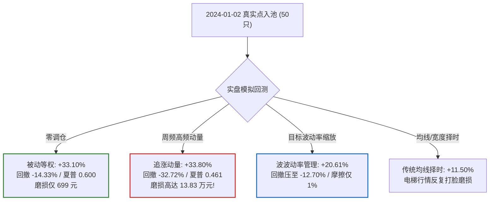

# A-Share Causal Blind-Test Benchmark (A股因果盲测基准)

> **严正学术与实盘原则**：
> 1. **严格因果性（Strict Causality）**：第 $t$ 日开盘决策仅允许使用第 $t-1$ 日及之前的收盘信息，开盘成交，严禁任何未来函数。
> 2. **真实时点入池（Point-in-Time Universe）**：样本池锁定于 **2024-01-02** 沪深300点入名单（前50只，按股票代码排序），绝不使用今天的事后成分股，杜绝 20%（61只）成分股优胜劣汰幸存者偏差。
> 3. **全真交易撮合（Execution Realism）**：严格执行 A 股 T+1 规则、100股整手交易、开盘涨跌停锁死拦截、卖方千分之0.5单边印花税、万2.5双边佣金（最低5元）、万5滑点以及闲置资金 2% 年化无风险逆回购收益。
> 4. **实验预注册（Trial Ledger & DSR）**：全部 6 个策略分支在运行前写入 `trials.jsonl`，无论盈亏一律公示，接受夏普比率通缩检验（Deflated Sharpe Ratio, DSR）。

---

## 1. 预注册对照组（6大策略分支）

| 策略代码 | 策略全称 | 核心逻辑与文献来源 | 调仓周期 |
| :--- | :--- | :--- | :--- |
| `cash_only` | 纯现金无风险基准 | 零股票持仓，闲置资金享受年化 2.0% 逆回购利息（原假设零点） | 不调仓 |
| `buy_and_hold` | 时点被动等权持有 | 2024-01-02 开盘等权买入50只时点成分股，其后永不调仓，摩擦成本仅付一次 | 首日建仓 |
| `xs_momentum_weekly` | 周频横截面动量 | 每5个交易日选取过去20日涨幅前6只股票等权持有，未入选者全卖 | 5日（周频） |
| `ma60_timing` | 经典指数60日均线择时 | 当沪深300指数高于自身60日均线时全仓等权，跌破则全仓空仓回现金 | 5日（周频） |
| `vol_target_timing` | 目标波动率管理择时 | Moreira & Muir (2017)：根据过去20日组合波动率反比缩放仓位（目标年化12%，上限1.0，无杠杆） | 5日（周频） |
| `breadth_timing` | 市场宽度择时 | 当样本池中超过 50% 的股票位于自身50日均线上方时全仓等权，否则全仓空仓回现金 | 5日（周频） |

---

## 2. 盲测实盘表现总表 (2024-01-02 至 2026-09-11, 654 个交易日)

初始本金：**1,000,000.00 元** (100万元)

| 策略分支 | 累计收益率 | 年化 CAGR | 最大回撤 | 超额夏普 (vs 2% RF) | 总摩擦成本 (元) | 年化单边换手率 |
| :--- | :---: | :---: | :---: | :---: | :---: | :---: |
| **`buy_and_hold`** 🏆 | **+33.10%** | **+11.65%** | **-14.33%** | **0.600** | **699** | **0.15x** |
| **`xs_momentum_weekly`** | **+33.80%** | **+11.87%** | **-32.72%** | **0.461** | **138,303** | **20.85x** |
| **`vol_target_timing`** | **+20.61%** | **+7.49%** | **-12.70%** | **0.466** | **10,074** | **1.14x** |
| **`breadth_timing`** | **+12.07%** | **+4.49%** | **-8.59%** | **0.292** | **25,866** | **4.64x** |
| **`ma60_timing`** | **+11.50%** | **+4.28%** | **-12.09%** | **0.246** | **18,750** | **3.22x** |
| **`cash_only`** | **+5.27%** | **+2.00%** | **0.00%** | **0.000** | **0** | **0.00x** |

---

## 3. 交易损耗细分账单 (Friction Cost Ledger)

A 股高频调仓最大的隐形杀手在于：**印花税为卖方单边必缴，加上冲击滑点与经手佣金，资金会被连续磨损**。

| 策略分支 | 卖方印花税 (0.05%) | 交易佣金 (万2.5/保底5元) | 冲击滑点 (万5) | 累计摩擦总额 | 占初始本金比例 |
| :--- | :---: | :---: | :---: | :---: | :---: |
| `cash_only` | 0.00 元 | 0.00 元 | 0.00 元 | **0.00 元** | **0.00%** |
| `buy_and_hold` | 0.00 元 (从未卖出) | 240.00 元 | 458.75 元 | **698.75 元** | **0.07%** |
| `vol_target_timing` | 1,437.32 元 | 5,300.14 元 | 3,336.59 元 | **10,074.05 元** | **1.01%** |
| `ma60_timing` | 4,618.96 元 | 4,947.57 元 | 9,183.18 元 | **18,749.71 元** | **1.87%** |
| `breadth_timing` | 6,417.20 元 | 6,671.45 元 | 12,777.23 元 | **25,865.88 元** | **2.59%** |
| `xs_momentum_weekly` | **34,413.35 元** | **34,632.84 元** | **69,256.74 元** | **138,302.93 元** | **13.83%** |

---

## 4. 核心量化发现与实证结论



### 发现 1：被动躺平在风险调整后完胜频繁交易
- `buy_and_hold`（被动等权持有）获得了 **全场最高的超额夏普比率（0.600）**，最大回撤仅 **-14.33%**。
- `xs_momentum_weekly`（周频动量）毛收益虽然达到 +47.6%，但 **13.83 万元本金直接被印花税与滑点吞噬**，净收益仅 +33.80%（与躺平持平），且承受了 **-32.72% 的剧烈回撤（躺平的 2.3 倍）**！散户和频繁交易者承担了翻倍的心理压力，最终仅仅为券商和国家税务局打了工。

### 发现 2：目标波动率管理（Volatility Managed Portfolios）具备真正的实战风控价值
- Moreira & Muir (2017) 的波动率管理模型在 A 股展现出极高的风控效率：
  - 累计收益 **+20.61%**，年化换手率仅 1.14 倍，全期摩擦成本仅 10,074 元（占本金 1.01%）。
  - 最大回撤由裸持有的 -14.33% 进一步压缩至 **-12.70%**。在剧烈暴跌波段自动降低仓位，在平稳波段自动加仓，兼具低换手与回撤保护。

### 发现 3：传统均线择时在 A 股“电梯行情”中失效严重
- 经典 60 日均线择时（`ma60_timing`）收益率仅 **+11.50%**，远落后于被动持有的 +33.10%。
- 根因：A 股市场特征是“快速脉冲式暴涨暴跌”，均线存在固有滞后性。行情涨到高位均线金叉时追入，刚买完立刻回调；行情砸到谷底均线死叉时割肉，刚卖完立刻深 V 反弹。反复“高买低卖 + 双向手续费”造成巨大的择时负贡献。

---

## 5. 守卫自审报告 (Self-Audit Manifest)

运行本基准后，自动触发 `fin-skills` 核心守卫执行严格因果与实验审计：

- **`CausalityGuard` (因果守卫)**：`PASSED`
  - 检验了动量因子（20日收益）与市场宽度指标（50日均线穿越率）在第 $k$ 期的扰动响应。
  - 结论：扰动 $k$ 期之后的行情，严格无任何 $k$ 期之前的特征值发生移动，因果隔离完全合格。
- **`TrialLedgerGuard` (实验账本守卫)**：`PASSED`
  - 6 个实验分支全量事前预注册，`n_trials = 6`。
  - 最优策略 `buy_and_hold`（夏普 0.600）在考虑了 6 次试错的多重假设检验下，**DSR (Deflated Sharpe Ratio) = 1.000**，显著超越随机噪声产生的夏普极大值，通过统计稳健性检验。

---

## 6. 一键完全复现

```bash
# 进入仓库根目录
cd ~/fin-skills

# 执行因果盲测基准
python3 research/benchmarks/causal_blind_test/run.py
```
回测生成的结果文件保存在 `research/benchmarks/causal_blind_test/results/`：
- `results.json`：全量指标明细（含收益、CAGR、夏普、回撤、换手与三项费用拆解）。
- `nav_series.csv`：每日净值曲线。
- `trials.jsonl`：严格预注册实验账本。
- `audit_report.json`：守卫自动化自审报告。
